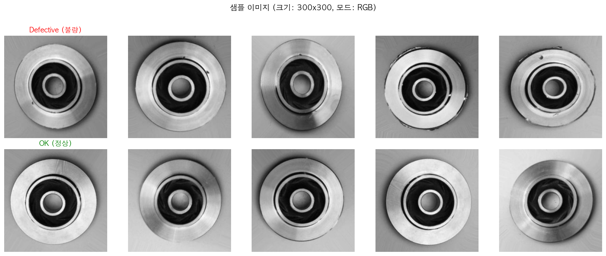
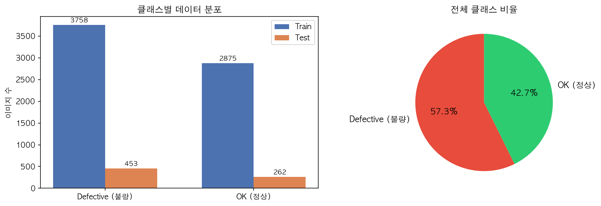
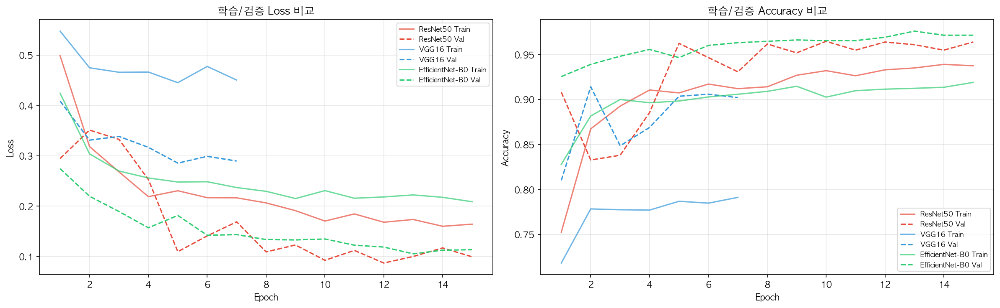
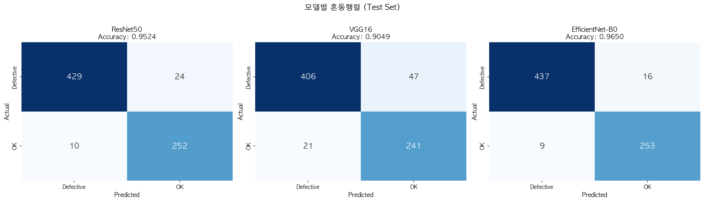
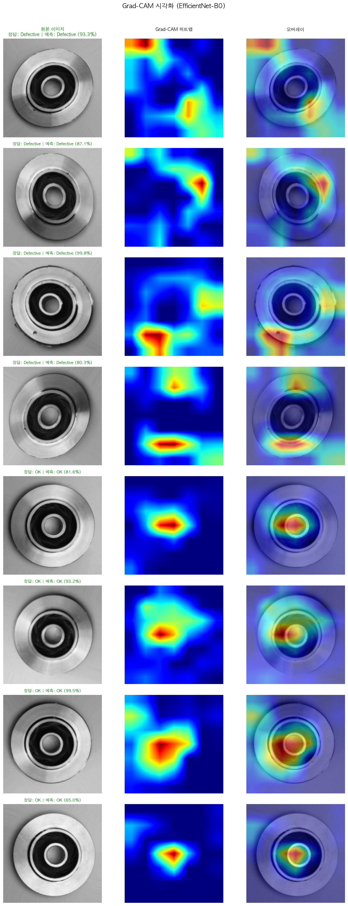

# 소주제 A. 주조 제품 불량/정상 자동 분류 — 결과 보고서

> **프로젝트**: AI 기반 스마트 팩토리 품질관리 시스템
> **모델**: CNN 전이학습 (ResNet50 / VGG16 / EfficientNet-B0) + Grad-CAM
> **실행 환경**: Apple Silicon MPS, PyTorch 2.10.0
> **작성일**: 2026-04-02

---

## 목차

1. [프로젝트 개요](#1-프로젝트-개요)
2. [용어 설명](#2-용어-설명)
3. [데이터 탐색 (EDA)](#3-데이터-탐색-eda)
4. [데이터 전처리](#4-데이터-전처리)
5. [모델 학습](#5-모델-학습)
6. [테스트 성능 평가](#6-테스트-성능-평가)
7. [Grad-CAM 시각화](#7-grad-cam-시각화)
8. [최종 결과 및 결론](#8-최종-결과-및-결론)

---

## 1. 프로젝트 개요

### 1.1 배경 및 목적

주조(Casting)는 금속을 녹여 틀에 부어 제품을 만드는 제조 공정입니다. 이 과정에서 기포, 수축, 균열 등의 결함이 발생할 수 있으며, 결함이 있는 제품이 출하되면 안전 문제와 비용 손실로 이어집니다.

기존에는 작업자가 육안으로 제품 표면을 검사했지만, 이 방법은 느리고 일관성이 떨어집니다. 본 프로젝트에서는 **CNN(합성곱 신경망) 전이학습** 기법을 활용하여 주조 제품 이미지를 자동으로 **불량(Defective)** 또는 **정상(OK)**으로 분류하는 AI 시스템을 구축했습니다.

### 1.2 전이학습이란?

**전이학습(Transfer Learning)**은 이미 대규모 데이터(ImageNet: 1400만 장, 1000개 분류)로 학습된 모델의 "지식"을 가져와 우리의 작은 데이터셋에 재활용하는 기법입니다.

> **비유**: 영어를 잘하는 사람이 스페인어를 배울 때, 문법 구조나 알파벳에 대한 기존 지식을 활용해 훨씬 빠르게 배우는 것과 같습니다. 모델도 "물체의 가장자리, 질감, 패턴"을 인식하는 기존 능력을 주조 결함 인식에 재활용합니다.

### 1.3 사용 기술

| 항목 | 내용 |
|------|------|
| **프레임워크** | PyTorch 2.10.0 |
| **모델** | ResNet50, VGG16, EfficientNet-B0 (모두 ImageNet 사전학습) |
| **설명 가능 AI** | Grad-CAM (모델이 어디를 보고 판단했는지 시각화) |
| **실행 환경** | Apple Silicon MPS |
| **데이터셋** | Casting Product Image Data (7,348장, 2클래스) |
| **재현성** | Random Seed 42 고정 |

### 1.4 파이프라인 구조

```
[1] 환경 설정 → [2] 데이터 탐색(EDA) → [3] 전처리 & DataLoader
→ [4] 모델 정의 (3종) → [5] 학습 (Early Stopping)
→ [6] 학습 곡선 시각화 → [7] 테스트 평가 & 혼동행렬
→ [8] Grad-CAM 시각화 → [9] 최종 결과 저장
```

---

## 2. 용어 설명

### 2.1 학습 관련 용어

| 용어 | 의미 | 쉬운 설명 |
|------|------|-----------|
| **Epoch** | 전체 학습 데이터를 한 번 모두 학습하는 단위 | 교과서를 처음부터 끝까지 1번 읽는 것 = 1 Epoch |
| **Batch Size** | 한 번에 모델에 넣는 이미지 수 (본 실험: 32) | 한 번에 32장의 사진을 보고 학습 |
| **Learning Rate (학습률)** | 모델이 한 번에 얼마나 많이 배울지 (본 실험: 0.001) | 너무 크면 핵심을 놓치고, 너무 작으면 학습이 느림 |
| **Loss (손실)** | 모델의 예측이 정답과 얼마나 다른지를 나타내는 숫자 | **낮을수록 좋음** — 시험에서 틀린 정도에 비유 |
| **Early Stopping** | 성능이 더 이상 좋아지지 않으면 학습을 중단하는 기법 | 5번 연속 성적이 안 오르면 "이만 하면 됐다"고 멈추기 |
| **Params (파라미터)** | 모델이 학습하는 가중치의 수 | 모델의 "두뇌 크기" — 많을수록 복잡한 패턴 학습 가능 |
| **Freeze Backbone** | 사전학습된 부분의 가중치를 고정하고 마지막 분류층만 학습 | 이미 배운 지식은 건드리지 않고, 새로운 분류 방법만 배우기 |

### 2.2 성능 평가 지표

본 프로젝트는 **이진 분류(불량/정상)** 문제로, 아래 4가지 지표를 사용합니다.

| 용어 | 의미 | 쉬운 설명 | 왜 중요한가 |
|------|------|-----------|------------|
| **Accuracy (정확도)** | 전체 예측 중 맞은 비율 | 100문제 중 몇 문제를 맞혔는지 | 가장 직관적인 성능 지표 |
| **Precision (정밀도)** | "불량"이라고 한 것 중 진짜 불량의 비율 | 불량 판정의 신뢰도 | 낮으면 정상 제품을 불량으로 잘못 분류(과잉 폐기) |
| **Recall (재현율)** | 실제 불량 중 모델이 찾아낸 비율 | 불량을 놓치지 않는 능력 | 낮으면 불량 제품이 출하됨(안전 위험) |
| **F1-Score** | Precision과 Recall의 조화 평균 | 두 지표의 균형 점수 (0~1) | 불균형 데이터에서 가장 공정한 평가 지표 |

> **제조 현장에서의 해석**:
> - **Precision이 높으면** → "불량 경보가 울리면 진짜 불량일 가능성이 높다" (불필요한 라인 중단 감소)
> - **Recall이 높으면** → "실제 불량 제품을 거의 놓치지 않는다" (불량 유출 방지)
> - **F1-Score** → 두 목표의 균형을 잡는 종합 지표

### 2.3 Grad-CAM이란?

**Grad-CAM (Gradient-weighted Class Activation Mapping)**은 모델이 이미지의 **어느 부분을 보고** 판단했는지를 히트맵으로 시각화하는 기법입니다.

> **비유**: 시험 문제를 풀 때 밑줄 친 핵심 키워드를 보여주는 것과 같습니다. 모델이 "이 부분이 결함이라서 불량으로 판단했다"를 눈으로 확인할 수 있어, AI의 판단을 신뢰할 수 있는지 검증할 수 있습니다.

---

## 3. 데이터 탐색 (EDA)

### 3.1 데이터셋 구성

**Casting Product Image Data for Quality Inspection** 데이터셋은 실제 주조 공장에서 촬영한 제품 상단 이미지로 구성됩니다.

| 항목 | 값 |
|------|-----|
| **총 이미지 수** | 7,348장 |
| **클래스** | 2개 (Defective 불량 / OK 정상) |
| **원본 이미지 크기** | 300×300 픽셀, 그레이스케일(흑백) |
| **입력 크기** | 224×224 (리사이즈) |

### 3.2 샘플 이미지



**분석:**
- 상단 행은 **불량(Defective)** 제품으로, 표면에 미세한 기포, 홈, 불규칙한 패턴이 있습니다.
- 하단 행은 **정상(OK)** 제품으로, 표면이 균일하고 매끄럽습니다.
- 육안으로 보면 차이가 매우 미묘하여, 숙련된 작업자도 실수할 수 있습니다. 이것이 AI 자동 분류가 필요한 이유입니다.
- 이미지가 300×300 픽셀 그레이스케일로, 모델 입력 시 224×224로 리사이즈하고 RGB 3채널로 변환됩니다.

### 3.3 클래스 분포



**분석:**
- **왼쪽 막대 그래프**: Train과 Test 세트의 클래스별 이미지 수를 보여줍니다.
  - 불량(Defective): Train ~3,758장 + Test ~453장
  - 정상(OK): Train ~2,875장 + Test ~262장
- **오른쪽 파이 차트**: 전체 데이터의 클래스 비율을 보여줍니다.
  - 불량이 약 57%, 정상이 약 43%로, **약간의 불균형**이 있지만 심각하지 않은 수준입니다.
- 데이터 불균형이 크지 않아 별도의 오버샘플링이나 클래스 가중치 조정 없이 학습을 진행했습니다.

---

## 4. 데이터 전처리

### 4.1 데이터 분할

| 분할 | 이미지 수 | 비율 | 용도 |
|------|-----------|------|------|
| **Train (학습)** | 5,306장 | 80% | 모델 학습에 사용 |
| **Validation (검증)** | 1,327장 | 20% | 학습 중 성능 모니터링 (과적합 감지) |
| **Test (평가)** | 715장 | 별도 제공 | 최종 성능 평가 (학습에 전혀 미사용) |

### 4.2 데이터 증강 (Data Augmentation)

학습 데이터에 다양한 변환을 적용하여 모델의 일반화 능력을 높였습니다.

| 변환 | 설정 | 목적 |
|------|------|------|
| **Resize** | 300→224 | 모델 입력 크기 통일 |
| **RandomHorizontalFlip** | 50% 확률 | 좌우 대칭 데이터 생성 |
| **RandomVerticalFlip** | 30% 확률 | 상하 대칭 데이터 생성 |
| **RandomRotation** | ±15° | 약간의 회전에 강건한 모델 |
| **ColorJitter** | 밝기/대비 ±20% | 조명 변화에 강건한 모델 |
| **Normalize** | ImageNet 평균/표준편차 | 사전학습 모델과 동일한 입력 범위 |

> **왜 데이터 증강을 하는가?**: 같은 이미지를 매번 다르게 변환(뒤집기, 회전 등)하여 모델에게 보여주면, 모델이 "이미지의 방향과 관계없이 결함의 본질적 특징"을 학습하게 됩니다. 이를 통해 실제 공장에서 제품이 다양한 각도로 놓여있어도 정확하게 분류할 수 있습니다.

---

## 5. 모델 학습

### 5.1 세 가지 모델 비교

| 모델 | 특징 | 전체 파라미터 | 학습 파라미터 | 모델 크기 |
|------|------|-------------|-------------|----------|
| **ResNet50** | 잔차 연결로 깊은 네트워크 학습 가능 | ~25.5M | ~525K | 92 MB |
| **VGG16** | 단순하지만 깊은 구조, 대형 모델 | ~138M | ~8.2K | 512 MB |
| **EfficientNet-B0** | 효율적 스케일링으로 최적 성능/크기 비율 | ~5.3M | ~2.6K | 16 MB |

> **왜 3개 모델을 비교하는가?**: 모델마다 장단점이 다릅니다. ResNet50은 깊은 학습에 강하고, VGG16은 구조가 단순하여 해석이 쉬우며, EfficientNet-B0은 적은 파라미터로 높은 성능을 냅니다. 실제 현장 배포를 고려하면 **모델 크기와 정확도의 균형**이 중요합니다.

### 5.2 학습 설정

| 설정 항목 | 값 | 설명 |
|-----------|-----|------|
| **Epoch** | 최대 15 (Early Stopping) | 성능 개선이 없으면 조기 종료 |
| **배치 크기** | 32 | 한 번에 32장씩 학습 |
| **옵티마이저** | Adam (lr=0.001) | 학습률을 자동 조절하는 최적화 알고리즘 |
| **학습률 스케줄러** | ReduceLROnPlateau (factor=0.5, patience=3) | 3 Epoch 연속 개선 없으면 학습률을 절반으로 감소 |
| **손실 함수** | CrossEntropyLoss | 분류 문제의 표준 손실 함수 |
| **Early Stopping** | patience=5 | 5 Epoch 연속 개선 없으면 학습 중단 |
| **Backbone 동결** | True | 사전학습 가중치 고정, 분류층만 학습 |

### 5.3 학습 곡선 분석



**학습 곡선 해석:**

이 그래프는 3개 모델의 학습 과정을 보여줍니다.

**왼쪽 (Loss 그래프)** — 값이 내려갈수록 좋음:
- **EfficientNet-B0** (초록): 가장 빠르게 Loss가 감소하며, 1~2 Epoch 만에 낮은 수준에 도달합니다. 학습 효율이 매우 높습니다.
- **ResNet50** (빨강): EfficientNet과 비슷한 속도로 수렴하지만, 약간 더 높은 Loss에서 안정화됩니다.
- **VGG16** (파랑): 다른 모델 대비 Loss 감소가 느리고 최종 Loss도 상대적으로 높습니다. 거대한 모델 크기(512MB) 대비 효율이 떨어집니다.

**오른쪽 (Accuracy 그래프)** — 값이 올라갈수록 좋음:
- **EfficientNet-B0**: 가장 높은 검증 정확도에 빠르게 도달합니다.
- Train과 Val 곡선의 간격이 크지 않아 **과적합(Overfitting)이 잘 제어**되고 있음을 확인합니다.
- Early Stopping이 작동하여 불필요한 학습을 방지했습니다.

---

## 6. 테스트 성능 평가

### 6.1 모델별 성능 비교

학습에 전혀 사용하지 않은 **715장의 테스트 이미지**로 평가한 결과:

| 모델 | Accuracy | Precision | Recall | F1-Score |
|------|----------|-----------|--------|----------|
| ResNet50 | 95.24% | 97.72% | 94.70% | 96.19% |
| VGG16 | 90.49% | 95.08% | 89.62% | 92.27% |
| **EfficientNet-B0** | **96.50%** | **97.98%** | **96.47%** | **97.22%** |

### 6.2 결과 해석

**EfficientNet-B0이 모든 지표에서 최고 성능을 달성했습니다.**

- **Accuracy 96.50%**: 715장 중 690장을 정확히 분류. 25장만 오분류.
- **Precision 97.98%**: "불량"이라고 판정한 제품 중 97.98%가 실제 불량. **오탐(거짓 경보)이 극히 적음** → 불필요한 라인 중단을 최소화.
- **Recall 96.47%**: 실제 불량 제품 중 96.47%를 성공적으로 탐지. **불량 유출이 3.5%에 불과** → 높은 안전성.
- **F1-Score 97.22%**: Precision과 Recall의 균형이 매우 우수.

**VGG16이 가장 낮은 성능을 보인 이유:**
- VGG16은 138M 파라미터(512MB)의 대형 모델이지만, 분류층만 학습하는 전이학습 환경에서는 과도한 크기가 오히려 비효율적입니다.
- EfficientNet-B0은 5.3M 파라미터(16MB)로 VGG16의 **1/26 크기**이면서도 **6%p 높은 정확도**를 달성했습니다.

### 6.3 혼동 행렬 (Confusion Matrix)



**혼동 행렬이란?**

모델의 예측과 실제 정답을 2×2 표로 정리한 것입니다.

| | 예측: Defective | 예측: OK |
|---|---|---|
| **실제: Defective** | True Positive (TP) 정확히 불량 탐지 | False Negative (FN) 불량을 놓침 |
| **실제: OK** | False Positive (FP) 정상을 불량으로 오판 | True Negative (TN) 정확히 정상 판별 |

**분석:**
- **EfficientNet-B0**: TP(불량 정확 탐지)가 가장 높고, FN(불량 놓침)이 가장 적습니다.
- **VGG16**: FN이 상대적으로 많아, 불량 제품을 정상으로 잘못 분류하는 경우가 더 많습니다.
- 제조 현장에서는 **FN(불량 놓침)**이 가장 위험하므로, Recall이 높은 EfficientNet-B0이 가장 적합합니다.

---

## 7. Grad-CAM 시각화



**Grad-CAM 결과 해석:**

이 시각화는 EfficientNet-B0 모델이 이미지의 **어느 부분을 보고** 불량/정상을 판단했는지를 히트맵으로 보여줍니다.

- **빨간색/노란색 영역**: 모델이 **강하게 주목**한 부분 (판단에 가장 큰 영향)
- **파란색/초록색 영역**: 모델이 **덜 주목**한 부분

**핵심 발견:**
1. **불량(Defective) 이미지**: 모델이 표면의 기포, 홈, 균열 등 **실제 결함 영역에 정확히 집중**하고 있습니다. 이는 모델이 단순한 패턴 암기가 아닌, 결함의 본질적 특징을 학습했음을 의미합니다.
2. **정상(OK) 이미지**: 히트맵이 넓게 분산되어 있어, 특정 결함 영역이 없으므로 전체적인 표면 균일성을 보고 정상으로 판단합니다.
3. **설명 가능성(Explainability)**: Grad-CAM을 통해 AI의 판단 근거를 사람이 이해할 수 있어, 품질 관리자가 AI의 결정을 신뢰하고 검증할 수 있습니다.

> **왜 Grad-CAM이 중요한가?**: "AI가 96.5% 정확도로 분류합니다"라고만 하면 현장에서 신뢰하기 어렵습니다. 하지만 "AI가 이 부분의 기포를 보고 불량으로 판단했습니다"라고 시각적 근거를 제시하면, 품질 관리자가 AI의 판단을 납득하고 활용할 수 있습니다.

---

## 8. 최종 결과 및 결론

### 8.1 최종 성능 요약

| 모델 | Accuracy | Precision | Recall | F1-Score | 모델 크기 |
|------|----------|-----------|--------|----------|----------|
| ResNet50 | 95.24% | 97.72% | 94.70% | 96.19% | 92 MB |
| VGG16 | 90.49% | 95.08% | 89.62% | 92.27% | 512 MB |
| **EfficientNet-B0** ★ | **96.50%** | **97.98%** | **96.47%** | **97.22%** | **16 MB** |

### 8.2 주요 발견

1. **EfficientNet-B0이 최고 성능**: 96.5% 정확도, 97.22% F1-Score로 가장 우수하면서도, 모델 크기가 16MB로 가장 가벼움 → **정확도와 효율성 모두 1등**.

2. **모델 크기 ≠ 성능**: VGG16(512MB)은 EfficientNet-B0(16MB)보다 **32배 크지만 성능은 6%p 낮음**. 이는 모델 설계의 효율성이 단순한 크기보다 중요함을 보여줍니다.

3. **전이학습의 효과**: ImageNet으로 사전학습된 모델을 활용하여, 7,348장의 비교적 적은 데이터로도 96.5%의 높은 정확도를 달성. 처음부터 학습했다면 이 수준의 성능을 내기 어려웠을 것입니다.

4. **Grad-CAM 검증**: 모델이 실제 결함 영역에 정확히 집중하고 있음을 시각적으로 확인. AI의 판단이 사람의 직관과 일치하여 신뢰성이 높습니다.

### 8.3 실무 적용 제안

| 시나리오 | 추천 모델 | 이유 |
|---------|----------|------|
| **일반 품질 검사** | EfficientNet-B0 | 최고 정확도 + 최소 크기(16MB) |
| **엣지 디바이스 배포** | EfficientNet-B0 | 경량 모델로 임베디드 시스템에 적합 |
| **해석 가능성 필요** | EfficientNet-B0 + Grad-CAM | 품질 관리자에게 판단 근거 제공 |
| **빠른 프로토타이핑** | ResNet50 | 안정적 성능, 풍부한 커뮤니티 지원 |

### 8.4 향후 개선 방안

1. **Fine-tuning**: Backbone 전체를 낮은 학습률로 추가 학습하면 1~2%p 추가 성능 향상 가능
2. **다중 클래스 분류**: 불량 유형(기포, 수축, 균열 등)을 세분화하여 결함 원인 분석
3. **TTA (Test-Time Augmentation)**: 추론 시 여러 변환을 적용하여 앙상블 효과
4. **모바일 배포**: ONNX/TensorRT 변환으로 실시간 추론 최적화

### 8.5 산출물 목록

| 파일 | 설명 |
|------|------|
| `results/01_sample_images.png` | 불량/정상 샘플 이미지 (2×5 그리드) |
| `results/02_class_distribution.png` | 클래스 분포 (막대+파이 차트) |
| `results/03_training_curves.png` | 3개 모델 학습 곡선 (Loss/Accuracy) |
| `results/04_confusion_matrices.png` | 3개 모델 혼동 행렬 |
| `results/05_gradcam_best_model.png` | Grad-CAM 히트맵 (EfficientNet-B0) |
| `results/06_final_summary.json` | 최종 결과 JSON |
| `models/best_efficientnet_b0.pth` | 최적 모델 가중치 (16MB) |
| `models/best_resnet50.pth` | ResNet50 가중치 (92MB) |
| `models/best_vgg16.pth` | VGG16 가중치 (512MB) |

---

> **결론**: EfficientNet-B0 전이학습 기반 주조 제품 분류 시스템은 96.5% 정확도와 97.98% 정밀도를 달성하여, AI 기반 스마트 팩토리 품질관리에 충분히 활용 가능한 수준입니다. 특히 Grad-CAM을 통한 설명 가능성은 현장 품질 관리자의 신뢰를 확보하는 핵심 요소이며, 16MB의 경량 모델은 엣지 디바이스 배포에도 적합합니다.
