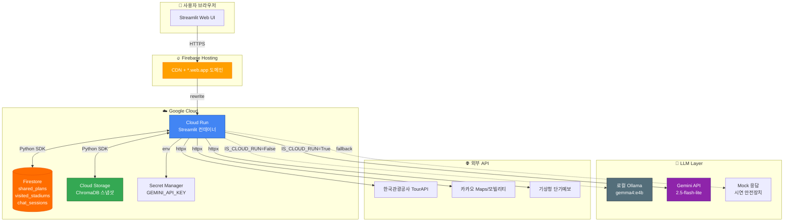
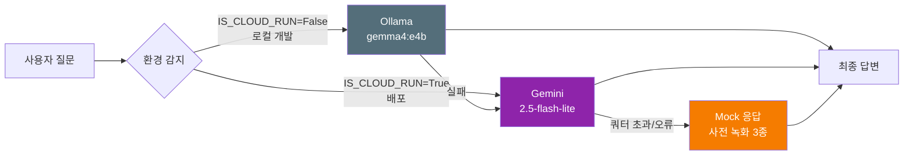
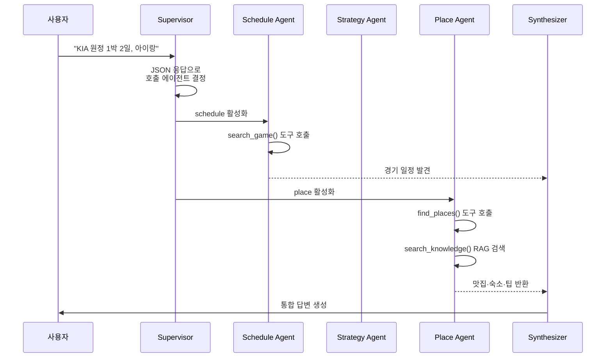

# 🏗️ 원정 응원 플래너 — 아키텍처

## 1. 전체 시스템 다이어그램

## 2. AI 레이어 — 3단계 Fallback

## 3. Multi-Agent 오케스트레이션

## 4. 데이터 흐름 — Phase별 누적

| Phase | 데이터 | 저장 위치 |
|---|---|---|
| 1 | KBO 일정·구장·전적 CSV | `data/*.csv` (앱 번들) |
| 1 | POI 캐시 (TourAPI) | `data/poi_cache/*.json` |
| 3 | 카카오 경로 캐시 | `data/route_cache/*.json` (ephemeral) |
| 4 | 승률 예측 모델 | `models/win_rate_model.pkl` (앱 번들) |
| 4 | RAG 인덱스 (ChromaDB) | Cloud Storage `gs://{bucket}/rag/chroma_snapshot.tar.gz` |
| 5 | 사용자 방문 구장 | Firestore `visited_stadiums/{user_id}` |
| 5 | 공유 원정 계획 | Firestore `shared_plans/{plan_id}` |
| 5 | 챗봇 대화 백업 | Firestore `chat_sessions/{session_id}` |

## 5. 요청 처리 순서 (사용자가 앱 접속 시)

1. 브라우저 → `https://mini12-310f5.web.app` → **Firebase Hosting CDN**
2. rewrite rule → `Cloud Run` 컨테이너 (asia-northeast3)
3. 첫 요청 시 **Cold start 5~15초** (컨테이너 부팅 + Streamlit 초기화)
4. 컨테이너 내부:
   - `K_SERVICE` 환경변수 감지 → `IS_CLOUD_RUN=True`
   - `llm_client`가 Gemini로 자동 라우팅
   - Firestore Admin SDK 초기화 (ADC 자동 사용)
   - ChromaDB는 `data/chroma_db/` 부재 시 GCS에서 다운로드
5. Streamlit 앱 렌더 → WebSocket 유지로 인터랙티브 세션

## 6. 비용 아키텍처 (월간 시연 기준)

| 항목 | 무료 tier | 예상 사용량 | 비용 |
|---|---|---|---|
| Firebase Hosting | 10GB 저장, 360MB/일 전송 | < 50MB | $0 |
| Cloud Run | 2M 요청, 180K vCPU-초/월 | ~10K 요청 | $0 |
| Cloud Build | 120분 빌드/일 | 배포당 3분 | $0 |
| Firestore | 50K reads, 20K writes/일 | 시연 수준 | $0 |
| Cloud Storage | 5GB 저장, 1GB 전송 | ~50MB | $0 |
| Secret Manager | 6개 시크릿 무료 | 1개 | $0 |
| Gemini API | 2.5-flash-lite 무료 tier | ~500 호출/일 | $0 |
| **합계** | | | **$0/월** |
