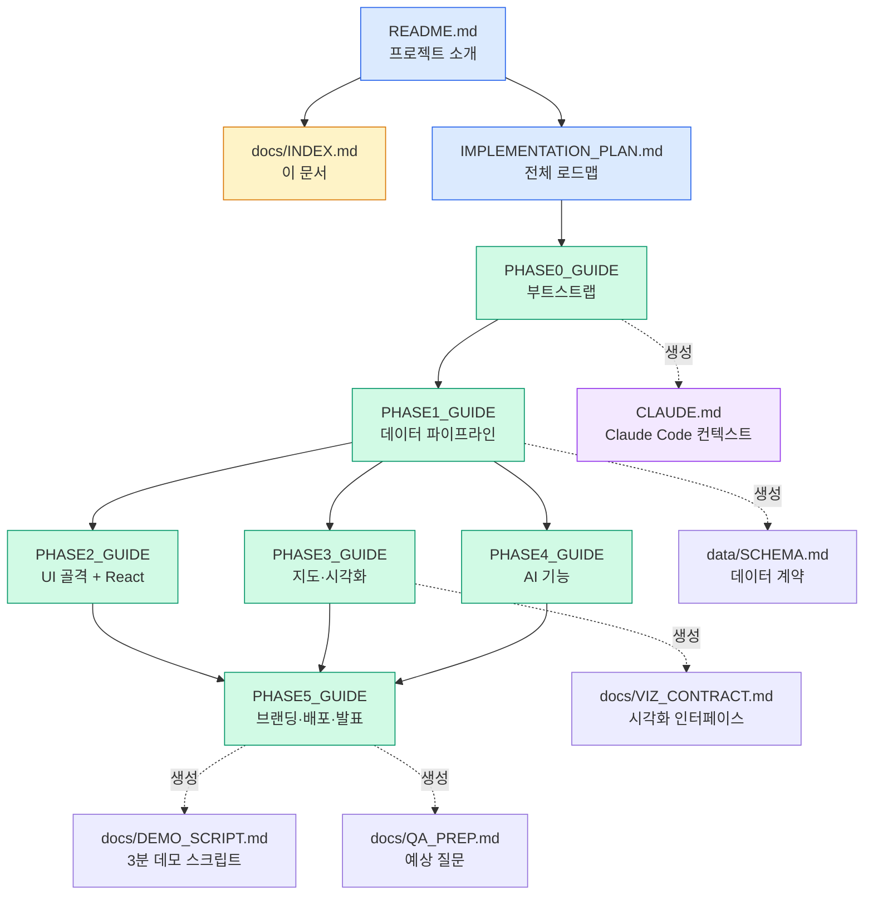

# 📖 프로젝트 문서 마스터 인덱스

> **원정 응원 플래너** 프로젝트의 모든 문서를 한곳에서 찾을 수 있는 허브 문서입니다.
> 처음 왔다면 이 페이지부터 읽으세요.

---

## 📌 TL;DR

- **프로젝트**: KBO 10개 구단 원정 응원러를 위한 Streamlit + React 기반 AI 플래너
- **일정**: 5일 (Phase 0~5), 실작업 약 12시간
- **문서**: 총 8개 (README + IMPLEMENTATION_PLAN + Phase 0~5 가이드)
- **다음 액션**: 아래 "나는 누구인가?"에서 자신의 역할을 골라 진입하세요 👇

---

## 🎯 나는 누구인가? — 페르소나별 진입점

| 나는... | 이걸 먼저 읽으세요 | 그다음 할 일 |
|---|---|---|
| 🧑‍✈️ **팀장** | [IMPLEMENTATION_PLAN.md](../IMPLEMENTATION_PLAN.md) | [Phase 0 가이드](../PHASE0_GUIDE.md)로 부트스트랩 시작 |
| 👥 **신규 팀원** | [README.md](../README.md) → 이 문서 | [추천 읽기 순서](#-추천-읽기-순서) 참조 |
| 🗃️ **데이터 엔지니어** | [Phase 1 가이드](../PHASE1_GUIDE.md) | `data/SCHEMA.md` 숙지 후 작업 착수 |
| 🎨 **프론트/UX 담당** | [Phase 2 가이드](../PHASE2_GUIDE.md) | Phase 5 브랜딩 파트 미리 훑어보기 |
| 🗺️ **지도/시각화 담당** | [Phase 3 가이드](../PHASE3_GUIDE.md) | Phase 1 데이터 스키마 숙지 필수 |
| 🤖 **AI/분석 담당** | [Phase 4 가이드](../PHASE4_GUIDE.md) | MVP 컷오프 지점 꼭 확인 |
| 🎓 **심사자/외부인** | [README.md](../README.md) | 배포 URL 접속 + 데모 영상 시청 |

---

## 📊 Phase 흐름 & 문서 의존 관계



**범례**:
- 🔵 파랑: 루트 문서 (최초 진입점)
- 🟡 노랑: 이 문서 (허브)
- 🟢 초록: Phase 가이드
- 🟣 보라: Phase 실행 중 자동 생성되는 문서

---

## 📚 전체 문서 카탈로그

### 루트 문서 (최상위)

| 문서 | 용도 | 주 독자 | 분량 |
|---|---|---|---|
| 📘 [README.md](../README.md) | 프로젝트 소개, 기획 의도, 트렌드 조사 | 전원·외부인 | 중 |
| 📋 [IMPLEMENTATION_PLAN.md](../IMPLEMENTATION_PLAN.md) | 6개 Phase 전체 로드맵, 리스크 관리 | 팀장·전원 | 중 |
| 📖 [docs/INDEX.md](./INDEX.md) | **이 문서** — 마스터 인덱스 | 전원 | 중 |

### Phase별 상세 가이드

| 문서 | Phase | 소요 | 주 담당 | 주요 산출물 |
|---|---|---|---|---|
| 🚀 [PHASE0_GUIDE.md](../PHASE0_GUIDE.md) | 0. 부트스트랩 | 30분 | 팀장 | Git 저장소, 디렉토리 구조, CLAUDE.md |
| 📦 [PHASE1_GUIDE.md](../PHASE1_GUIDE.md) | 1. 데이터 파이프라인 | 2시간 | 데이터 엔지니어 | CSV 3종, POI 캐시, data_loader.py |
| 🎨 [PHASE2_GUIDE.md](../PHASE2_GUIDE.md) | 2. UI 골격 + React | 2.5시간 | 프론트/UX | 사이드바, 5개 탭, React 컴포넌트 3종 |
| 🗺️ [PHASE3_GUIDE.md](../PHASE3_GUIDE.md) | 3. 지도·시각화 | 2시간 | 지도/시각화 | Folium 지도, Plotly 차트 3종 |
| 🤖 [PHASE4_GUIDE.md](../PHASE4_GUIDE.md) | 4. AI 기능 | 3시간 | AI/분석 | 승률 모델, LLM 챗봇, Function Calling |
| 🎬 [PHASE5_GUIDE.md](../PHASE5_GUIDE.md) | 5. 발표 준비 | 2시간 | 전원 | 배포, 발표 자료, 데모 영상 |

### 실행 중 자동 생성되는 부가 문서

이 문서들은 해당 Phase 진행 중 Claude Code가 자동 생성합니다. 이 인덱스에는 **존재 여부만 표기**하며, 실제 내용은 각 Phase 가이드의 Step을 따라 생성됩니다.

| 문서 | 생성 시점 | 용도 |
|---|---|---|
| `CLAUDE.md` | Phase 0 Step 4 | Claude Code 세션 자동 로드 컨텍스트 |
| `data/SCHEMA.md` | Phase 1 Step 1 | 팀 전체의 데이터 계약 |
| `docs/VIZ_CONTRACT.md` | Phase 3 Step 1 | 지도·차트 함수 시그니처 |
| `docs/PRESENTATION_OUTLINE.md` | Phase 5 Step 4 | 10장 슬라이드 초안 |
| `docs/DEMO_SCRIPT.md` | Phase 5 Step 5 | 3분 데모 시나리오 |
| `docs/RECORDING_CHECKLIST.md` | Phase 5 Step 6 | 영상 녹화 절차 |
| `docs/QA_PREP.md` | Phase 5 Step 7 | 예상 질문 10개 |
| `docs/RETROSPECTIVE.md` | Phase 5 후 | 프로젝트 회고 |

---

## 📖 추천 읽기 순서

상황에 따라 세 가지 경로를 추천합니다.

### 🆕 경로 A: 프로젝트 처음 시작 (팀장)

```
1. README.md                    (5분) — 프로젝트 맥락 이해
2. IMPLEMENTATION_PLAN.md       (10분) — 전체 6 Phase 파악
3. 이 문서 (INDEX.md)           (3분) — 문서 구조 숙지
4. PHASE0_GUIDE.md              (5분) — 즉시 부트스트랩 착수
```
**총 23분**, 이후 실제 작업 시작.

### 👤 경로 B: 중간 합류한 신규 팀원

```
1. README.md                    (5분) — 뭐 하는 프로젝트?
2. 이 문서 (INDEX.md)           (5분) — 문서 맵 파악
3. CLAUDE.md                    (3분) — 현재 진행 Phase 확인
4. 현재 Phase의 가이드 문서     (15분) — 실제 작업 내용
5. data/SCHEMA.md (있을 경우)   (3분) — 팀 규약 숙지
```
**총 31분**, 이후 작업 투입.

### 🔍 경로 C: 발표·심사·리뷰용

```
1. README.md                    (5분) — 프로젝트 소개
2. 배포 URL 접속 및 체험        (10분) — 실제 동작 확인
3. PHASE4_GUIDE.md 개요         (3분) — AI 아키텍처 이해
4. PHASE5_GUIDE.md 평가 기준    (3분) — 평가 의도 파악
```
**총 21분**.

---

## ❓ "~하려면 어디 봐야 하나?" — 실전 FAQ

팀원이 실제로 가장 많이 묻는 질문들입니다. **각 답변은 구체적 문서·섹션으로 직행**합니다.

### 🛠️ 환경·세팅 관련

<table>
<tr><th>질문</th><th>답변</th></tr>
<tr>
  <td>개발 환경 처음 세팅하려면?</td>
  <td><a href="../PHASE0_GUIDE.md#-3-step-2-python-가상환경-생성-">Phase 0 Step 2</a></td>
</tr>
<tr>
  <td>공공데이터 API 키 어디서 받아?</td>
  <td><a href="../PHASE0_GUIDE.md#-1-사전-준비-prerequisites">Phase 0 섹션 1-2</a></td>
</tr>
<tr>
  <td>.env 파일 실수로 커밋했어</td>
  <td><a href="../PHASE0_GUIDE.md#-12-트러블슈팅-faq">Phase 0 FAQ Q3</a></td>
</tr>
<tr>
  <td>CLAUDE.md는 어떻게 써?</td>
  <td><a href="../PHASE0_GUIDE.md#-10-claudemd-전체-템플릿">Phase 0 섹션 10</a></td>
</tr>
</table>

### 🗃️ 데이터 관련

<table>
<tr><th>질문</th><th>답변</th></tr>
<tr>
  <td>KBO 경기 일정 데이터는 어디서?</td>
  <td><a href="../PHASE1_GUIDE.md#-4-step-4-kbo-경기일정-실제-수집-30분">Phase 1 Step 4</a> (3단 폴백 전략)</td>
</tr>
<tr>
  <td>TourAPI 어떻게 호출해?</td>
  <td><a href="../PHASE1_GUIDE.md#-6-step-6-tourapi-클라이언트-작성-30분--phase-1의-핵심">Phase 1 Step 6</a></td>
</tr>
<tr>
  <td>구장 좌표 정보는?</td>
  <td><a href="../PHASE1_GUIDE.md#-3-step-3-구장-좌표-데이터-확정-15분">Phase 1 Step 3</a></td>
</tr>
<tr>
  <td>더미 데이터 먼저 만들려면?</td>
  <td><a href="../PHASE1_GUIDE.md#-2-step-2-더미-데이터-선행-생성--phase-24-블록-해제의-열쇠">Phase 1 Step 2</a></td>
</tr>
<tr>
  <td>데이터 스키마(컬럼)는 뭐야?</td>
  <td><code>data/SCHEMA.md</code> (Phase 1 Step 1에서 자동 생성)</td>
</tr>
</table>

### 🎨 UI·컴포넌트 관련

<table>
<tr><th>질문</th><th>답변</th></tr>
<tr>
  <td>사이드바 필터 구현하려면?</td>
  <td><a href="../PHASE2_GUIDE.md#-3-step-2-사이드바-필터-구현-30분">Phase 2 Step 2</a></td>
</tr>
<tr>
  <td>React 컴포넌트 어떻게 끼워넣어?</td>
  <td><a href="../PHASE2_GUIDE.md#-5-step-4-react-컴포넌트-1--히어로-섹션-30분">Phase 2 Step 4</a></td>
</tr>
<tr>
  <td>탭 추가·변경하려면?</td>
  <td><a href="../PHASE2_GUIDE.md#-4-step-3-5개-탭-스캐폴딩-20분">Phase 2 Step 3</a></td>
</tr>
<tr>
  <td>팀 컬러 CSS 적용하려면?</td>
  <td><a href="../PHASE5_GUIDE.md#-2-step-1-브랜딩--css-테마-마감-30분">Phase 5 Step 1</a></td>
</tr>
</table>

### 🗺️ 지도·차트 관련

<table>
<tr><th>질문</th><th>답변</th></tr>
<tr>
  <td>Folium 지도 처음 만들려면?</td>
  <td><a href="../PHASE3_GUIDE.md#-2-step-2-folium-기본-지도-컴포넌트-30분">Phase 3 Step 2</a></td>
</tr>
<tr>
  <td>마커 클릭 이벤트 처리는?</td>
  <td><a href="../PHASE3_GUIDE.md#-4-step-4-마커-클릭--우측-상세-패널-30분--시그니처-기능">Phase 3 Step 4</a> ⭐</td>
</tr>
<tr>
  <td>카카오모빌리티 경로 API는?</td>
  <td><a href="../PHASE3_GUIDE.md#-5-step-5-카카오모빌리티-경로--fallback-30분">Phase 3 Step 5</a></td>
</tr>
<tr>
  <td>Plotly 차트 추가하려면?</td>
  <td><a href="../PHASE3_GUIDE.md#-6-step-6-plotly-차트-2종-30분">Phase 3 Step 6</a></td>
</tr>
<tr>
  <td>승률 게이지는 어떻게?</td>
  <td><a href="../PHASE3_GUIDE.md#-7-step-7-승률-게이지-인디케이터-20분-권장">Phase 3 Step 7</a></td>
</tr>
</table>

### 🤖 AI 기능 관련

<table>
<tr><th>질문</th><th>답변</th></tr>
<tr>
  <td>승률 예측 모델 학습은?</td>
  <td><a href="../PHASE4_GUIDE.md#-2-step-1-승률-예측-모델-30분-mvp-필수">Phase 4 Step 1</a></td>
</tr>
<tr>
  <td>LLM 챗봇 기본 구현은?</td>
  <td><a href="../PHASE4_GUIDE.md#-4-step-3-기본-llm-챗봇-구현---mvp-컷오프-지점">Phase 4 Step 3</a> (MVP)</td>
</tr>
<tr>
  <td>Function Calling 도구는 어떻게?</td>
  <td><a href="../PHASE4_GUIDE.md#️-6-step-5-function-calling-도구-구현-45분-강력-권장">Phase 4 Step 5</a></td>
</tr>
<tr>
  <td>Multi-Agent 구조는?</td>
  <td><a href="../PHASE4_GUIDE.md#-8-step-7-multi-agent-순차-호출-패턴-30분-선택">Phase 4 Step 7</a></td>
</tr>
<tr>
  <td>OpenAI 비용 관리는?</td>
  <td><a href="../PHASE4_GUIDE.md#-1-아키텍처-결정-박스--읽고-시작">Phase 4 섹션 1</a> "비용 관리 원칙"</td>
</tr>
<tr>
  <td>API 장애 시 Fallback은?</td>
  <td><a href="../PHASE4_GUIDE.md#-10-step-9-검증--시연-안전장치--필수">Phase 4 Step 9</a></td>
</tr>
</table>

### 🚀 배포·발표 관련

<table>
<tr><th>질문</th><th>답변</th></tr>
<tr>
  <td>Streamlit Cloud 배포하려면?</td>
  <td><a href="../PHASE5_GUIDE.md#-4-step-3-streamlit-cloud-배포-30분">Phase 5 Step 3</a></td>
</tr>
<tr>
  <td>발표 자료 어떻게 구성?</td>
  <td><a href="../PHASE5_GUIDE.md#-5-step-4-발표-자료-10장-구성-45분">Phase 5 Step 4</a> (10장 구성)</td>
</tr>
<tr>
  <td>3분 데모 스크립트는?</td>
  <td><a href="../PHASE5_GUIDE.md#-6-step-5-데모-시나리오-3분-스크립트-30분">Phase 5 Step 5</a></td>
</tr>
<tr>
  <td>시연 백업 영상은 어떻게?</td>
  <td><a href="../PHASE5_GUIDE.md#-7-step-6-시연-백업-전략-삼중화-30분">Phase 5 Step 6</a></td>
</tr>
<tr>
  <td>Q&A 예상 질문 준비는?</td>
  <td><a href="../PHASE5_GUIDE.md#-8-step-7-qa-대비-30분">Phase 5 Step 7</a></td>
</tr>
</table>

### 🎯 평가·수익·확장 관련

<table>
<tr><th>질문</th><th>답변</th></tr>
<tr>
  <td>수익 모델은 어떻게 구성?</td>
  <td><a href="../README.md">README</a> 기획 의도 + Phase 5 슬라이드 7</td>
</tr>
<tr>
  <td>평가 기준 100점을 어떻게 채워?</td>
  <td><a href="../PHASE5_GUIDE.md#-1-평가-기준-역설계--100점을-어떻게-채울-것인가">Phase 5 섹션 1</a></td>
</tr>
<tr>
  <td>시장 근거 데이터는?</td>
  <td><a href="../README.md">README</a> 섹션 2 "트렌드 조사 및 분석"</td>
</tr>
</table>

---

## 🆘 자주 겪는 문제 TOP 10

가장 빈도 높은 이슈들을 한곳에 모았습니다. 해당 Phase의 FAQ 섹션으로 직행하세요.

| # | 문제 | 해결 참조 |
|---|---|---|
| 1 | 공공데이터 API 키 승인 지연 | [Phase 1 FAQ Q1~4](../PHASE1_GUIDE.md#-12-트러블슈팅-faq) |
| 2 | React 컴포넌트 빈 화면 | [Phase 2 FAQ Q1](../PHASE2_GUIDE.md#-12-트러블슈팅-faq) |
| 3 | 한글 Popup 깨짐 | [Phase 3 FAQ Q4](../PHASE3_GUIDE.md#-12-트러블슈팅-faq) |
| 4 | `last_object_clicked`가 None | [Phase 3 FAQ Q6](../PHASE3_GUIDE.md#-12-트러블슈팅-faq) |
| 5 | OpenAI Rate Limit | [Phase 4 FAQ Q1](../PHASE4_GUIDE.md#-13-트러블슈팅-faq) |
| 6 | AI 도구 호출 안 됨 | [Phase 4 FAQ Q3](../PHASE4_GUIDE.md#-13-트러블슈팅-faq) |
| 7 | LLM API 비용 초과 | [Phase 4 FAQ Q7](../PHASE4_GUIDE.md#-13-트러블슈팅-faq) |
| 8 | Streamlit Cloud 빌드 실패 | [Phase 5 FAQ Q1](../PHASE5_GUIDE.md#-13-트러블슈팅-faq) |
| 9 | 배포 후 Secrets 접근 불가 | [Phase 5 FAQ Q2](../PHASE5_GUIDE.md#-13-트러블슈팅-faq) |
| 10 | 발표 시간 초과 | [Phase 5 FAQ Q8](../PHASE5_GUIDE.md#-13-트러블슈팅-faq) |

---

## 🗺️ Phase 흐름 요약표

각 Phase의 핵심 정보를 한 장에 정리한 요약표입니다.

| Phase | 이름 | 시간 | 담당 | 컷오프 지점 |
|---|---|---|---|---|
| **0** | 부트스트랩 | 30분 | 팀장 | `streamlit run app.py` 성공 |
| **1** | 데이터 파이프라인 | 2시간 | 데이터 엔지니어 | `scripts/validate_data.py` PASS |
| **2** | UI 골격 + React | 2.5시간 | 프론트/UX | 5개 탭 + React 3종 작동 |
| **3** | 지도·시각화 | 2시간 | 지도/시각화 | 마커 클릭 상호작용 작동 |
| **4** | AI 기능 | 3시간 | AI/분석 | ⭐ **90분에 MVP 컷오프** |
| **5** | 발표 준비 | 2시간 | 전원 | 2회 리허설 완료 |

**🎯 핵심 규칙**: 각 Phase의 완료 조건을 충족하지 못하면 다음 Phase로 넘어가지 않습니다. 특히 Phase 1의 `validate_data.py` PASS는 Phase 2~4 진입 게이트입니다.

---

## 🔗 외부 리소스

### 프로젝트에서 사용하는 외부 서비스

- **데이터**: [공공데이터포털](https://www.data.go.kr/), [한국관광공사 TourAPI](https://api.visitkorea.or.kr/)
- **지도**: [Kakao Maps API](https://apis.map.kakao.com/), [Kakao Mobility](https://developers.kakaomobility.com/)
- **AI**: [OpenAI Platform](https://platform.openai.com/), [Google AI Studio](https://aistudio.google.com/)
- **배포**: [Streamlit Community Cloud](https://share.streamlit.io/)

### 기술 문서

- [Streamlit 공식 문서](https://docs.streamlit.io/)
- [streamlit-folium](https://folium.streamlit.app/)
- [Folium 공식 문서](https://python-visualization.github.io/folium/)
- [Plotly Python 갤러리](https://plotly.com/python/)
- [React CDN 방식 가이드](https://react.dev/learn/add-react-to-an-existing-project)
- [OpenAI Function Calling](https://platform.openai.com/docs/guides/function-calling)
- [LangGraph Multi-Agent](https://langchain-ai.github.io/langgraph/tutorials/multi_agent/)

### Claude Code

- [Claude Code 공식 문서](https://docs.claude.com/en/docs/claude-code)
- [Claude API Reference](https://docs.anthropic.com/en/api/getting-started)

---

## 📝 용어집 (Glossary)

프로젝트에서 반복 사용되는 용어를 정리합니다.

| 용어 | 의미 |
|---|---|
| **KBO** | Korea Baseball Organization, 한국 프로야구 리그 |
| **TourAPI** | 한국관광공사에서 제공하는 관광 정보 공공 API |
| **POI** | Point of Interest, 지도상 관심 지점 (맛집·숙소·관광지 등) |
| **MVP** | Minimum Viable Product, 최소 기능 제품 — 발표 가능한 최소 단위 |
| **Agentic RAG** | 검색과 도구 호출을 결합한 LLM 응답 생성 기법 |
| **Function Calling** | LLM이 외부 함수를 호출하도록 하는 기능 (OpenAI 기준) |
| **Tool Use** | Function Calling의 Anthropic·업계 표준 명칭 |
| **Fallback** | 주 경로 실패 시 사용하는 대체 동작 |
| **ARPU** | Average Revenue Per User, 사용자당 평균 매출 |
| **시그니처 기능** | 발표 시 가장 강조할 핵심 차별화 기능 |
| **컷오프 지점** | Phase 내에서 "여기까지만 해도 통과"되는 최소 작업 지점 |
| **시연 모드** | Phase 4의 Mock 응답을 사용하는 안전 시연 모드 |

---

## 🔄 이 문서는 살아있는 문서

이 인덱스는 **프로젝트 진행에 따라 업데이트되어야 합니다**. 다음 경우에 수정하세요.

- [ ] 새 문서 추가 시 → "전체 문서 카탈로그" 테이블
- [ ] Phase 완료 시 → `CLAUDE.md`의 "현재 진행 Phase" 업데이트 (이 문서 아님)
- [ ] 팀원 역할 변경 시 → "나는 누구인가" 섹션
- [ ] 새 FAQ 발생 시 → "자주 겪는 문제 TOP 10"

---

## 📮 더 궁금하면

- **팀 내부 질문**: Slack/Discord 채널 `#project-sports` 또는 팀장에게 직접
- **기술적 질문**: 해당 Phase 가이드의 FAQ 먼저 확인 → 없으면 Claude Code에 질문
- **심사자 문의**: GitHub Issues 또는 README 하단 연락처

---

## 🎬 마지막으로

이 문서는 프로젝트의 **지도**입니다. 길을 잃었을 때, 뭘 봐야 할지 모를 때, 새로운 팀원이 합류했을 때 이곳을 먼저 들르세요.

각 Phase 가이드는 "어떻게 만들 것인가"를 다루고, 이 문서는 "어디에 뭐가 있는가"를 다룹니다.

**Good luck with your presentation! ⚾🏆**

---

*문서 마지막 업데이트: 2026-04-17*
*다음 리뷰 예정: Phase 완료 시마다*
*버전: v1.0*
