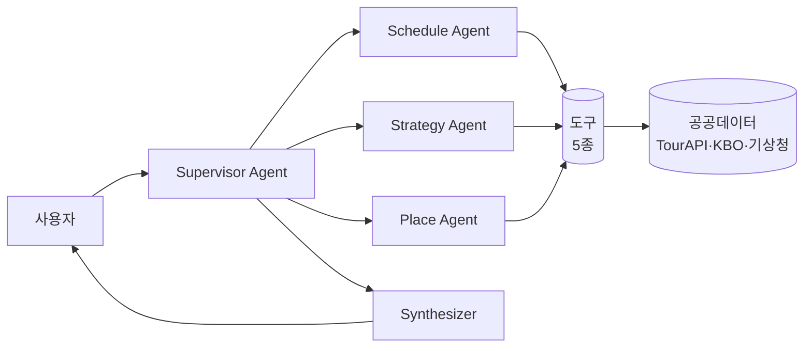

# 🎬 Phase 5 구현 가이드 — 브랜딩 · 배포 · 발표 준비

> **목표**: Phase 0~4에서 만든 것을 심사자에게 3분 안에 설득할 수 있는 형태로 마감한다. 이 Phase는 "구현"이 아니라 **"전달"**이 핵심.
> **실제 작업 시간**: 약 2시간 + 리허설 30~60분
> **대상 독자**: **팀원 전원** (병렬 작업)
> **전제 조건**: [Phase 4 가이드](./PHASE4_GUIDE.md)의 MVP 완료. AI 챗봇 최소한 작동.

---

## ⚠️ 시작 전 마인드셋 — 이 Phase는 "구현"이 아니라 "전달"이다

Phase 0~4에서 아무리 멋진 기능을 만들어도, 발표 3분 안에 심사자에게 전달되지 않으면 **점수로 이어지지 않습니다.** 이 Phase의 모든 작업은 다음 질문에 답하는 것입니다.

> "우리가 만든 이 앱이 왜 중요하고, 실제로 작동하며, 앞으로 어디로 갈 수 있는가?"

코드 한 줄 더 짜기보다 **예상 질문 하나 더 준비하는 것이 점수에 더 기여**한다는 점을 기억하세요.

---

## 🎯 0. Phase 5 개요

### ⏰ 타임라인 (팀 전원 병렬 작업 기준)

```
00:00 ━━━━━━━━━━━━━━━━━━━━━━━━━━━━━━━━━━━━━━━━━━━━━━━━━━━━━  시작
          │ 프론트: 브랜딩         │ 데이터: 배포 리허설     │ AI: Q&A 준비
          │ (Step 1~2, 45분)      │ (Step 3, 30분)          │ (Step 7, 30분)
          │                        │                          │
          │ 지도: 데모 영상        │ 팀장: 슬라이드 조립     │
          │ (Step 6, 30분)         │ (Step 4, 45분)          │
00:45 ━━━━━━━━━━━━━━━━━━━━━━━━━━━━━━━━━━━━━━━━━━━━━━━━━━━━━
          데모 시나리오 스크립트 공동 작성 (Step 5, 30분)
01:15 ━━━━━━━━━━━━━━━━━━━━━━━━━━━━━━━━━━━━━━━━━━━━━━━━━━━━━
          시연 백업 전략 점검 (Step 6, 30분)
01:45 ━━━━━━━━━━━━━━━━━━━━━━━━━━━━━━━━━━━━━━━━━━━━━━━━━━━━━
          1차 리허설 (Step 8a, 20분)
02:05 ━━━━━━━━━━━━━━━━━━━━━━━━━━━━━━━━━━━━━━━━━━━━━━━━━━━━━
          수정 & 2차 리허설 (Step 8b, 25분)
02:30 ━━━━━━━━━━━━━━━━━━━━━━━━━━━━━━━━━━━━━━━━━━━━━━━━━━━━━
          최종 제출물 점검 (Step 9, 15분)
02:45 ━━━━━━━━━━━━━━━━━━━━━━━━━━━━━━━━━━━━━━━━━━━━━━━━━━━━━ 🏁 완료
```

### 완료 조건 (7가지 전부 참이어야 함)
1. ✅ 앱이 Streamlit Cloud에 배포되었거나 로컬 실행 영상 준비 완료
2. ✅ 팀 컬러 테마 CSS 적용, 빈 상태·에러 메시지 모두 처리
3. ✅ 10장 내외 발표 자료 완성 (PDF 또는 PPTX)
4. ✅ 데모 시나리오 3분 스크립트 확정
5. ✅ 시연 백업 영상 3종 녹화 완료
6. ✅ Q&A 예상 질문 10개에 답변 초안 작성
7. ✅ 최소 2회 리허설 완료

---

## 📊 1. 평가 기준 역설계 — 100점을 어떻게 채울 것인가

강의계획서의 평가 기준에서 역으로 출발합니다. **각 배점마다 Phase 5에서 대응해야 할 구체적 작업**을 정리한 표입니다.

| 평가 항목 | 배점 | Phase 5 대응 작업 |
|---|---|---|
| **주제 적절성** | 20 | 슬라이드 2~3장에 "왜 이 주제인가" 수치 기반 근거 (MZ 고관여 팬 50%, 스포츠 직관 100만 등) |
| **데이터 활용** | 20 | 슬라이드 한 장에 공공데이터 출처 (TourAPI·KBO·기상청), 데모에서 실제 API 호출 시연 |
| **기능 구현** | 25 | 3분 데모에 사이드바·지도·차트·AI 챗봇 전부 등장. 필수 기능 체크리스트로 점검 |
| **시각화 완성도** | 15 | CSS 브랜딩 마감, 스크린샷 3종 고해상도, 발표 자료 디자인 통일 |
| **분석 및 해석** | 10 | 모든 차트에 해석 캡션, AI 응답에 맥락 설명, "이 데이터로 알 수 있는 것" 명시 |
| **발표 및 협업** | 10 | 팀원 전원이 담당 파트 직접 발표, 역할 분담 슬라이드 포함, 매끄러운 전환 |

**이 표를 팀 전원이 출력해서 책상에 붙여두세요.** 모든 결정의 기준이 됩니다.

---

## 🎨 2. Step 1. 브랜딩 & CSS 테마 마감 (30분)

### 목표
Phase 2에서 시작한 팀 컬러 테마를 **앱 전체에 일관되게** 적용한다. Streamlit 기본 스타일이 튀지 않도록 커스텀.

### 🤖 Claude Code 프롬프트

````
assets/css/style.css를 다음 명세로 완성해줘.

### 목표
- 팀 컬러가 앱 전체에 일관되게 반영
- Streamlit 기본 스타일의 각진 느낌 완화
- 폰트 Pretendard로 통일

### CSS 변수 정의

```css
:root {
  --font-main: 'Pretendard Variable', 'Pretendard', -apple-system, 
               BlinkMacSystemFont, 'Noto Sans KR', sans-serif;
  --color-bg: #FAFAFA;
  --color-card: #FFFFFF;
  --color-text: #1F2937;
  --color-text-muted: #6B7280;
  --color-border: #E5E7EB;
  --color-accent: #DC2626;  /* JS에서 팀 컬러로 동적 변경 */
  --radius-md: 8px;
  --radius-lg: 12px;
  --shadow-sm: 0 1px 3px rgba(0,0,0,0.08);
  --shadow-md: 0 4px 12px rgba(0,0,0,0.1);
}
```

### Pretendard 로딩

@import url('https://cdn.jsdelivr.net/gh/orioncactus/pretendard@v1.3.9/dist/web/variable/pretendardvariable-dynamic-subset.css');

html, body, [class*="css"] {
  font-family: var(--font-main) !important;
}

### 주요 Streamlit 컴포넌트 커스터마이징

1. 헤더 (st.title, st.subheader)
   - 폰트 weight 700, letter-spacing -0.02em
   - h1: 2rem, h2: 1.5rem, h3: 1.25rem

2. 버튼 (st.button)
   - border-radius: var(--radius-md)
   - primary 버튼 배경은 var(--color-accent)
   - hover 시 살짝 떠오르는 효과

3. 메트릭 (st.metric)
   - 배경 var(--color-card), 그림자 var(--shadow-sm)
   - 패딩 16px, border-radius 12px

4. 데이터프레임 (st.dataframe)
   - 헤더 배경 #F3F4F6
   - 행 높이 44px

5. 탭 (st.tabs)
   - 활성 탭 하단 border를 var(--color-accent)
   - 폰트 weight 600

6. 사이드바
   - 배경 #FFFFFF (기본 회색보다 깨끗)
   - 구분선 얇게

7. 채팅 메시지 (st.chat_message)
   - user 메시지: 오른쪽 정렬, accent 컬러 배경
   - assistant 메시지: 왼쪽 정렬, 흰색 배경 + border

8. 성공/경고/에러 (st.success, st.warning, st.error)
   - 현재 기본 스타일보다 부드러운 톤으로
   - 아이콘 왼쪽 정렬 유지

9. 빈 상태 메시지 전용 클래스
   - .empty-state: 중앙 정렬, 아이콘 큼, 텍스트 muted

### 팀 컬러 CSS 변수 동적 주입 (app.py)

app.py의 CSS 주입 로직을 수정해서 현재 선택된 팀의 컬러를
CSS 변수로 주입해:

```python
from src.ui.components.hero import TEAM_COLORS

def inject_css(team: str):
    palette = TEAM_COLORS.get(team, TEAM_COLORS["LG"])
    css = Path("assets/css/style.css").read_text()
    # :root 블록에 팀 컬러 override 추가
    override = f"""
    <style>
    {css}
    :root {{
      --color-accent: {palette['color']};
      --color-accent-sub: {palette['subColor']};
    }}
    </style>
    """
    st.markdown(override, unsafe_allow_html=True)
```

### 반응형 처리 (최소 데스크톱 기준)

@media (max-width: 900px) {
  /* 사이드바 자동 접힘은 Streamlit이 처리. */
  /* 카드 패딩만 줄이기 */
}

### 금지사항
- !important 남용 금지 (Streamlit 스타일 우선순위 충돌 시에만)
- 인라인 스타일 직접 변경 금지 (DOM 구조 바뀌면 깨짐)

작성 후 streamlit run app.py로 확인. 탭 전환, 팀 변경 시 컬러가
일관되게 바뀌는지 확인.
````

### 검증
- 사이드바에서 팀 변경 → 모든 accent 컬러(버튼·탭·메트릭) 일제히 변화
- 모든 텍스트가 Pretendard 폰트로 통일
- 흰 공간·그림자가 적절해 "덩어리 덩어리" 답답한 느낌 제거

---

## 🛡️ 3. Step 2. 예외 처리 & 에지 케이스 점검 (15분)

### 목표
빈 데이터, API 실패, 로딩 지연 등 **"잘못될 수 있는 모든 순간"**에 사용자 친화적 메시지가 뜨도록 전수 점검.

### 체크리스트 (수동 점검)

각 항목을 하나씩 시뮬레이션하고 메시지가 적절히 뜨는지 확인:

| # | 상황 | 시뮬레이션 방법 | 기대 동작 |
|---|---|---|---|
| 1 | 원정 경기 없는 기간 선택 | 사이드바에서 1월 날짜 선택 | "선택한 기간에 원정 경기가 없습니다" |
| 2 | TourAPI 키 없음 | .env에서 TOUR_API_KEY 지워보기 | POI 로드 실패 시 빈 상태 카드 |
| 3 | 카카오 API 실패 | 키 무효화 | Fallback 직선 + 경고 토스트 |
| 4 | OpenAI 쿼터 초과 | quota 소진된 키 사용 | Gemini 자동 전환 또는 fallback 응답 |
| 5 | 지도 마커 0개 | 임의로 POI 리스트 비우기 | "주변 POI 정보 없음" 안내 |
| 6 | 기상청 API 장애 | API 일부러 막기 | "날씨 정보 확인 불가" 표시, 앱 멈추지 않음 |
| 7 | 모델 파일 없음 | models/win_rate_model.pkl 삭제 | "모델 미학습" 메시지 + 게이지 숨김 |

### 🤖 Claude Code 프롬프트

````
src/ui/components/empty_state.py를 만들어 공통 빈 상태 컴포넌트를 정의.

```python
def empty_state(icon: str, title: str, message: str, action: str = None):
    """빈 상태 메시지 카드"""
    import streamlit as st
    st.markdown(f"""
    <div class="empty-state" style="text-align:center; padding:40px 20px;
         background: var(--color-card); border-radius: var(--radius-lg); 
         border: 1px dashed var(--color-border);">
      <div style="font-size:48px; margin-bottom:16px;">{icon}</div>
      <h3 style="color: var(--color-text); margin:0 0 8px;">{title}</h3>
      <p style="color: var(--color-text-muted); margin:0;">{message}</p>
    </div>
    """, unsafe_allow_html=True)
    if action:
        st.button(action, type="primary")


def error_box(message: str, details: str = None):
    """사용자 친화적 에러 메시지"""
    import streamlit as st
    st.error(f"⚠️ {message}")
    if details:
        with st.expander("기술적 세부 정보"):
            st.code(details)
```

그리고 전체 코드베이스에서 다음 패턴을 찾아 교체:

1. 빈 DataFrame → empty_state 호출
2. try-except에서 raw Exception을 사용자에게 노출 → error_box
3. API None 반환 → empty_state + "데이터 로드 중..." 문구

수정 대상 파일 (우선순위 순):
- src/ui/tabs/tab1_games.py
- src/ui/tabs/tab2_map.py  
- src/ui/tabs/tab3_places.py
- src/ui/tabs/tab4_ai.py
- src/ui/tabs/tab5_badges.py

각 탭의 데이터 로딩 직후에 len(df) == 0 체크 삽입.
````

### 검증
- 위 7개 시나리오 전부 실제 시뮬레이션 실행
- 어떤 경우에도 **Python 스택트레이스가 화면에 뜨지 않음**

---

## 🚀 4. Step 3. Streamlit Cloud 배포 (30분)

### 목표
앱을 공개 URL로 배포해서 발표 자료에 QR 코드로 포함할 수 있게 한다. **로컬 실행 백업도 동시 준비.**

### 🤖 Claude Code 프롬프트

````
.streamlit/secrets.toml.example 파일을 만들어줘.
Streamlit Cloud의 Secrets 관리에 붙여넣을 템플릿.

```toml
# Streamlit Cloud > Settings > Secrets에 붙여넣을 값
# 실제 키는 여기 적지 말고 Streamlit Cloud UI에서 입력

TOUR_API_KEY = "..."
WEATHER_API_KEY = "..."
KAKAO_REST_API_KEY = "..."
KAKAO_MOBILITY_API_KEY = "..."
OPENAI_API_KEY = "..."
GEMINI_API_KEY = "..."
```

그리고 src/config.py에서 환경변수 로드를 다음과 같이 변경:

```python
import os
import streamlit as st

def get_secret(key: str, default: str = "") -> str:
    """
    Streamlit Cloud secrets > 환경변수 > 기본값 순서로 조회.
    로컬에서는 .env의 값이 환경변수로 로드되어 사용됨.
    """
    try:
        # Streamlit Cloud에서 배포 시 st.secrets 사용
        if hasattr(st, 'secrets') and key in st.secrets:
            return st.secrets[key]
    except Exception:
        pass
    return os.getenv(key, default)

# 기존 상수들을 get_secret으로 교체
TOUR_API_KEY = get_secret("TOUR_API_KEY")
# ...
```

이렇게 하면 로컬 .env와 Streamlit Cloud secrets 둘 다 자동으로 작동.
````

### 배포 단계 (수기)

1. **GitHub 저장소 public 전환** (Private도 가능하지만 3개 앱 제한)

2. **Streamlit Cloud 가입**
   - https://share.streamlit.io
   - GitHub 계정으로 로그인

3. **새 앱 생성**
   - Repository: 우리 저장소
   - Branch: `main`
   - Main file: `app.py`
   - App URL (custom): `away-game-companion` (선점되어 있으면 팀명 추가)

4. **Secrets 등록**
   - Settings > Secrets
   - `.streamlit/secrets.toml.example` 내용 복사 후 실제 키 입력
   - Save

5. **Deploy 버튼 클릭**
   - 첫 빌드 약 3~5분 소요

6. **배포 URL 확보**
   - `https://{your-app}.streamlit.app`
   - README.md 상단 배지에 추가

### 배포 실패 Plan B (로컬 시연)

배포가 불가능한 경우(private 저장소 제한, API 키 문제 등) 로컬에서 화면 공유로 시연. 다음 명령어 사전 리허설:

```bash
# 발표 당일 실행 순서
cd away-game-companion
source venv/bin/activate
streamlit run app.py --server.port 8501 --server.headless true
# 브라우저에서 http://localhost:8501 열고 전체화면 모드
```

### 검증
- 배포 URL 접속 시 앱이 정상 로드
- 모든 탭 클릭 가능
- AI 챗봇 1회 호출 성공 (secrets 설정 확인)
- 모바일에서도 기본 레이아웃 유지 (세부 깨짐은 OK)

---

## 🎥 5. Step 4. 발표 자료 10장 구성 (45분)

### 스토리 아크 설계 — Why → What → How → So What → What's Next

### 슬라이드 구성 (정확히 10장)

| # | 제목 | 역할 | 담당자 | 핵심 메시지 |
|---|---|---|---|---|
| 1 | **표지** | 강한 첫인상 | 팀장 | 서비스명 + 슬로건 + 팀명 |
| 2 | **문제 정의** | 공감대 형성 | 팀장 | 원정 응원러의 Pain Point 3가지 |
| 3 | **시장 근거** | 숫자로 설득 | 데이터 엔지니어 | MZ 50%, 직관 100만, 스포츠관광 트렌드 |
| 4 | **서비스 소개** | What인가 | 프론트/UX | 한 줄 정의 + 타깃 사용자 페르소나 |
| 5 | **핵심 기능 시연** | How 작동 | 지도/시각화 | 스크린샷 3장 + 데모 영상 링크 |
| 6 | **기술 아키텍처** | 전문성 | AI/분석 | Multi-Agent 다이어그램 + 기술 스택 |
| 7 | **수익 모델** | 사업 감각 | 팀장 | 8단 구조 + 세그먼트별 ARPU |
| 8 | **사회적 가치** | 공감대 | 데이터 엔지니어 | 지역경제 활성화 + 스포츠관광 인프라 |
| 9 | **개발 후기 & 한계** | 정직성 | 전원 | 성취·한계·다음 단계 |
| 10 | **Q&A** | 마무리 | 팀장 | 연락처 + GitHub + 배포 URL QR |

### 🤖 Claude Code 프롬프트

````
docs/PRESENTATION_OUTLINE.md를 만들어 10장 슬라이드의
상세 콘텐츠 초안을 작성해줘. 각 슬라이드마다:
- 제목
- 부제
- 본문 3~5 bullet
- 비주얼 요소 제안 (아이콘, 차트, 이미지)
- 발표 스크립트 20초 이내

특히 다음 슬라이드는 핵심 데이터와 함께 작성:

## 슬라이드 3. 시장 근거
- 한국프로스포츠협회 2023 보고서: 고관여 팬 절반이 MZ세대
- K리그·KBO 2024 상반기 누적 관중 100만 돌파
- 한국스포츠과학원 2025 10대 트렌드: "팬덤 이코노미", "지역경제 활성화"
- 글로벌 Fantasy Sports 시장 2030년 $68.9B 전망

## 슬라이드 6. 기술 아키텍처
- Mermaid 다이어그램으로 Multi-Agent 구조 표현:



## 슬라이드 7. 수익 모델
표로 8단 구조 표현:
| 번호 | 수익원 | 단가 |
|---|---|---|
| 1 | 티켓 수수료 | 300~800원 |
| 2 | 교통편 제휴 | 500~1,500원 |
| ... (Phase 1~4 브레인스토밍 참조) |

작성 후 팀장이 PPTX 또는 Canva로 슬라이드 디자인화.
````

### 발표 자료 도구 선택

| 도구 | 장점 | 단점 | 추천 대상 |
|---|---|---|---|
| **Google Slides** | 실시간 협업, 무료 | 디자인 템플릿 적음 | 팀이 분산되어 있을 때 |
| **Canva** | 디자인 템플릿 풍부 | 발표 모드 약함 | 비주얼 퀄리티 우선 |
| **PowerPoint** | 애니메이션 풍부 | 협업 번거로움 | 솔로 작업자 |
| **Gamma** | AI가 자동 생성 | 세밀 조정 어려움 | 시간 매우 부족할 때 |

**추천: Google Slides로 공동 편집 → PPTX로 export해 발표용**

---

## 🎬 6. Step 5. 데모 시나리오 3분 스크립트 (30분)

### 핵심 원칙

- **3분을 3구간으로 쪼갠다** (각 60초)
- **각 구간마다 "보여줄 화면 + 말할 것"**을 쌍으로 작성
- **실시간 시연 vs 녹화 영상을 미리 정한다**

### 3분 스크립트 템플릿

### 🤖 Claude Code 프롬프트

````
docs/DEMO_SCRIPT.md를 만들어 3분 데모 시나리오를 작성해줘.

## 구간 1: 인트로 & 문제 상황 (0:00 ~ 0:45)

**화면**: 앱 첫 화면 (랜딩 히어로)
**발화자**: 팀장
**대사** (15초):
"안녕하세요, 원정 응원 플래너를 소개합니다. 여러분, LG 트윈스 팬이 광주로 원정 응원을 가고 싶은데, 경기 일정 따로·맛집 따로·숙소 따로 검색해본 적 있으신가요? 저희 앱은 이 모든 걸 한 번에 짜드립니다."

**화면 전환**: 사이드바에서 팀을 LG → KT로 변경 → 히어로 컬러 전환 시연
**대사** (20초):
"팀을 선택하면 브랜딩이 자동으로 바뀌고, 날짜·예산·인원 구성만 지정하면 AI가 맞춤 코스를 제안합니다."

## 구간 2: 핵심 기능 시연 (0:45 ~ 2:15)

**화면**: 탭 2 (지도)
**발화자**: 지도/시각화 담당
**대사** (30초):
"지도 탭에서는 선택된 원정 경기장을 중심으로 반경 3km 내 맛집 15곳, 숙소 20곳, 관광지 10곳을 한눈에 확인할 수 있습니다. 공공데이터인 한국관광공사 TourAPI에서 실시간으로 조회합니다."

**화면**: 맛집 마커 클릭 → 우측 패널에 상세 정보 표시 ★ 시그니처 기능
**대사** (20초):
"마커를 클릭하면 우측에 상세 정보가 즉시 표시됩니다. 사진, 주소, 경기장에서의 거리, 제휴 쿠폰까지 한 번에."

**화면 전환**: 탭 1 (경기 & 예측)
**발화자**: AI/분석 담당
**대사** (20초):
"경기 탭에서는 과거 10년 KBO 데이터로 학습한 로지스틱 회귀 모델이 오늘 경기의 원정 팀 승률을 예측합니다. 이 경우 LG의 KT전 원정 승률 46%."

**화면**: 탭 4 (AI 챗봇)
**대사** (20초):
"마지막으로 AI 플래너 탭. '광주 원정 1박 2일 아이랑 가려는데 추천해줘'라고 물어보면—"

**화면**: Mock 모드로 AI 응답 스트리밍 ← **안전을 위해 Mock 사용**
**대사** (10초):
"—이렇게 5개 에이전트가 협업해 실제 데이터 기반으로 답변을 만듭니다."

## 구간 3: 가치 & 마무리 (2:15 ~ 3:00)

**화면**: 슬라이드 7 (수익 모델) 복귀
**발화자**: 팀장
**대사** (30초):
"저희 서비스는 티켓 수수료·숙박 제휴·지자체 스포츠관광 데이터 라이선스 등 8단 수익 구조를 갖추고 있습니다. 특히 지방 중소도시의 스포츠관광 활성화에 기여할 수 있다는 점이 사회적 가치입니다."

**화면**: 슬라이드 10 (Q&A + QR 코드)
**대사** (15초):
"저희 원정 응원 플래너, QR 코드로 직접 체험해보실 수 있습니다. 질문 받겠습니다. 감사합니다."

---

**총 소요시간**: 2:55 (5초 여유)

**안전장치 체크**:
- 구간 2 중반의 AI 챗봇 부분은 **Mock 모드 필수**
- 각 화면 전환 시 "3, 2, 1" 내적 카운트 후 마우스 클릭
- 네트워크 장애 시 녹화 영상으로 즉시 전환 (백업 영상 파일명: demo_backup.mp4)

작성 후 팀원 전원 스크립트 숙지 및 대사 분담 확정.
````

---

## 📹 7. Step 6. 시연 백업 전략 삼중화 (30분)

### 세 겹의 안전장치

```
1차: 실시간 시연 (라이브)
  ↓ 실패 시
2차: Mock 모드 (Phase 4의 녹화 응답 재생)
  ↓ 실패 시
3차: 사전 녹화 영상 (QuickTime/OBS)
```

### 🎥 녹화 대상 3종

1. **전체 플로우 영상 (3분)** — 발표 스크립트 그대로 리허설 녹화
2. **AI 챗봇 응답 영상 (30초)** — 실시간으로 호출되지 않을 때 교체용
3. **탭 전환 모음 (1분)** — 만일 앱 자체가 안 뜨면 영상만으로 시연

### 🤖 Claude Code 프롬프트 (녹화 체크리스트)

````
docs/RECORDING_CHECKLIST.md를 만들어줘. 발표 전날 밤에 수행할
녹화 절차를 단계별로 정리.

## 녹화 장비 준비
- OBS Studio 또는 macOS QuickTime Player
- 해상도 1920x1080 또는 1280x720
- 마이크 테스트 완료

## 녹화 1: 전체 플로우 (3분)
1. Streamlit Cloud 배포 URL 접속 (또는 localhost:8501)
2. 브라우저 전체 화면 (F11)
3. Phase 5 Step 5의 데모 스크립트 순서대로 클릭
4. 각 전환 사이 2초 호흡
5. 녹화 파일: demo_full.mp4

## 녹화 2: AI 챗봇 응답 (30초)
- Phase 4의 🎬 시연 모드 토글 ON
- 3가지 예시 질문 입력 각각 녹화:
  - demo_ai_1.mp4: 광주 1박 2일 가족
  - demo_ai_2.mp4: 부산 맛집 세 곳
  - demo_ai_3.mp4: 우천 실내관광

## 녹화 3: 탭 전환 모음 (1분)
- 사이드바 필터 변경 모습
- 5개 탭 순차 전환
- 지도 마커 클릭 상호작용
- 파일: demo_tabs.mp4

## 파일 저장 위치
- assets/videos/ 디렉토리 생성
- Google Drive에도 백업 업로드
- 발표용 USB 또는 외장하드에도 복사

## 발표 당일 재생 준비
- QuickTime Player 미리 영상 로드
- 영상 썸네일이 "대기 화면"처럼 보이도록 첫 프레임 조정
- 키보드 단축키: Space로 재생, ESC로 전체화면 종료

체크리스트 형태로 정리하되, 각 단계마다 "완료" 체크박스 포함.
````

---

## 🙋 8. Step 7. Q&A 대비 (30분)

### 예상 질문 10개 + 답변 초안

### 🤖 Claude Code 프롬프트

````
docs/QA_PREP.md를 만들어줘. 예상 질문 10개와 답변 초안을 작성.
답변은 30초 이내로 말할 수 있는 길이로.

## Q1. 이 서비스, 실제 상용화 가능성은?
A: 스포츠관광 시장이 이미 존재하고(한국스포츠과학원 트렌드), 
구단 제휴·지자체 데이터 라이선스 등 B2B 수익원이 명확합니다. 
다만 현재는 프로토타입 수준이고, 실제 상용화를 위해선 
티켓·숙박 예약 제휴사와의 공식 파트너십이 필요합니다.

## Q2. AI 응답의 정확도는?
A: 승률 예측 모델은 58% 정확도로, 실제 KBO 데이터 특성상 
55~65% 수준이 정상입니다. AI 챗봇은 공공데이터와 자체 지식 DB를 
근거로 응답하지만, LLM 특성상 환각 가능성이 있어 
"앱 내 지도에서 실제 확인" 안내를 병행합니다.

## Q3. 공공데이터 말고 다른 데이터 출처는?
A: TourAPI·KBO·기상청이 메인이고, 구장별 노하우 50개는 
팀에서 직접 큐레이션했습니다. 향후 확장 시 카카오맵 리뷰·
식당 제휴사 데이터와 결합 가능합니다.

## Q4. Streamlit 선택 이유는? React만으로 안 되나요?
A: Streamlit은 Python 데이터 처리와 UI를 빠르게 연결하는 
프로토타이핑 도구로 선택했고, 인터랙티브한 UI 3곳 
(히어로·뱃지·팀 셀렉터)은 React로 구현해 차별화했습니다. 
실제 상용 서비스라면 Next.js + FastAPI 분리 아키텍처로 
재설계하는 것이 맞습니다.

## Q5. 데이터가 허구인 것 같은데요?
A: KBO 일정과 팀 전적은 실제 데이터를 최대한 반영했지만,
일부는 LLM이 생성한 보조 데이터입니다. 이 부분은 슬라이드 9
(한계점)에서도 언급했습니다. 상용화 시 공식 데이터 라이선스 필요.

## Q6. Multi-Agent가 진짜 필요한가요? 단일 LLM으로 되지 않나요?
A: 맞습니다. 현재 구현은 OpenAI tool_use 기반 순차 호출로
Multi-Agent 효과를 냅니다. 진짜 Multi-Agent (LangGraph)는 
에이전트 간 병렬 처리·검증이 필요할 때 가치가 있고, 
이 프로젝트는 아직 그 단계는 아닙니다.

## Q7. 한국어가 어색한 부분이 있는데요?
A: LLM의 생성 특성상 완벽하지 않습니다. 시스템 프롬프트로 
"존댓말 + 지역 방언"을 지시했지만, 추가 fine-tuning이 필요한 영역입니다.

## Q8. 모바일 대응은 왜 안 되어있나요?
A: 현재 스코프는 데스크톱 우선입니다. 5일 프로젝트 한계로 
반응형 디자인은 추후 개선으로 남겼습니다.

## Q9. 개인정보는 어떻게 처리하나요?
A: 현재 로그인 기능이 없고 사용자 데이터를 저장하지 않습니다. 
뱃지 시스템도 session_state로만 관리. 상용화 시 
개인정보보호법 준수 필요.

## Q10. 팀원 간 역할 분담이 어떻게 이뤄졌나요?
A: 4명이 Phase별로 주 담당을 나눴습니다. 팀장이 전체 조율, 
데이터 엔지니어가 공공데이터 파이프라인, 프론트/UX가 UI·CSS, 
지도/시각화가 Folium·Plotly, AI/분석이 LLM·모델을 맡았고 
Phase 5는 전원 병렬로 진행했습니다.

## 답변 못 할 질문 대비 템플릿

"좋은 질문입니다. 현재 프로토타입 단계라 그 부분까지는 검증하지 못했지만, 
말씀해주신 관점은 추후 개선 시 중요한 고려 사항으로 가져가겠습니다."

팀원마다 담당 답변 영역 지정:
- Q1, 7, 10: 팀장
- Q2, 5, 6: AI/분석 담당
- Q3, 9: 데이터 엔지니어
- Q4, 8: 프론트/UX 담당
````

---

## 🎭 9. Step 8. 최종 리허설 2회 (45분)

### 1차 리허설: 내용 점검 (20분)

**목적**: 말할 것이 빠졌는지, 데모 순서가 자연스러운지 확인

**방식**:
1. 팀원 한 명을 심사자 역할로 지정
2. 실제 발표 환경 구축 (화면 공유·마이크)
3. 3분 발표 풀샷으로 진행
4. 종료 후 20분 피드백:
   - 이해 안 되는 부분
   - 지루한 구간
   - 강조가 약한 부분
   - 전환이 어색한 부분

### 2차 리허설: 시간 측정 (25분)

**목적**: 정확히 3분 ± 15초로 맞추기

**방식**:
1. 1차 피드백 반영 후 스크립트 수정
2. 스톱워치 측정하며 풀샷
3. 각 구간별 실제 소요시간 기록
4. 초과 시: 대사 삭제, 말 속도 조정
5. 부족 시: 구간별 강조 포인트 추가

### 리허설 체크리스트

- [ ] 1차 리허설 완료, 피드백 반영
- [ ] 2차 리허설 시간 3:00 ± 15초
- [ ] 팀원 전원이 담당 파트 막힘없이 발화
- [ ] 전환 대사("이제 넘겨드리겠습니다" 등) 자연스러움
- [ ] 데모 중 마우스 클릭 위치 미리 기억
- [ ] 발표자 간 배턴 터치 지점 합의

---

## 📦 10. Step 9. 최종 제출물 점검 (15분)

### 제출물 체크리스트

| # | 제출물 | 파일 경로 | 상태 |
|---|---|---|---|
| 1 | 프로젝트 실행 파일 | `app.py` | ☐ |
| 2 | 데이터 파일 | `data/*.csv` | ☐ |
| 3 | 발표 자료 PDF | `docs/presentation.pdf` | ☐ |
| 4 | 발표 자료 PPTX (편집본) | `docs/presentation.pptx` | ☐ |
| 5 | README.md | `README.md` | ☐ |
| 6 | requirements.txt | `requirements.txt` | ☐ |
| 7 | 배포 URL | `README.md` 상단 | ☐ |
| 8 | GitHub 저장소 링크 | `README.md` 상단 | ☐ |
| 9 | 데모 영상 백업 | `assets/videos/*.mp4` | ☐ |
| 10 | QR 코드 이미지 | 발표 자료 10페이지 | ☐ |

### 최종 Git 커밋

```bash
git add .
git commit -m "feat(phase-5): finalize branding, deploy, and presentation"
git tag v1.0-presentation
git push origin main --tags
```

### 🤖 Claude Code 프롬프트 (최종 README 업데이트)

````
README.md 상단에 다음을 추가해줘:

```markdown
# ⚾ 원정 응원 플래너

[](https://streamlit.io)
[](https://python.org)
[](./LICENSE)

🌐 **Live Demo**: https://{actual-url}.streamlit.app
📹 **Demo Video**: [YouTube/Google Drive 링크]
📑 **Presentation**: [docs/presentation.pdf](./docs/presentation.pdf)
💻 **GitHub**: https://github.com/{org}/away-game-companion
```

그리고 README 하단에 팀원 소개 섹션 추가:

## 👥 Team

| 역할 | 이름 | 담당 |
|---|---|---|
| 팀장 / 데이터 | {이름} | Phase 0~1 주도 |
| 프론트 / UX | {이름} | Phase 2 주도 |
| 지도 / 시각화 | {이름} | Phase 3 주도 |
| AI / 분석 | {이름} | Phase 4 주도 |
````

---

## 👥 11. 팀 역할 재분배 (Phase 5 전용)

Phase 5는 팀 전원이 병렬로 달리는 유일한 Phase입니다.

### 🎨 프론트 / UX
- Step 1 CSS 브랜딩
- Step 2 예외 처리 점검
- Step 5 데모 스크립트 작성 참여
- 발표 자료 디자인 검수

### 🗄️ 데이터 엔지니어
- Step 3 Streamlit Cloud 배포
- Step 6 녹화 영상 촬영
- Step 9 최종 제출물 점검

### 🗺️ 지도 / 시각화
- Step 6 전체 플로우 영상 녹화
- Step 5 데모 스크립트 시연 리허설
- 발표 자료의 스크린샷 3종 촬영

### 🤖 AI / 분석
- Step 7 Q&A 예상 질문 준비
- Step 6 AI 챗봇 응답 영상 녹화
- 발표 자료 "기술 아키텍처" 슬라이드 작성

### 🧑‍✈️ 팀장
- Step 4 발표 자료 10장 조립
- Step 8 리허설 진행 주도
- Step 5 데모 스크립트 최종 결정

---

## 🧾 12. 완료 체크리스트

### 브랜딩 & UX
- [ ] `assets/css/style.css` 완성, 팀 컬러 자동 반영
- [ ] Pretendard 폰트 전역 적용
- [ ] 빈 상태·에러 메시지 7종 전부 대응

### 배포
- [ ] `.streamlit/secrets.toml.example` 작성
- [ ] Streamlit Cloud 배포 성공
- [ ] 배포 URL에서 모든 탭 작동 확인
- [ ] 로컬 실행 Plan B 리허설

### 발표 자료
- [ ] 10장 슬라이드 초안 완성
- [ ] 스크린샷 3종 삽입
- [ ] Multi-Agent 아키텍처 다이어그램 포함
- [ ] QR 코드 생성 및 10페이지에 배치

### 데모 & 백업
- [ ] 3분 데모 스크립트 확정
- [ ] 전체 플로우 영상 `demo_full.mp4`
- [ ] AI 응답 영상 3종 `demo_ai_{1~3}.mp4`
- [ ] 탭 전환 영상 `demo_tabs.mp4`

### Q&A
- [ ] 예상 질문 10개 답변 초안
- [ ] 답변 못할 질문 대비 템플릿 암기
- [ ] 팀원별 담당 질문 분담 완료

### 리허설
- [ ] 1차 리허설 (내용 점검) 완료
- [ ] 2차 리허설 (시간 측정) 3분 ± 15초
- [ ] 팀원 전원 파트 발화 가능

### 제출물
- [ ] GitHub 태그 `v1.0-presentation` 생성
- [ ] README 배지 & 데모 URL 추가
- [ ] PDF로 export한 발표 자료
- [ ] 모든 영상 Google Drive에 업로드

---

## 🆘 13. 트러블슈팅 FAQ

### Q1. Streamlit Cloud 빌드가 실패합니다
- `requirements.txt` 패키지 버전 충돌: 특정 버전 고정 (`streamlit==1.40.1`)
- 메모리 초과: chromadb나 sentence-transformers 같은 무거운 라이브러리 제거
- 로그 확인: Streamlit Cloud > App > Logs에서 상세 에러 추적

### Q2. 배포 후 API 호출이 안 됩니다
- Secrets 설정 재확인 (환경변수명 정확히 일치)
- `st.secrets` 접근 권한: 앱 재시작 필요
- 외부 API IP 제한: 공공데이터포털의 일부 API는 도메인 등록 필요

### Q3. 발표 자료에 스크린샷이 흐릿해요
- 브라우저 zoom 100%로 맞추고 Retina 디스플레이에서 촬영
- macOS: ⌘+Shift+5로 고해상도 스크린샷
- Windows: Win+Shift+S

### Q4. Mermaid 다이어그램이 슬라이드에서 렌더링 안 돼요
- Mermaid Live Editor에서 생성 후 PNG/SVG export
- PowerPoint/Google Slides는 Mermaid 직접 지원 안 함

### Q5. 녹화한 영상이 너무 커요
- HandBrake로 압축 (1080p → 720p, H.264)
- 3분 영상이 100MB 이하여야 Google Drive 공유 편함

### Q6. 발표 당일 긴장돼요
- 리허설 추가 (3차, 4차)
- 스크립트를 키포인트 bullet만 카드에 메모
- 심호흡 + 팀원과 파이팅

### Q7. 팀원 중 한 명이 불참하면?
- 역할을 동적으로 재분배 (팀장이 흡수)
- 영상 녹화에 빠진 팀원 목소리 녹음으로 대체
- Q&A 담당 영역도 재분배

### Q8. 시간이 초과되면?
- 구간 2의 설명을 축약 (20초 → 10초)
- 데모 영상 속도 1.25배 재생 (QuickTime 가능)
- 슬라이드 9 "한계점"을 30초 → 15초로

---

## 🎬 14. 발표 당일 D-Day 체크리스트

### 발표 2시간 전
- [ ] 배포 URL 정상 동작 확인
- [ ] 녹화 영상 4종 재생 테스트
- [ ] 노트북 완충 + 전원 어댑터 지참
- [ ] HDMI/USB-C 어댑터 준비
- [ ] 발표 자료 PDF + PPTX 둘 다 USB에 복사

### 발표 30분 전
- [ ] 브라우저 불필요한 탭 닫기
- [ ] 알림 OFF (Do Not Disturb 모드)
- [ ] 발표 프롬프터 화면 준비
- [ ] 물 한 컵, 티슈 확보

### 발표 5분 전
- [ ] 앱 사전 로드 (콜드 스타트 방지)
- [ ] 화면 공유 테스트
- [ ] 팀원 간 배턴 터치 최종 확인
- [ ] 심호흡 3회

### 발표 직후
- [ ] Q&A 녹음 or 메모
- [ ] 심사자 피드백 즉시 기록
- [ ] 팀 회고 30분 이내 진행

---

## 🎓 15. 프로젝트 회고 템플릿 (발표 후)

### 🤖 Claude Code 프롬프트

````
docs/RETROSPECTIVE.md를 만들어줘. 프로젝트 회고 템플릿.

## KPT (Keep / Problem / Try)

### Keep (유지할 것)
- Phase별 가이드 문서 기반 작업
- Claude Code 활용으로 코딩 속도 가속
- 더미 데이터 선행 생성으로 병렬 작업 가능

### Problem (문제였던 것)
- (팀 회고에서 채우기)

### Try (다음에 시도할 것)
- (팀 회고에서 채우기)

## 개인별 배운 점 (각자 작성)
- 팀장:
- 데이터 엔지니어:
- 프론트/UX:
- 지도/시각화:
- AI/분석:

## 기술적 교훈
- LLM 비용 관리의 중요성
- 배포 리허설은 발표 전날 필수
- 더미 데이터 전략의 효과

## 다음 프로젝트에 적용할 것
- (팀 토론 후 기록)
````

---

## 📚 참고

- 전체 계획: [IMPLEMENTATION_PLAN.md](./IMPLEMENTATION_PLAN.md) Phase 5 섹션
- 이전 가이드: [PHASE4_GUIDE.md](./PHASE4_GUIDE.md)
- Streamlit Community Cloud: https://share.streamlit.io
- Streamlit 배포 가이드: https://docs.streamlit.io/streamlit-community-cloud
- Mermaid Live Editor: https://mermaid.live/

---

*가이드 마지막 업데이트: 2026-04-17*
*예상 총 소요 시간: 2시간 + 리허설 30~60분*

**🏆 수고하셨습니다! 모든 Phase 가이드가 완성되었습니다. 이제 발표에서 최고의 결과를 만들어내세요!**
