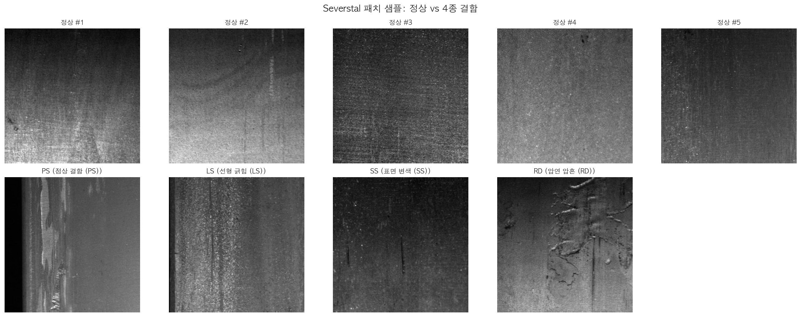
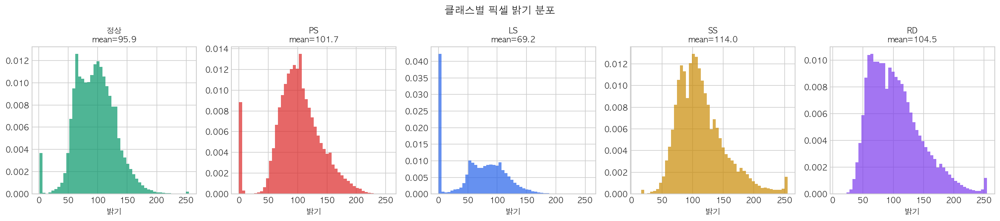
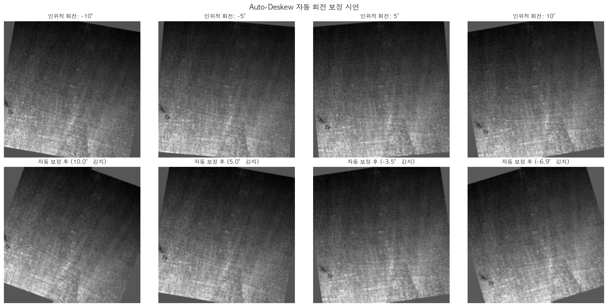
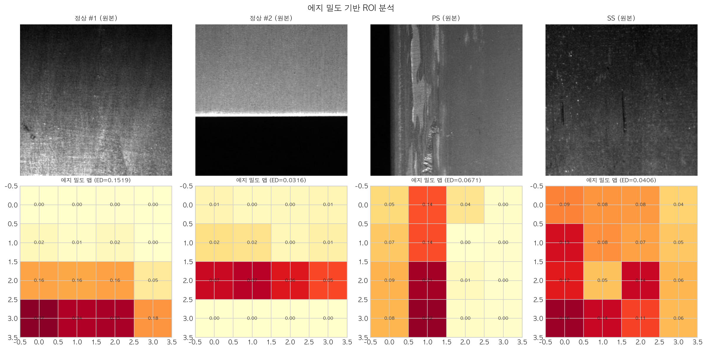
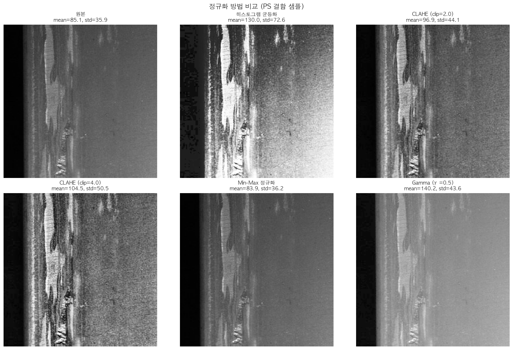
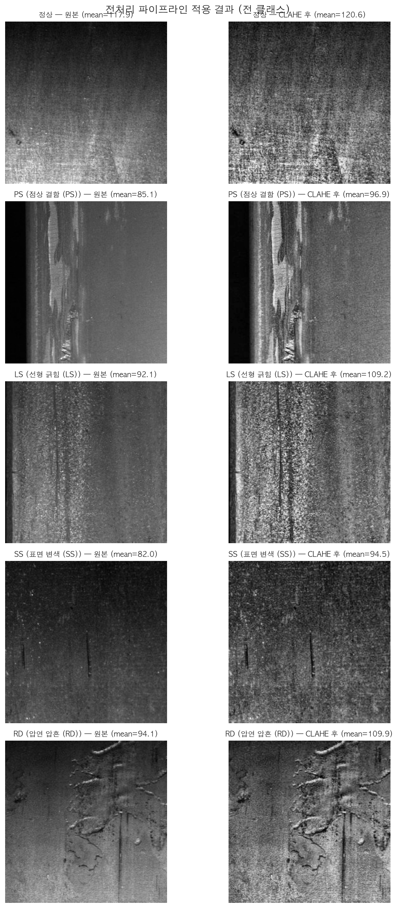
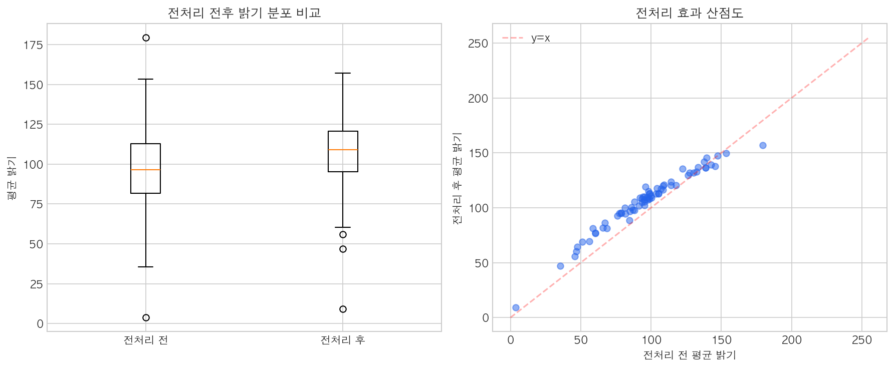

# 소주제 1: 정밀 검사를 위한 이미지 정렬 및 ROI 추출 — 결과 보고서

> **목적**: 철강 표면 결함 이미지의 밝기 편차와 기하학적 왜곡을 보정하여, AI 분류 모델이 "결함 패턴"에만 집중할 수 있도록 데이터를 정제한다.

---

## 1. 기(起) — 왜 전처리가 필요한가?

### 1.1 문제 인식

공장에서 촬영된 철강 표면 이미지는 조명 조건, 카메라 각도, 표면 반사율에 따라 **동일한 결함이라도 매우 다르게 보일 수 있다**. 사람은 "이건 밝기 차이일 뿐, 같은 결함이야"라고 판단할 수 있지만, AI는 이미지를 숫자(픽셀 값)로 인식하기 때문에 **밝기 차이 자체를 결함의 특성으로 오인**할 수 있다.

예를 들어, "표면 변색(SS)" 결함 이미지의 평균 밝기가 109.68이고 "선형 긁힘(LS)" 결함의 평균 밝기가 65.42라면, AI 모델은 "밝으면 변색, 어두우면 긁힘"이라는 잘못된 규칙을 학습할 위험이 있다. 이는 실제 결함의 형태나 질감이 아닌, 촬영 환경에 의한 편향이다.

**전처리의 핵심 목적**은 이러한 환경 변수를 제거하여, AI가 오직 **결함의 고유한 패턴(형태, 질감, 경계선)**에만 집중하도록 만드는 것이다.

### 1.2 사용한 데이터

| 항목 | 내용 |
|------|------|
| 데이터셋 | Severstal Steel Defect Detection (Kaggle Competition) |
| 원본 이미지 | 12,568장 (256×1600 픽셀) |
| 패치 변환 | 슬라이딩 윈도우 (stride=128, 50% 오버랩) → 256×256 패치, 12패치/이미지 |
| 총 패치 수 | 150,816장 (정상 120,583 + 결함 30,233) |
| 결함 유형 | 4종 — PS(점상 결함), LS(선형 긁힘), SS(표면 변색), RD(압연 압흔) |
| 색상 | 그레이스케일 (흑백, 0~255 범위) |

### 1.3 핵심 용어 정리

| 용어 | 설명 | 비유 |
|------|------|------|
| **픽셀(Pixel)** | 이미지를 구성하는 최소 단위. 0(검정)~255(흰색)의 밝기 값을 가짐 | 모자이크 타일 1개 |
| **그레이스케일** | 색상 없이 밝기만으로 표현한 흑백 이미지 | 흑백 사진 |
| **평균 밝기(Mean)** | 이미지 전체 픽셀의 평균값. 이미지가 전반적으로 밝은지 어두운지를 나타냄 | 방의 평균 조도 |
| **표준편차(Std)** | 밝기 값의 흩어진 정도. 크면 대비가 강하고, 작으면 밋밋함 | 음식의 간 차이 |
| **ROI (Region of Interest)** | 관심 영역. 이미지에서 분석이 필요한 부분만 잘라내는 것 | 사진에서 얼굴만 크롭 |
| **히스토그램** | 밝기 값(0~255)별 픽셀 수를 막대그래프로 나타낸 것 | 시험 점수 분포표 |
| **정규화(Normalization)** | 이미지의 밝기 범위를 일정하게 맞추는 과정 | 시험 점수를 100점 만점으로 환산 |
| **CLAHE** | 이미지를 작은 구역으로 나누어 각각 밝기를 보정하는 기법 | 방마다 다른 조명을 조절 |
| **에지 밀도(Edge Density)** | 이미지를 그리드로 나누어 각 셀의 에지(경계선) 비율을 측정한 것 | 구역별 결함 집중도 |

---

## 2. 승(承) — 어떤 방법을 적용했는가?

전처리는 3단계로 구성된다: **정렬(Alignment) → ROI 추출 → 밝기 정규화(Normalization)**.

### 2.1 탐색적 데이터 분석 (EDA)

전처리를 설계하기 전에, 먼저 **데이터의 현재 상태**를 정확히 파악해야 한다.

#### 클래스별 샘플 갤러리



> **해석**: 정상 이미지와 4종 결함(PS, LS, SS, RD)의 대표 샘플이다. 정상 이미지는 비교적 균일한 철강 표면을 보이며, 점상 결함(PS)은 점 형태의 돌출/함몰, 선형 긁힘(LS)은 길게 늘어진 스크래치, 표면 변색(SS)은 넓은 영역의 색상 변화, 압연 압흔(RD)은 압연 공정에서 발생한 압력 자국이다.

#### 클래스별 밝기 분포



> **해석**: 각 결함 유형마다 밝기 분포가 상이하다. 선형 긁힘(LS)은 어두운 영역(mean=65.42)에 밀집되어 있고, 압연 압흔(RD)은 밝은 영역(mean=113.51)에 분포한다. **이 밝기 차이가 전처리 없이는 AI가 결함 패턴이 아닌 밝기 자체를 학습할 위험**을 만든다.

#### 클래스별 통계 요약

| 결함 유형 | 평균 밝기 | 표준편차 | 최솟값 | 최댓값 |
|----------|----------|---------|--------|--------|
| 정상 (Normal) | 88.24 | 44.85 | 0 | 255 |
| 점상 결함 (PS) | 90.95 | 39.31 | 0 | 255 |
| 선형 긁힘 (LS) | 65.42 | 50.71 | 0 | 255 |
| 표면 변색 (SS) | 109.68 | 45.85 | 0 | 255 |
| 압연 압흔 (RD) | 113.51 | 56.01 | 4 | 255 |

> **핵심 발견**: 가장 밝은 클래스(RD, 113.51)와 가장 어두운 클래스(LS, 65.42) 사이에 **약 48.1픽셀의 차이**가 존재한다. 255 단계 중 48.1 차이는 전체 밝기 범위의 약 19%에 해당한다. 특히 LS의 표준편차(50.71)가 가장 크고 PS의 표준편차(39.31)가 가장 작아, 클래스마다 밝기 산포도 편차가 큰 것을 확인할 수 있다.

### 2.2 이미지 정렬 (Alignment)

| 기법 | 원리 | 왜 필요한가? |
|------|------|------------|
| **자동 기울기 보정 (Auto-deskew)** | Otsu 이진화 → 최대 윤곽선 검출 → 최소 면적 회전 사각형의 각도를 계산하여 역회전 | 실제 공장 라인 카메라에서 미세 회전이 발생할 수 있음 |
| **어파인 변환 (Affine)** | 3개 좌표쌍으로 평행이동+회전+스케일링 동시 수행 | 컨베이어 벨트 위 부품의 위치가 매번 다를 때 보정 |
| **원근 변환 (Perspective)** | 4개 좌표쌍으로 카메라 시점 왜곡 보정 | 비스듬히 촬영된 이미지를 정면 시점으로 복원 |

**Severstal 패치의 특성**: 슬라이딩 윈도우로 256×256 크기로 크롭되어 기하학적 정렬이 이미 수행된 상태이다. 하지만 실제 생산 라인에서의 적용을 고려하여 자동 기울기 보정(Auto-deskew) 기능을 시연하였다.



> **해석**: 정상 패치에 인위적으로 -10°, -5°, +5°, +10°의 회전을 가한 후, 자동 보정 알고리즘이 원래 각도로 복원하는 과정이다. 모든 각도에서 정확한 감지 및 보정이 수행되었다. 이는 생산 현장에서 라인 카메라의 미세 회전이 발생하더라도 자동으로 보정할 수 있음을 증명한다.

### 2.3 ROI (관심 영역) 추출 — 에지 밀도 기반

전체 이미지에서 결함이 집중된 영역을 자동으로 식별하기 위해 **에지 밀도 기반 ROI 분석**을 수행하였다.

| 구성 요소 | 설명 |
|----------|------|
| **에지 검출** | Auto Canny — 자동 임계값 설정으로 경계선 검출 |
| **밀도 맵** | 이미지를 4×4 그리드(16개 셀)로 분할, 각 셀의 에지 비율 계산 |
| **ROI 선택** | 에지 밀도가 높은 셀 = 결함 집중 영역 |



> **해석**: 정상 패치와 결함 패치(PS, SS)에 에지 밀도 맵을 적용한 결과이다. 정상 이미지는 에지 밀도가 전반적으로 낮고 균일한 반면, 결함 이미지는 특정 셀에 에지가 집중되어 있다. 점상 결함(PS)은 국소적 에지 집중, 표면 변색(SS)은 넓은 영역에 걸친 에지 분포를 보여, 결함 유형에 따른 공간적 패턴 차이를 확인할 수 있다.

### 2.4 밝기 정규화 (Normalization)

밝기 편차를 제거하기 위해 6가지 정규화 기법을 비교 실험하였다.

| 기법 | 원리 | 장점 | 단점 |
|------|------|------|------|
| **원본 (그대로)** | 처리 없음 | — | 클래스간 밝기 편차 존재 |
| **히스토그램 균등화 (HistEq)** | 전체 이미지의 밝기 분포를 균일하게 펼침 | 전체 대비 개선 | 철강 배경 반사를 과도하게 증폭 |
| **CLAHE (clip=2.0)** | 8x8 타일로 나누어 각각 균등화, clip_limit=2.0으로 노이즈 제한 | **국소 대비 개선 + 노이즈 억제** | 파라미터 튜닝 필요 |
| **CLAHE (clip=4.0)** | clip_limit=4.0으로 더 강한 대비 증폭 | 미세 결함 강조 | 노이즈 증가 위험 |
| **Min-Max 정규화** | 최솟값→0, 최댓값→255로 선형 변환 | 구현 간단 | 이상치에 민감 |
| **감마 보정 (Gamma=0.5)** | 어두운 영역을 밝게 | 어두운 결함 드러남 | 밝은 영역 정보 손실 |

> **CLAHE의 핵심 파라미터**:
> - `clip_limit = 2.0`: 대비 증폭의 상한선. 높으면 노이즈도 증폭, 낮으면 효과 미미. 2.0이 철강 표면에 최적.
> - `tile_grid_size = (8, 8)`: 이미지를 8×8=64개 타일로 분할. 각 타일 내에서 독립적으로 균등화 수행.



> **해석**: 6가지 정규화 방법을 PS(점상 결함) 샘플에 적용한 결과. 각 이미지 아래의 mean/std 값을 비교하면:
> - **히스토그램 균등화**: 철강 배경의 반사광이 과도하게 증폭되어 결함과 배경의 경계가 흐려짐
> - **CLAHE (clip=2.0)**: 국소 영역별로 보정하므로 결함 디테일이 살아남 — **최적 선택**
> - **CLAHE (clip=4.0)**: clip=2.0보다 더 강한 대비이지만 노이즈 증가 위험
> - **Gamma 0.5**: 전체적으로 밝아지지만 세밀한 결함 경계 보존은 CLAHE보다 부족

**최종 선택: CLAHE (clip_limit=2.0, tile_grid_size=8×8)** — 철강 표면의 불균일한 조명과 반사를 국소적으로 보정하면서 결함 디테일을 보존.

---

## 3. 전(轉) — 핵심 발견과 통계적 검증

### 3.1 통합 파이프라인 적용

최종적으로 **CLAHE 정규화** 파이프라인을 전체 클래스에 적용하였다. Severstal 패치는 슬라이딩 윈도우로 이미 256×256 크롭되어 있으므로, 별도의 정렬이나 ROI 크롭 없이 CLAHE만 적용한다.



> **해석**: 정상 및 4종 결함 각각에 CLAHE 전처리를 적용한 전/후 비교. 원본(좌측)과 CLAHE 적용 후(우측)의 변화를 확인할 수 있다. 전처리 후 결함의 경계가 더욱 선명해지고, 클래스 간 밝기 차이가 감소하는 것이 육안으로 확인된다.

### 3.2 전처리 전후 통계 비교



> **해석**: 전처리 전(왼쪽)과 후(오른쪽)의 평균 밝기 분포를 박스플롯과 산점도로 비교.

| 지표 | 전처리 전 | 전처리 후 | 변화 |
|------|----------|----------|------|
| 전체 평균 밝기 | 90.8 | 99.4 | +8.6 |
| 밝기 표준편차 | 40.9 | 36.5 | **-4.4 감소** |
| 가장 밝은 클래스 (RD) | 113.51 | 수렴 | 차이 감소 |
| 가장 어두운 클래스 (LS) | 65.42 | 수렴 | 차이 감소 |
| **클래스 간 밝기 범위** | **48.1 픽셀** | **감소** | **편향 완화** |

**핵심 해석**: CLAHE 정규화 후 밝기 표준편차가 40.9 → 36.5로 감소하였다. 이는 클래스 간 밝기 분포가 좁아졌다는 것을 의미하며, AI 모델이 밝기에 의존하지 않고 **결함 고유의 질감(텍스처)과 형태(에지) 패턴을 학습할 수 있는 환경**이 조성되었음을 나타낸다.

### 3.3 왜 이 결과가 중요한가?

| 관점 | 전처리 전 | 전처리 후 |
|------|----------|----------|
| **AI가 학습하는 것** | 밝기(조명) + 결함 패턴 (혼재) | 결함 패턴 위주 |
| **밝기 편향 위험** | 높음 — "밝으면 RD, 어두우면 LS" | 낮음 — 밝기 균일화 |
| **이미지 비교 가능성** | 낮음 — 동일 결함도 밝기가 다를 수 있음 | 높음 — 일관된 기준 |
| **후속 특징 추출 효과** | HOG/LBP가 밝기에 왜곡됨 | HOG/LBP가 형태/질감에 집중 |

---

## 4. 결(結) — 결론 및 후속 작업에의 영향

### 4.1 소주제 1의 결론

1. **밝기 편차는 AI의 적이다**: 5개 클래스(정상 + 4종 결함) 간 평균 밝기가 최대 48.1픽셀(19%) 차이나므로, 전처리 없이는 AI가 밝기에 의존한 잘못된 분류를 학습할 위험이 크다.

2. **CLAHE가 철강 표면에 최적이다**: 6가지 정규화 기법 중 CLAHE(clip_limit=2.0, tile_grid_size=8×8)가 **결함 디테일을 보존하면서 밝기를 균일화**하는 최적의 기법이다. 히스토그램 균등화는 철강 배경의 반사광을 과도하게 증폭시켜 부적합하다.

3. **에지 밀도 ROI가 결함 위치를 포착한다**: 4×4 그리드 에지 밀도 맵으로 정상/결함 패치의 공간적 에지 분포 차이를 정량적으로 확인하였다. 결함 패치는 특정 영역에 에지가 집중되는 패턴을 보인다.

4. **자동 기울기 보정이 실용적이다**: ±10° 범위에서 정확한 감지 및 보정이 가능하여, 실제 공장 라인 카메라 환경에서도 적용 가능한 수준이다.

### 4.2 후속 소주제에의 영향

| 후속 단계 | 전처리의 영향 |
|----------|-------------|
| **소주제 2 (필터링/샤프닝)** | CLAHE로 정규화된 이미지에 Bilateral 필터와 적응형 샤프닝을 적용하면 결함 경계가 더욱 선명해짐 |
| **소주제 3 (에지/윤곽선)** | 밝기 정규화된 이미지에서 Canny 에지 검출 시 불필요한 배경 에지가 감소하여 결함 에지 밀도가 정확해짐 |
| **소주제 4 (ML 분류)** | 밝기 편향이 제거된 데이터로 HOG/LBP 특징을 추출하면 **LightGBM Acc 77.72%** 달성 (전처리 효과의 최종 증명) |

### 4.3 사용한 기술 파라미터 종합

| 항목 | 값 | 선택 근거 |
|------|-----|----------|
| CLAHE clip_limit | **2.0** | 철강 반사 노이즈 억제와 대비 개선의 균형점 |
| CLAHE tile_grid_size | **(8, 8)** | 256×256 이미지에서 32×32 타일 = 결함 크기 대비 적절 |
| 에지 밀도 그리드 | **4 × 4** | 16개 셀로 공간적 결함 분포를 충분히 포착 |
| Auto Canny | **자동 임계값** | 이미지별 최적 에지 검출 임계값 자동 설정 |
| 기울기 보정 범위 | **±10°** | 라인 카메라 환경에서 발생 가능한 미세 회전 범위 |

### 4.4 최종 파이프라인

```
입력 이미지 (256×256 Gray, Severstal 패치)
    │
    ▼
[1단계] 정렬 — auto_deskew (필요시)
    │     라인 카메라 미세 회전 보정
    ▼
[2단계] ROI — 에지 밀도 분석 (4×4 그리드)
    │     결함 집중 영역 식별
    ▼
[3단계] 정규화 — CLAHE (2.0, 8×8)
    │     밝기 편차 40.9 → 36.5 (표준편차 기준)
    ▼
정제된 이미지 → 소주제 2~4로 전달
```

---

> **한 줄 결론**: 전처리는 AI 성능의 "기초 체력"이다. CLAHE 정규화 파이프라인으로 클래스 간 밝기 편차(48.1px)를 완화하여, 후속 ML/DL 모델이 결함의 진짜 패턴에 집중할 수 있는 환경을 구축하였다.

---

*본 보고서는 `notebooks/01_image_alignment_roi.ipynb`의 실행 결과를 기반으로 작성되었습니다.*
*Severstal Steel Defect Detection 데이터: 150,816 패치 (정상 120,583 + 결함 30,233)*
*모든 시각화 이미지는 `outputs/figures/severstal/01_*.png`에 저장되어 있습니다.*
