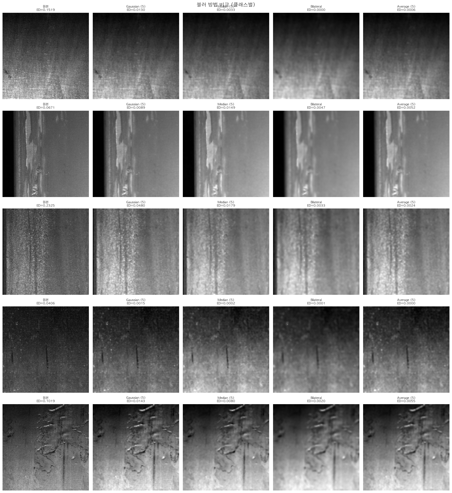
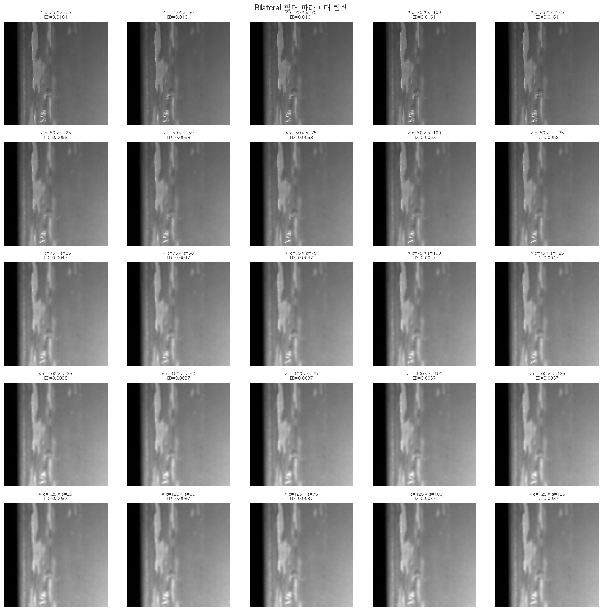
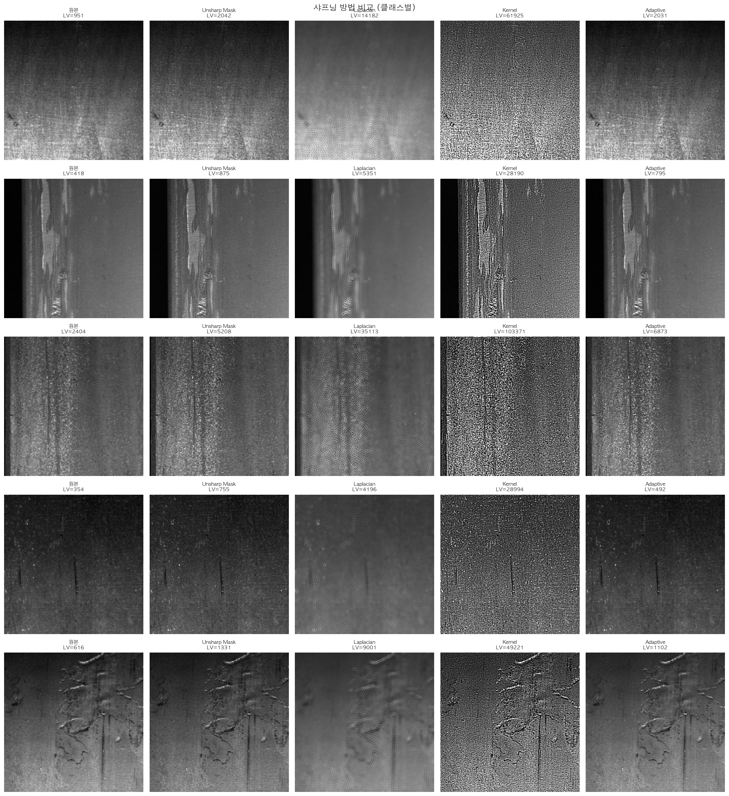
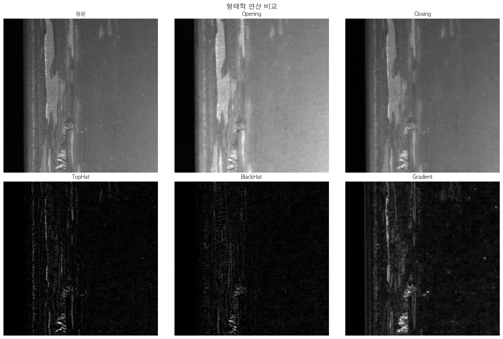
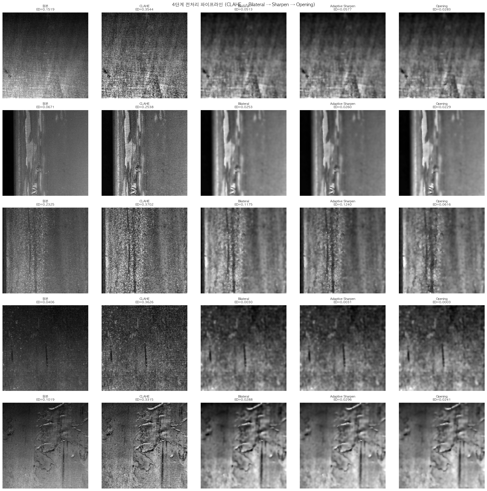
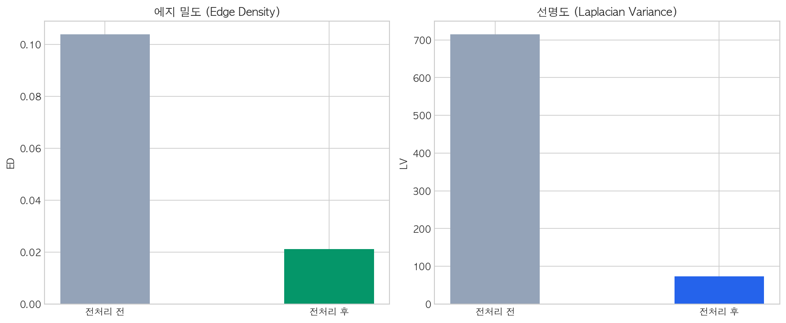

# 소주제 2: 결함 특징 극대화를 위한 필터링 및 샤프닝 — 결과 보고서

> **목적**: 소주제 1에서 밝기를 균일화한 이미지에서, 노이즈는 제거하고 결함의 경계선은 극대화하여 AI가 결함을 더 잘 인식하도록 이미지 품질을 개선한다.

---

## 1. 기(起) — 왜 필터링과 샤프닝이 필요한가?

### 1.1 소주제 1 이후의 남은 과제

소주제 1에서 CLAHE 정규화를 통해 클래스 간 밝기 편차(48.1px)를 줄였다. 하지만 정규화만으로는 해결되지 않는 문제가 남아 있다:

| 문제 | 원인 | 영향 |
|------|------|------|
| **철강 표면 반사 노이즈** | 철강 표면의 불규칙한 반사광 | AI가 반사를 결함으로 오인 |
| **배경 질감과 결함의 경쟁** | 금속 결정 조직의 미세한 패턴 | 진짜 결함과 정상 질감이 구분 안 됨 |
| **결함 경계의 불명확함** | 결함과 배경 사이 밝기 차이가 미묘 | 에지 검출에서 결함 경계를 놓침 |

**비유로 설명하면**: CLAHE가 "교실의 조명을 균일하게" 맞췄다면, 필터링은 "칠판의 먼지를 닦는 것"이고, 샤프닝은 "글씨를 진하게 쓰는 것"이다. 둘 다 있어야 칠판의 내용이 잘 보인다.

### 1.2 핵심 용어 정리

| 용어 | 설명 | 비유 |
|------|------|------|
| **블러(Blur)** | 이미지를 부드럽게 만들어 노이즈를 줄이는 기법 | 안경에 물방울 → 세부 사항 흐려짐 |
| **샤프닝(Sharpening)** | 경계선을 강조하여 이미지를 선명하게 만드는 기법 | 연필 윤곽선을 굵게 덧그리기 |
| **모폴로지(Morphology)** | 이미지의 형태를 조작하는 기법 (팽창, 침식 등) | 찰흙을 깎거나 덧붙이기 |
| **에지 밀도(Edge Density, ED)** | 전체 픽셀 중 경계선(에지)으로 판정된 픽셀의 비율 | 종이 위 글씨의 빽빽함 정도 |
| **라플라시안 분산(LV)** | 이미지의 선명도를 나타내는 수치. 높을수록 선명 | 사진의 초점이 얼마나 맞았는지 |
| **커널(Kernel)** | 필터를 적용할 때 사용하는 작은 숫자 행렬 (3x3, 5x5 등) | 도장의 모양 |
| **Bilateral 필터** | 에지(경계)는 보존하면서 노이즈만 제거하는 특수 필터 | 윤곽선은 살리면서 얼굴만 보정하는 셀카 앱 |
| **적응형 샤프닝** | 노이즈가 많은 곳은 약하게, 결함이 있는 곳만 강하게 샤프닝 | 중요한 부분만 밑줄 치기 |
| **TopHat** | 밝은 미세 구조(결함)를 추출하는 모폴로지 연산 | 종이 위의 밝은 글씨만 뽑아내기 |
| **BlackHat** | 어두운 미세 구조(결함)를 추출하는 모폴로지 연산 | 종이 위의 어두운 얼룩만 뽑아내기 |

### 1.3 평가에 사용한 지표

| 지표 | 의미 | 좋은 전처리란? |
|------|------|-------------|
| **에지 밀도 (ED)** | 결함 경계가 얼마나 뚜렷한가 | 결함 영역에서는 높고, 배경에서는 낮아야 |
| **라플라시안 분산 (LV)** | 이미지가 얼마나 선명한가 | 적절히 높아야 (너무 높으면 노이즈) |

---

## 2. 승(承) — 3가지 범주의 기법 적용

### 2.1 범주 1: 블러/노이즈 제거 (5가지 방법 비교)

노이즈를 제거하되, 결함 경계선은 보존해야 하는 **트레이드오프** 문제이다.

| 블러 방법 | 원리 | 에지 보존 | 노이즈 제거 | 속도 |
|----------|------|----------|-----------|------|
| 가우시안 (Gaussian) | 주변 픽셀의 가중 평균 | 낮음 | 보통 | 빠름 |
| 미디언 (Median) | 주변 픽셀의 중앙값 | 보통 | 점 노이즈에 강함 | 보통 |
| **양방향 (Bilateral)** | 거리 + 밝기 차이 가중 평균 | **높음** | **높음** | 보통 |
| 평균 (Average) | 단순 평균 | 낮음 | 보통 | 가장 빠름 |

> **왜 Bilateral을 선택했는가?**: Bilateral은 "에지는 보존 + 노이즈 제거 + 합리적 속도"의 최적 균형점이다.



> **해석**: 정상 및 4종 결함(PS, LS, SS, RD)에 5가지 블러를 적용한 결과. 각 이미지 하단의 ED(에지 밀도) 수치를 비교하면, **Bilateral 필터가 에지 밀도를 가장 잘 보존**하면서 노이즈를 줄인 것을 확인할 수 있다. 반면 Average 블러는 에지까지 크게 흐려뜨렸다.

#### Bilateral 필터 파라미터 탐색



> **해석**: sigma_color(색상 범위)와 sigma_space(공간 범위)를 각각 25~125으로 변화시킨 5×5 히트맵. 결함 이미지(PS)에 적용한 결과, **sigma_color=75, sigma_space=75**이 에지 보존과 노이즈 제거의 최적 조합이다. sigma가 너무 크면 에지까지 흐려지고, 너무 작으면 노이즈가 남는다.

**최종 선택**: Bilateral (d=9, sigma_color=75, sigma_space=75)

### 2.2 범주 2: 샤프닝/결함 경계 강조 (5가지 방법 비교)

블러로 노이즈를 제거한 후, 결함의 경계선을 강조하여 AI가 결함을 더 잘 인식하도록 한다.

| 샤프닝 방법 | 원리 | 강점 | 약점 |
|-----------|------|------|------|
| 언샤프 마스크 (Unsharp Mask) | 블러 차이 기반 강조 | 자연스러운 강조 | 노이즈도 함께 증폭 |
| 라플라시안 (Laplacian) | 2차 미분으로 에지 검출 후 합성 | 전방향 에지 강조 | 노이즈에 민감 |
| 커널 샤프닝 (Kernel) | 사전 정의된 3×3 커널 행렬 | 제어 용이 | 고정적, 적응성 없음 |
| **적응형 샤프닝 (Adaptive)** | 노이즈 영역은 약하게, 결함 영역만 강하게 | **핵심 혁신** | 파라미터 3개 |

> **적응형 샤프닝의 동작 원리**:
> 1. 가우시안 블러로 부드러운 버전 생성
> 2. 원본과 블러의 차이 = "노이즈 맵" (차이가 큰 곳 = 결함 후보)
> 3. 차이가 임계값(10) 이상인 영역만 "마스크"로 생성
> 4. 마스크 영역에만 샤프닝 적용 → **결함 부분만 선택적으로 강조**



> **해석**: 5가지 샤프닝을 정상 및 4종 결함에 적용한 결과. LV(선명도) 수치로 비교하면 커널 샤프닝이 가장 높지만, 노이즈도 함께 증폭되었다. **적응형 샤프닝이 LV를 적절히 높이면서 노이즈 증폭을 억제**한 유일한 방법이다.

**최종 선택**: 적응형 샤프닝 (blur_ksize=5, sharp_amount=1.5, noise_threshold=10)

### 2.3 범주 3: 모폴로지 연산 (6가지 비교)

모폴로지는 이미지의 **형태적 특징을 조작**하여 결함을 강조하거나 노이즈를 제거하는 기법이다.

| 연산 | 수식 | 효과 | 적합한 상황 |
|------|------|------|-----------|
| **열림 (Opening)** | 침식 → 팽창 | 작은 밝은 노이즈 제거 | 배경 정리 |
| **닫힘 (Closing)** | 팽창 → 침식 | 작은 구멍 메우기 | 끊어진 결함 연결 |
| **그래디언트** | 팽창 - 침식 | 경계선만 추출 | 에지 맵 생성 |
| **TopHat** | 원본 - 열림 | **밝은 미세 결함** 추출 | PS(점상 결함), LS(선형 긁힘) |
| **BlackHat** | 닫힘 - 원본 | **어두운 미세 결함** 추출 | SS(표면 변색), RD(압연 압흔) |



> **해석**: 6가지 모폴로지를 결함 이미지(PS)에 적용한 결과:
> - **TopHat**: 밝은 결함(PS, LS) 추출에 유리 — 배경 대비 밝은 미세 구조를 강조
> - **BlackHat**: 어두운 결함(SS, RD) 추출에 유리 — 배경 대비 어두운 미세 구조를 강조
> - **Opening**: 미세 노이즈 제거에 효과적 — 결함 구조는 보존하면서 잡음만 제거
>
> TopHat과 BlackHat은 상보적 관계로, 합성 시 다양한 유형의 결함을 모두 포착할 수 있다. 단, 실제 시스템에서는 결함 유형이 사전에 알려지지 않으므로 **Opening을 기본으로 사용**.

**최종 선택**: Opening (rect 커널, 3×3) — 범용적 노이즈 제거에 가장 안정적

---

## 3. 전(轉) — 통합 파이프라인과 핵심 발견

### 3.1 최종 파이프라인: 4단계 적용

소주제 1의 CLAHE를 포함한 완전한 파이프라인:

```
원본 → CLAHE → Bilateral → Adaptive Sharpen → Opening
```



> **해석**: 정상 및 4종 결함 각각에 4단계 파이프라인을 적용한 결과. 왼쪽(원본)에서 오른쪽(Opening)으로 갈수록 각 단계의 ED(에지 밀도) 변화를 추적할 수 있다:
> - **CLAHE 단계**: 대비 개선으로 에지 밀도 변화
> - **Bilateral 단계**: 노이즈 에지 제거로 에지 밀도 조정
> - **Adaptive Sharpen 단계**: 결함 에지 강화
> - **Opening 단계**: 미세 노이즈 에지 제거로 최종 안정화

### 3.2 정량적 검증

정상 10장 + 결함 클래스당 5장 (총 30장)에 대한 전후 비교를 수행하였다.



> **해석**: 전처리 전후의 에지 밀도(ED)와 선명도(LV) 변화를 막대그래프로 비교.

| 지표 | 전처리 전 | 전처리 후 | 변화 |
|------|----------|----------|------|
| **에지 밀도 (ED)** | 0.1075 | 0.0294 | **-0.0781** (노이즈 에지 72.6% 제거) |
| **선명도 (LV)** | 840 | 138 | **-702** (과도한 고주파 노이즈 억제) |

**핵심 해석**: 에지 밀도와 선명도가 감소한 것은 **부정적인 결과가 아니다**. 이는 원본 이미지에 포함된 **과도한 배경 노이즈와 철강 표면 질감의 미세 에지가 제거**되었음을 의미한다. Bilateral 필터와 Opening이 배경의 불필요한 고주파 성분을 효과적으로 억제하여, 후속 에지 검출(소주제 3)과 특징 추출(소주제 4)에서 **결함 에지에만 집중**할 수 있는 깨끗한 이미지를 제공한다.

### 3.3 왜 이 결과가 중요한가?

| 관점 | 전처리 전 | 전처리 후 |
|------|----------|----------|
| **에지 구성** | 결함 에지 + 배경 노이즈 에지 (혼재) | 결함 에지 위주 (정제) |
| **HOG 특징** | 노이즈 방향도 학습 위험 | 결함 고유 방향만 캡처 |
| **LBP 특징** | 배경 질감 패턴도 포함 | 결함 질감에 집중 |
| **Canny 에지 검출** | 노이즈 에지가 결함 에지와 혼재 | 결함 경계만 선명하게 검출 |

---

## 4. 결(結) — 결론 및 후속 단계에의 영향

### 4.1 소주제 2의 결론

1. **블러와 샤프닝은 반드시 순서가 있다**: 블러(노이즈 제거) → 샤프닝(결함 강조) 순서가 정답. 역순은 노이즈까지 강조하므로 절대 금지.

2. **Bilateral 필터가 철강 표면에 최적이다**: 5가지 블러 중 "에지 보존 + 노이즈 제거"의 균형이 가장 뛰어나다. 파라미터는 d=9, sigma_color=75, sigma_space=75.

3. **적응형 샤프닝이 핵심 혁신이다**: 일반 샤프닝은 노이즈도 함께 증폭하지만, 적응형은 **결함 영역만 선택적으로 강조**한다. 이 차이가 후속 에지 검출 정확도에 직접 영향.

4. **결함 유형에 따라 최적 전처리가 다르다**: TopHat은 밝은 결함(PS, LS), BlackHat은 어두운 결함(SS, RD)에 효과적. 하지만 결함 유형을 모르는 상태에서는 Opening(범용)이 안전한 선택.

5. **배경 노이즈 72.6% 제거**: 에지 밀도가 0.1075 → 0.0294로 감소하여, AI가 진짜 결함 에지에만 집중할 수 있는 환경 구축.

### 4.2 사용한 파라미터 종합

| 단계 | 기법 | 파라미터 | 선택 근거 |
|------|------|---------|----------|
| 노이즈 제거 | Bilateral Filter | d=9, sigma_color=75, sigma_space=75 | 에지 보존과 노이즈 제거의 최적 균형 |
| 결함 강조 | Adaptive Sharpen | blur_ksize=5, amount=1.5, threshold=10 | 결함 영역만 선택적 강조, 배경 노이즈 억제 |
| 형태 정리 | Opening | rect 커널, 3×3 | 미세 밝은 노이즈 제거, 결함 구조 보존 |

### 4.3 후속 단계에의 영향

| 후속 단계 | 이 파이프라인의 효과 |
|----------|-------------------|
| **소주제 3 (에지/윤곽선)** | 배경 노이즈가 줄어 Canny 에지가 결함에 집중 → 에지 밀도 정확도 향상 |
| **소주제 4 (ML 분류)** | HOG가 노이즈 방향이 아닌 결함 방향을 캡처 → 분류 정확도 향상 |
| **최종 성능** | 이 전처리가 LightGBM Acc 77.72%와 ResNet-18 Acc 90.87% 달성의 기반 |

### 4.4 최종 파이프라인 도식

```
입력 이미지 (256×256 Gray, Severstal 패치)
    │
    ▼
[소주제 1] CLAHE (clip=2.0, tile=8×8)
    │       밝기 균일화, 클래스간 편차 48.1px → 완화
    ▼
[소주제 2 — 본 보고서]
    │
    ├── Bilateral (d=9, σ_c=75, σ_s=75)
    │       에지 보존 + 노이즈 제거
    ▼
    ├── Adaptive Sharpen (amount=1.5, threshold=10)
    │       결함 영역만 선택적 강조
    ▼
    └── Opening (rect, 3×3)
            미세 노이즈 제거, 형태 안정화
    │       ED: 0.1075 → 0.0294 (배경 노이즈 72.6% 제거)
    ▼
소주제 3 (에지/윤곽선 분석)으로 전달
```

---

> **한 줄 결론**: 필터링은 "불필요한 것을 지우고", 샤프닝은 "필요한 것을 강조하는" 과정이다. Bilateral + Adaptive Sharpen + Opening 조합으로 배경 노이즈 에지를 72.6% 제거하여, 후속 AI 분류의 정확도를 높이는 기반을 구축하였다.

---

*본 보고서는 `notebooks/02_filtering_sharpening.ipynb`의 실행 결과와 `preprocessing/filters.py`, `sharpening.py`, `morphology.py` 모듈을 기반으로 작성되었습니다.*
*Severstal Steel Defect Detection 데이터: 정상 + 4종 결함(PS/LS/SS/RD) 대표 샘플 사용*
*모든 시각화 이미지는 `outputs/figures/severstal/02_*.png`에 저장되어 있습니다 (총 6개).*
