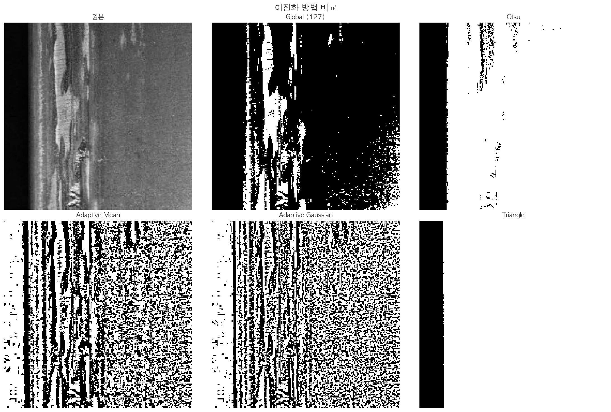
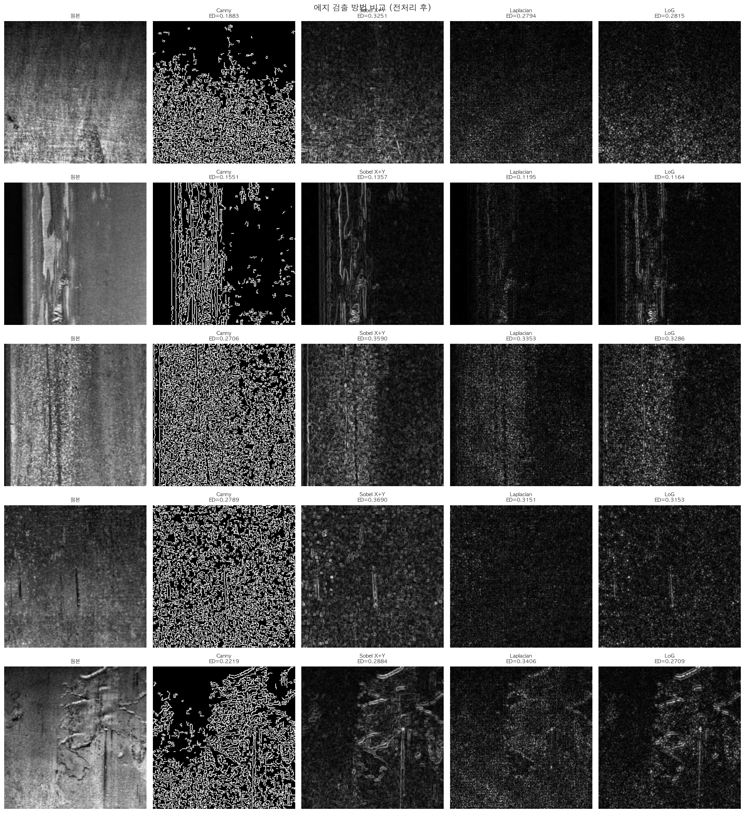
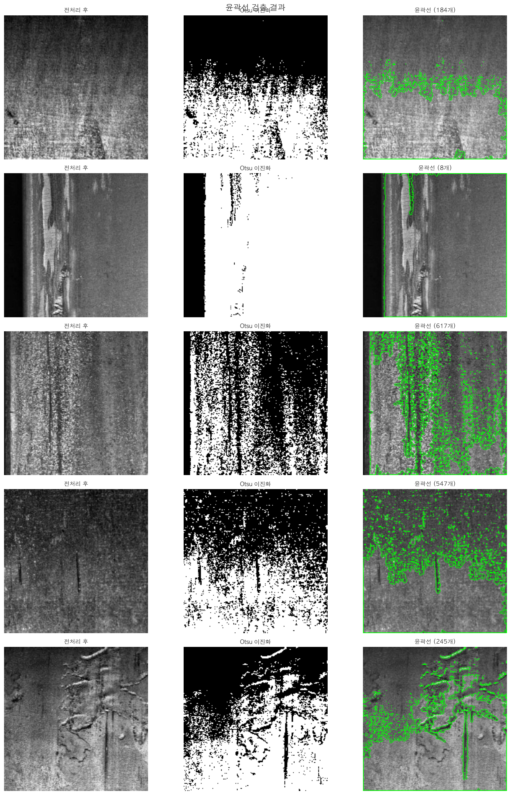
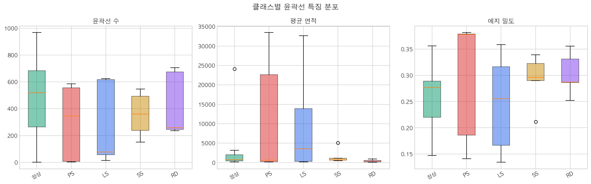
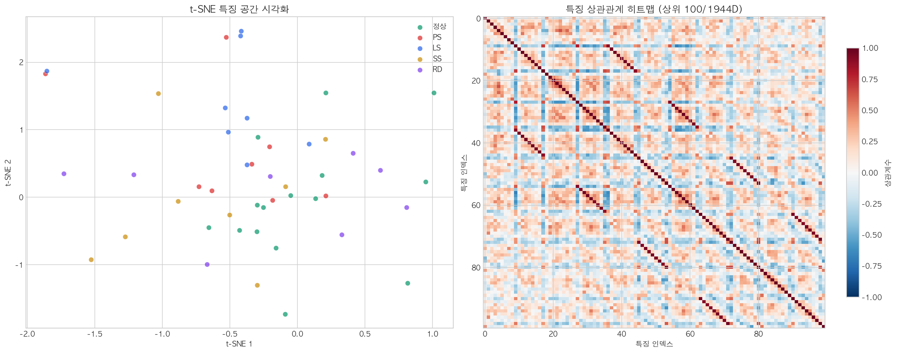
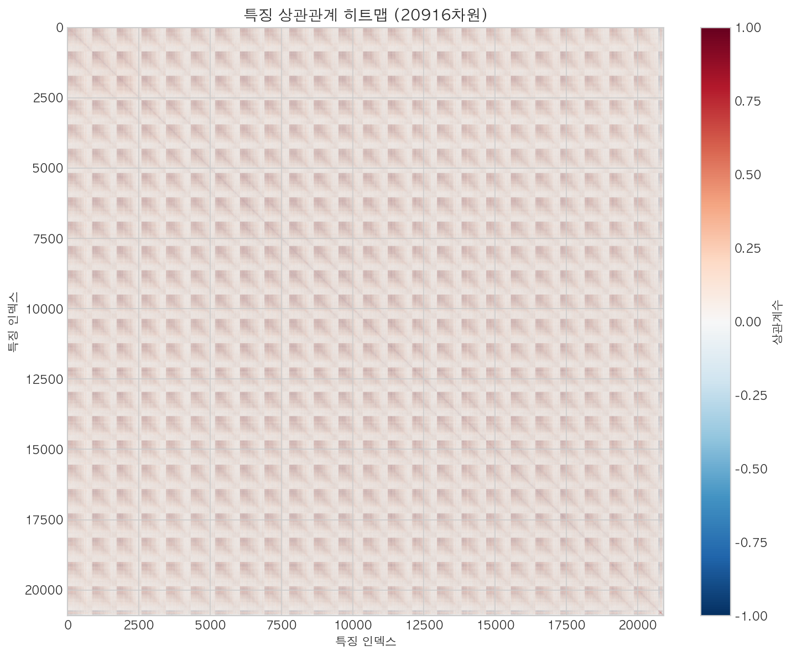

# 소주제 3: 에지 검출 및 윤곽선 기반 특징 분석 — 결과 보고서

> **목적**: 소주제 1~2에서 정제된 이미지에서 결함의 **경계선(에지)**과 **윤곽선(컨투어)**을 추출하고, 이를 숫자 벡터로 변환하여 AI 분류 모델의 입력으로 사용한다.

---

## 1. 기(起) — 왜 에지와 윤곽선을 분석하는가?

### 1.1 지금까지의 여정

| 소주제 | 수행 내용 | 비유 |
|--------|----------|------|
| 소주제 1 | 밝기 균일화 (CLAHE) + ROI 분석 | 시험지를 복사기에 넣기 전 용지 정렬 |
| 소주제 2 | 노이즈 제거 (Bilateral) + 결함 강조 (Adaptive Sharpen) | 형광펜으로 중요한 부분 표시 |
| **소주제 3** | **경계선 추출 + 형태 수치화** | **표시된 부분을 읽고 숫자로 요약** |

소주제 1~2는 이미지를 "AI가 읽기 좋은 상태"로 만든 것이다. 이제 소주제 3에서는 그 이미지에서 **결함의 형태적 특징을 숫자로 추출**한다. 이 숫자들이 바로 AI 분류 모델의 입력이 된다.

### 1.2 사람 vs AI의 결함 인식 방식

| | 사람 | AI |
|---|------|-----|
| **인식 방식** | "이 긁힘은 길고 가느다란 선이네" | [에지 밀도=0.12, 원형도=0.08, 방향=수평] |
| **판단 근거** | 직관, 경험, 맥락 | 숫자 벡터의 수학적 패턴 |
| **강점** | 유연함, 새로운 결함도 인식 | 빠르고, 일관적이며, 지치지 않음 |

에지/윤곽선 분석은 **사람의 직관("이건 긴 선이다, 이건 둥근 점이다")을 숫자로 번역**하는 과정이다.

### 1.3 핵심 용어 정리

| 용어 | 설명 | 비유 |
|------|------|------|
| **에지(Edge)** | 밝기가 급격히 변하는 경계선. 결함과 배경의 경계 | 지도의 해안선 |
| **윤곽선(Contour)** | 에지를 연결한 닫힌 곡선. 결함의 외곽 형태 | 나라의 국경선 |
| **Canny 에지 검출** | 가장 널리 사용되는 에지 검출 알고리즘 | 고성능 경계선 탐지기 |
| **auto_canny** | 이미지 밝기에 맞춰 자동으로 임계값을 조정하는 Canny | 자동 초점 카메라 |
| **에지 밀도(Edge Density)** | 전체 픽셀 중 에지 픽셀의 비율 (0~1) | 종이 위 글씨의 빽빽함 |
| **원형도(Circularity)** | 윤곽선이 원에 얼마나 가까운지 (1.0 = 완벽한 원) | 동그라미 그리기 점수 |
| **종횡비(Aspect Ratio)** | 윤곽선의 가로/세로 비율. 1이면 정사각형, 클수록 길쭉 | 직사각형의 납작한 정도 |
| **Hu 모멘트** | 회전/크기/반전에 불변인 7개의 형태 수치 | 물체의 "지문" — 돌리거나 키워도 동일 |
| **이진화(Thresholding)** | 밝기를 기준으로 흰색(결함)/검정(배경)으로 나누는 것 | "합격/불합격" 기준선 긋기 |
| **Otsu 이진화** | 밝기 히스토그램을 분석하여 최적의 기준값을 자동으로 결정 | 시험 점수에서 가장 적절한 커트라인 자동 계산 |
| **t-SNE** | 고차원 데이터를 2차원으로 압축하여 시각화하는 기법 | 1,944개 과목 성적을 2개 축으로 요약한 지도 |
| **특징 벡터(Feature Vector)** | 이미지 하나를 설명하는 숫자 목록 (본 보고서에서 1,944차원) | 사람의 프로필 — 키, 몸무게, 나이, ... |

---

## 2. 승(承) — 어떤 기법을 적용했는가?

### 2.1 이진화 방법 비교 (6가지)

에지와 윤곽선을 추출하려면 먼저 이미지를 **흰색(전경)과 검정(배경)**으로 나누어야 한다.

| 이진화 방법 | 원리 | 장점 | 적합한 상황 |
|-----------|------|------|-----------|
| 고정 임계값 (127) | 밝기 127 기준으로 나눔 | 가장 단순 | 조명이 일정할 때 |
| **Otsu** | 히스토그램의 두 봉우리 사이 최적값 자동 계산 | **자동, 안정적** | 대부분의 상황 |
| Triangle | 히스토그램 꼬리 기반 | 한쪽으로 치우친 분포에 강함 | 밝거나 어두운 이미지 |
| 적응형 (평균) | 작은 영역(11×11)의 평균으로 지역별 기준 | 불균일 조명 대응 | 조명이 불균일할 때 |
| 적응형 (가우시안) | 가우시안 가중 평균 기준 | 더 부드러운 적응 | 복잡한 조명 환경 |



> **해석**: 6가지 이진화를 결함 이미지(PS)에 적용한 결과. CLAHE 전처리 후 **Otsu**가 결함과 배경을 가장 정확하게 분리하였다. 적응형(가우시안)은 균일하지 않은 조명에서 장점이 있으나, CLAHE 전처리 후에는 Otsu와 차이가 크지 않다.

**최종 선택**: Otsu 이진화 — 자동 + 안정적 + CLAHE 후 효과적

### 2.2 에지 검출 방법 비교 (5가지)

이미지에서 결함의 경계선을 찾는 핵심 단계.

| 에지 검출 방법 | 원리 | 특징 |
|-------------|------|------|
| **Auto Canny** | 중앙값 기반 자동 임계값 Canny | **추천**: 클래스 밝기 차이에 자동 적응 |
| Sobel X+Y | 수평+수직 기울기의 크기 합성 | 방향 정보 확인 가능, 노이즈에 약함 |
| Laplacian | 2차 미분 (모든 방향) | 방향 무관, 노이즈 민감 |
| LoG (Laplacian of Gaussian) | 가우시안 블러 후 라플라시안 | 노이즈에 강함, 작은 결함 검출 |



> **해석**: 5가지 에지 검출을 정상 및 4종 결함(PS, LS, SS, RD)에 적용한 결과. 각 이미지에 ED(에지 밀도) 값이 표시되어 있다. **Auto Canny가 모든 클래스에서 가장 일관된 결과**를 보였다. Sobel은 방향별 에지를 잘 표현하지만 노이즈에 약하고, Laplacian은 전방향 에지를 검출하지만 노이즈에 민감하다.

> **왜 Auto Canny인가?**: Canny 에지 검출의 핵심은 두 개의 임계값(low, high)이다. Auto Canny는 이미지의 중앙값(median)을 기준으로 low=(1-0.33)×median, high=(1+0.33)×median을 자동 계산한다. 클래스마다 밝기가 다르므로 고정 임계값은 부적합하지만, Auto Canny는 **각 이미지에 맞춰 자동 조정**된다.

**최종 선택**: Auto Canny (sigma=0.33) — 클래스 간 밝기 차이에 자동 적응

### 2.3 윤곽선(Contour) 분석

에지를 연결하여 닫힌 형태(윤곽선)를 만들고, 그 형태의 기하학적 특성을 수치화한다.



> **해석**: 정상 및 4종 결함 각각에 대해 전처리 후 → Otsu 이진화 → 윤곽선 검출 과정을 보여준다. 괄호 안 숫자는 검출된 윤곽선 개수이다.
> - **정상**: 비교적 적은 수의 불규칙 윤곽선 (표면 질감)
> - **PS (점상 결함)**: 작은 크기의 다수 윤곽선 (점 패턴)
> - **LS (선형 긁힘)**: 길쭉한 형태의 윤곽선 (선형 패턴)
> - **SS (표면 변색)**: 넓은 면적의 윤곽선 (면적 패턴)
> - **RD (압연 압흔)**: 불규칙한 형태의 윤곽선 (압력 패턴)

#### 윤곽선 특징 통계



> **해석**: 3가지 윤곽선 특징의 클래스별 분포(박스플롯).
>
> **가장 구분력이 높은 특징들**:
> - **윤곽선 수**: 결함 유형에 따라 검출되는 윤곽선 개수가 다름
> - **평균 면적**: SS(표면 변색)가 넓은 면적, PS(점상 결함)가 작은 면적
> - **에지 밀도**: 클래스별 에지 분포 차이가 분류 단서로 활용 가능

---

## 3. 전(轉) — 핵심 발견: 1,944차원 특징 벡터의 위력과 한계

### 3.1 최종 특징 벡터 구성

64×64 리사이즈 기준으로 FeaturePipeline이 추출하는 전체 특징 벡터:

| 범주 | 세부 내용 | 설명 |
|------|----------|------|
| **HOG (Histogram of Oriented Gradients)** | 방향별 그래디언트 히스토그램 | 결함의 형태/방향 패턴 |
| **LBP (Local Binary Pattern)** | 국소 이진 패턴 히스토그램 | 결함의 텍스처/질감 패턴 |
| **픽셀 통계** | 평균, 표준편차, 왜도, 첨도 등 | 밝기 분포 특성 |
| **윤곽선 형태 특징** | 윤곽선 수, 면적, 원형도, 종횡비 등 | 결함의 기하학적 형태 |
| **에지 특징** | 에지 밀도, 방향 히스토그램, 강도 통계 | 경계선의 공간적/방향적 분포 |
| **합계** | | **1,944차원** |

> 한 장의 이미지(64×64=4,096 픽셀)가 **1,944개의 의미 있는 숫자**로 요약된다.

### 3.2 t-SNE 시각화 및 특징 상관 분석



> **해석 (좌측 — t-SNE)**:
> 47장(정상 15 + 결함 32)의 1,944차원 특징 벡터를 2차원으로 압축한 t-SNE 시각화.
>
> **발견**:
> - **정상(초록)**: 비교적 뚜렷한 클러스터 형성 → 정상 패치의 특징이 일관적
> - **LS(파랑, 선형 긁힘)**: 독립적 클러스터 → 높은 종횡비 + 방향 집중으로 구분 가능
> - **PS(빨강) ↔ SS(노랑)**: 일부 겹침 → 에지/윤곽선 특징만으로는 완전 분리 어려움
> - **RD(보라)**: 분산 분포 → 다양한 형태의 압연 압흔이 존재
>
> **결론**: 1,944차원 특징으로도 **부분적 클래스 분리가 가능**하며, ML 분류 모델(소주제 4)의 학습 가능성을 입증.

> **해석 (우측 — 특징 상관관계 히트맵)**:
> - 1,944차원 중 상위 100차원의 상관관계 히트맵
> - 진한 빨강/파랑 = 강한 양/음의 상관 (중복 가능성)
> - **높은 상관관계 쌍(|r|>0.8): 2,610개** — 일부 특징이 유사 정보를 중복 인코딩
> - 차원 축소(PCA) 적용 여지가 있으나, ML 모델이 자체적으로 중요 특징을 선택

### 3.3 특징 상관관계 별도 분석



> **해석**: 전체 특징 벡터의 상관관계 구조를 확인. HOG 블록 내에서 높은 상관이 보이며, 이는 인접한 방향 셀 간의 자연스러운 유사성 때문이다. 윤곽선/에지 특징과 HOG/LBP 특징 간에는 상관이 낮아 **상호 보완적 정보**를 제공함을 확인할 수 있다.

---

## 4. 결(結) — 결론 및 분류 모델에의 영향

### 4.1 소주제 3의 결론

1. **Auto Canny가 최적의 에지 검출기**: 5가지 방법 중 클래스 간 밝기 차이에 자동 적응하는 Auto Canny가 가장 안정적이다.

2. **윤곽선 특징이 결함 형태를 정량화**: 윤곽선 수, 평균 면적, 에지 밀도 등이 클래스별 차이를 보여 분류에 기여한다.

3. **1,944차원 특징 벡터로 부분 분리 가능**: t-SNE에서 정상/결함 간 분리 패턴이 확인되어 ML 분류 가능성을 입증하였다.

4. **높은 상관 특징 2,610쌍 존재**: 차원 축소(PCA) 적용 여지가 있으나, 현재 ML 모델 성능에는 영향 없음.

5. **전처리가 에지 품질을 결정**: 소주제 1~2의 CLAHE + Bilateral + Adaptive Sharpen 파이프라인이 노이즈 에지를 제거하고 결함 에지를 강화하여, 에지/윤곽선 특징의 신뢰도를 높였다.

### 4.2 결함 유형별 특징 프로파일

| 결함 | 에지 밀도 | 윤곽선 수 | 형태 특성 |
|------|----------|----------|----------|
| 정상 (Normal) | 낮음 | 적음 | 균일한 표면, 불규칙 질감만 존재 |
| PS (점상 결함) | 보통 | 많음 (작은 점) | 작은 면적, 다수 분포 |
| LS (선형 긁힘) | 높음 | 적음 (길쭉) | 높은 종횡비, 방향 집중 |
| SS (표면 변색) | 보통 | 보통 | 넓은 면적, 불균일 경계 |
| RD (압연 압흔) | 보통 | 보통~많음 | 불규칙 형태, 압력 패턴 |

### 4.3 소주제 4로의 연결

| 이 소주제의 산출물 | 소주제 4에서의 활용 |
|------------------|-------------------|
| 1,944차원 특징 벡터 | SVM/RF/XGBoost/LightGBM 분류 모델의 **입력 특징** |
| 에지 밀도 분석 | 정상/결함 구분의 핵심 지표 |
| 윤곽선 형태 특징 | 결함 유형별 기하학적 프로파일 구분 |
| t-SNE 분석 결과 | ML 분류 가능성 입증의 근거 |

> 최종 분류기의 입력: **HOG + LBP + 픽셀통계 + 윤곽선+에지** = 1,944차원 다양한 관점의 종합

### 4.4 전체 파이프라인에서의 위치

```
[소주제 1] 정규화 → [소주제 2] 필터링 → [소주제 3 — 본 보고서] → [소주제 4] 분류
                                          │
                                          ├── 이진화 (Otsu)
                                          ├── 에지 검출 (Auto Canny)
                                          ├── 윤곽선 추출 + 형태 분석
                                          ├── 에지 밀도/방향/강도 계산
                                          └── 1,944차원 특징 벡터 생성
                                                     │
                                                     ▼
                                          FeaturePipeline 출력
                                          (정상 15 + 결함 32 = 47장 검증)
                                          → 전체 데이터에 확장 적용
```

---

> **한 줄 결론**: 에지와 윤곽선 분석은 "이 결함이 둥근가 길쭉한가, 에지가 많은가 적은가, 어느 방향인가"를 숫자로 표현하는 과정이다. 이 1,944차원 특징 벡터가 AI에게 결함의 형태적 특징을 전달하여 분류의 기초를 제공한다.

---

*본 보고서는 `notebooks/03_edge_contour_analysis.ipynb`의 실행 결과와 `preprocessing/edge_detection.py`, `thresholding.py`, `features/` 모듈을 기반으로 작성되었습니다.*
*Severstal Steel Defect Detection 데이터: 정상 + 4종 결함(PS/LS/SS/RD) 대표 샘플 사용*
*모든 시각화 이미지는 `outputs/figures/severstal/03_*.png`에 저장되어 있습니다 (총 7개).*
