# 소주제 4: 하이브리드 결함 분류 모델링 — 결과 보고서

> **목적**: 소주제 1~3에서 구축한 전처리 파이프라인과 특징 벡터를 활용하여, 전통 ML · 딥러닝 · 이상 탐지 세 가지 접근법으로 Severstal 철강 4종 결함을 자동 분류하고, 최종적으로 2단계 하이브리드 검수 시스템을 완성하며, 교차 도메인 + 합성 강건성 이중 검증으로 실무 배포 가능성을 평가한다.

---

## 1. 기(起) — 세 가지 질문

### 1.1 소주제 1~3의 여정과 최종 질문

| 소주제 | 한 일 | 비유 |
|--------|------|------|
| 소주제 1 | 밝기 균일화 + ROI 추출 | 시험지 복사 전 용지 정렬 |
| 소주제 2 | 노이즈 제거 + 결함 경계 강조 | 형광펜으로 중요 부분 표시 |
| 소주제 3 | 에지/윤곽선 추출 + 74차원 특징 벡터 | 표시된 부분을 숫자로 요약 |
| **소주제 4** | **숫자를 보고 "이건 어떤 결함인가?" 판단** | **시험 채점 — 정답 맞추기** |

이제 이미지가 숫자(특징 벡터)로 변환되었으므로, 최종 질문은:

> **"이 숫자들을 보고 정상/비정상을 판별하고, 결함이라면 4종(PS/LS/SS/RD) 중 어떤 것인지 맞출 수 있는가?"**

하지만 우리는 여기서 멈추지 않고 세 가지 관점에서 질문한다:

| 접근법 | 질문 | 특징 |
|--------|------|------|
| **전통 ML** | "수동으로 설계한 특징(HOG, LBP)으로 결함을 분류할 수 있는가?" | 해석 가능, 빠름 |
| **딥러닝** | "AI가 스스로 특징을 학습하면 얼마나 잘하는가?" | 높은 정확도, 블랙박스 |
| **이상 탐지** | "정상만 학습하면 새로운 결함도 잡을 수 있는가?" | 라벨 불필요, 미지의 결함 |

### 1.2 데이터셋 개요 (v6.0 기준)

| 항목 | 내용 |
|------|------|
| 원본 | Severstal Steel Defect Detection (Kaggle) |
| 원본 이미지 | 12,568장 (256 × 1,600 픽셀) |
| 패치 분할 | 256×256, stride=128 (50% 오버랩), 1장당 12패치 |
| **총 패치 수** | **150,816장** (Normal 120,583 + Defect 30,233) |
| 결함 4종 | PS(점상 결함) / LS(선형 결함) / SS(변색 결함) / RD(압흔 결함) |
| 파이프라인 | 2-Stage: Stage 1(이진: 정상/비정상) → Stage 2(4종 결함 분류) |

### 1.3 핵심 용어 정리

| 용어 | 설명 | 비유 |
|------|------|------|
| **SVM (Support Vector Machine)** | 클래스 사이에 최적의 경계선을 그어 분류 | 교실에서 학생들 사이에 줄을 그어 조 나누기 |
| **Random Forest** | 수백 개의 결정 트리가 투표하여 분류 | 100명의 전문가가 다수결로 결정 |
| **KNN (K-Nearest Neighbors)** | 가장 가까운 K개 이웃의 클래스로 판정 | "주변 이웃을 보고 동네 판단" |
| **XGBoost / LightGBM** | 결정 트리를 순차적으로 쌓아 성능을 높이는 기법 | 실수를 고치면서 점점 나아지는 학습 |
| **MLP** | 다층 퍼셉트론, 입력→은닉→출력 신경망 | 단순한 뇌 모형 |
| **VotingEnsemble** | 여러 모델의 예측을 투표로 합산 | 배심원 다수결 |
| **ResNet-18** | 18층 깊이의 딥러닝 신경망, 잔차 연결로 깊이에도 학습 가능 | 18층 건물, 엘리베이터(잔차)로 정보 전달 |
| **전이 학습 (Transfer Learning)** | ImageNet 사전 학습 지식을 금속 결함에 활용 | 영어를 배운 사람이 스페인어를 빨리 배우는 것 |
| **Fine-tuning** | 사전 학습 모델의 전체 가중치를 새 데이터에 맞게 미세 조정 | 기성복을 맞춤 수선 |
| **Feature Extractor** | 사전 학습 백본을 동결하고 마지막 분류층만 학습 | 건물 리모델링 없이 간판만 교체 |
| **Autoencoder** | 입력을 압축했다가 복원하는 신경망. 정상만 학습하면 결함은 복원 실패 | 외운 것만 다시 그릴 수 있는 화가 |
| **AUROC** | 정상과 비정상을 얼마나 잘 구분하는지의 지표 (0.5=랜덤, 1.0=완벽) | 시험의 변별력 |
| **Recall (재현율)** | 실제 결함 중 AI가 잡아낸 비율 | "범인 100명 중 몇 명을 검거했나" |
| **혼동행렬 (Confusion Matrix)** | 실제 클래스 vs AI 예측 클래스를 표로 정리 | 채점표 — 어떤 문제를 틀렸는지 한눈에 |

---

## 2. 승(承) — 세 가지 접근법 실험

### 2.1 접근법 A: 전통 ML — 7개 모델 이진 분류 (NB04, NB07)

#### 실험 설계 (NB07)

| 항목 | 내용 |
|------|------|
| 데이터 | 1,000 패치 (Normal 500 + Defect 500) |
| 이미지 크기 | 200×200 그레이스케일 |
| 특징 벡터 | HOG + LBP + Pixel Stats + Edge + Contour = **20,916차원** |
| 분할 | Train 800 / Test 200 (80:20) |

#### Stage 1 이진 분류 (정상 vs 비정상) 성능 — NB07 결과

| 모델 | 핵심 원리 | 정확도 | F1 Score | Recall | AUC-ROC |
|------|----------|--------|----------|--------|---------|
| **VotingEnsemble** | SVM+RF+XGB 소프트 투표 | **73.00%** | **0.7545** | **83.00%** | 0.7916 |
| XGBoost | 그래디언트 부스팅 | 72.00% | 0.7333 | 77.00% | 0.7969 |
| LightGBM | 경량 그래디언트 부스팅 | 72.00% | 0.7477 | 83.00% | **0.8010** |
| Random Forest | 200개 트리 다수결 | 69.50% | 0.7265 | 81.00% | 0.7496 |
| SVM (RBF) | 최적 경계면 + 고차원 변환 | 66.00% | 0.6699 | 69.00% | 0.7165 |
| MLP | 3층 신경망 (256→128→64) | 66.00% | 0.6531 | 64.00% | 0.6827 |
| KNN (K=5) | 거리 기반 5-이웃 투표 | 59.00% | 0.3387 | 21.00% | 0.6835 |

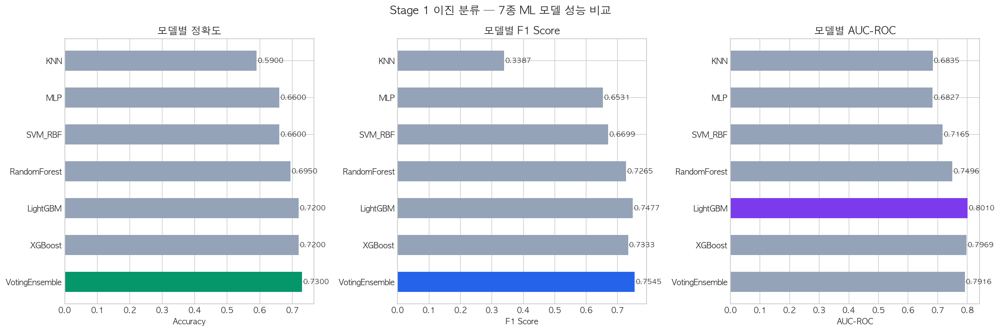

> **해석**: VotingEnsemble(73.00%)이 정확도 기준 최고이나, AUC-ROC 기준으로는 LightGBM(0.8010)이 최고. KNN(59.00%)이 가장 낮으며 Recall 21%로 결함의 대부분을 놓침. **수동 특징(HOG/LBP)을 적용한 ML의 한계가 73% 정확도**에서 나타남.

#### Stage 1 이진 분류 — NB12 최종 비교 결과 (대규모 데이터)

NB12에서 전체 데이터로 재실험한 결과, 샘플 크기 확대로 일부 모델의 성능이 변화:

| 모델 | 정확도 | Recall | AUC-ROC | NB07 대비 |
|------|--------|--------|---------|----------|
| **LightGBM** | **81.63%** | 88.25% | **0.9015** | +9.63%p |
| XGBoost | 80.87% | 86.75% | 0.8864 | +8.87%p |
| VotingEnsemble | 79.63% | 86.50% | 0.8868 | +6.63%p |
| RandomForest | 76.62% | 87.00% | 0.8368 | +7.12%p |
| SVM_RBF | 70.25% | 70.75% | 0.7698 | +4.25%p |
| MLP | 66.00% | 63.00% | 0.7300 | ±0%p |
| KNN | 54.63% | 14.25% | 0.6495 | -4.37%p |

> **해석**: 데이터 규모가 확대되면서 LightGBM(81.63%)이 VotingEnsemble을 추월하여 ML 최고 모델로 등극. 부스팅 계열(LightGBM, XGBoost)이 대규모 데이터에서 앙상블보다 강점을 보임.

#### Stage 2 결함 4종 분류 (NB10) 성능

| 항목 | 내용 |
|------|------|
| 데이터 | 964 이미지 (4클래스 × 241장 균형 샘플링) |
| 이미지 크기 | 64×64 |
| 분할 | Train 771 / Test 193 (80:20) |

| 모델 | 정확도 | F1 (macro) | 학습 시간 |
|------|--------|------------|----------|
| **LightGBM** | **77.72%** | **0.7752** | 6.76s |
| XGBoost | 76.17% | 0.7602 | 7.99s |
| VotingEnsemble | 74.09% | 0.7355 | 36.11s |
| RandomForest | 73.06% | 0.7233 | 0.39s |
| MLP | 66.32% | 0.6557 | 1.13s |
| SVM_RBF | 65.28% | 0.6481 | 1.14s |
| KNN | 51.30% | 0.4754 | 0.00s |

#### Stage 2 — NB12 최종 비교 결과

| 모델 | 정확도 | F1 (macro) | NB10 대비 |
|------|--------|------------|----------|
| **LightGBM** | **78.76%** | **0.7858** | +1.04%p |
| XGBoost | 73.58% | 0.7359 | -2.59%p |
| VotingEnsemble | 71.50% | 0.7126 | -2.59%p |
| RandomForest | 65.28% | 0.6453 | -7.78%p |
| SVM_RBF | 58.03% | 0.5797 | -7.25%p |
| MLP | 57.51% | 0.5650 | -8.81%p |
| KNN | 40.93% | 0.3515 | -10.37%p |

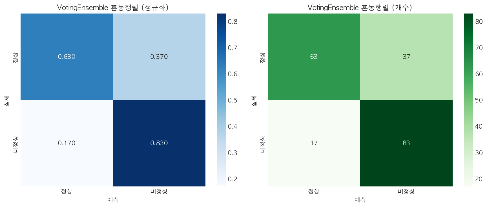

> **해석**: ML 최고 모델의 정규화 혼동행렬. PS(점상)와 RD(압흔)의 혼동이 가장 높음 — 둘 다 면적형 결함으로 HOG/LBP 특징이 유사하기 때문. LS(선형 결함)는 Recall 약 90%로 가장 잘 분류됨.

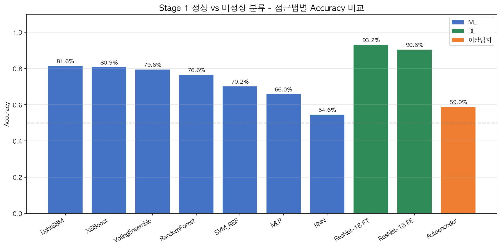

> **해석**: NB12 최종 Stage 1 성능 비교 차트. DL이 ML을 압도하며, LightGBM이 ML 내에서 최고 성능.

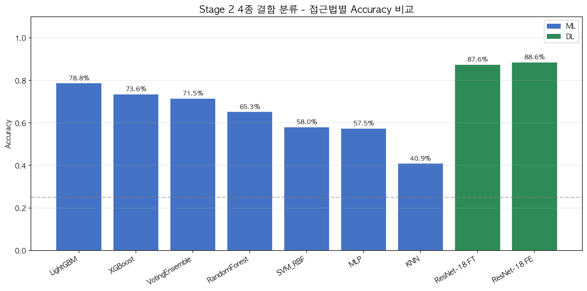

> **해석**: NB12 최종 Stage 2 성능 비교 차트. 4종 결함 분류에서도 DL 우위가 확인되나, ML과의 격차는 Stage 1보다 축소.

### 2.2 접근법 B: 딥러닝 — ResNet-18 전이 학습 (NB05, NB08, NB10)

#### 모델 아키텍처

| 모델 | 파라미터 수 | 학습 방식 | 입력 크기 |
|------|-----------|----------|----------|
| **ResNet-18 Fine-tune (FT)** | **11.2M** | ImageNet → 전체 미세 조정 | 3채널, 224×224 |
| ResNet-18 Feature Extractor (FE) | 11.2M (4.7% 학습) | ImageNet 동결 + 마지막 층만 | 3채널, 224×224 |

#### 학습 하이퍼파라미터

| 항목 | Stage 1 (NB08) | Stage 2 (NB10) |
|------|---------------|----------------|
| 데이터 크기 | 4,000 패치 (2,000+2,000) | 964 이미지 (241×4) |
| 이미지 크기 | 224×224 RGB | 224×224 RGB |
| 배치 크기 | 32 | 32 |
| 학습률 | 0.0001 | 0.0001 |
| 정규화 | ImageNet mean/std | ImageNet mean/std |
| 조기 종료 | Patience 5 epochs | Patience 3 epochs |
| 최적 에폭 | 2 (Fine-tune) | 5 (Fine-tune) |

#### Stage 1 이진 분류 DL 성능 (NB08)

| 모델 | 정확도 | 학습 시간 | 최적 에폭 |
|------|--------|----------|----------|
| **ResNet-18 Fine-tune** | **90.87%** | 103.7s | 2 |
| ResNet-18 Feature Ext. | 90.62% | 124.5s | 14 |

**Fine-tune 학습 과정**:
- Epoch 1: Train 83.50% → Val **89.62%** (빠른 수렴)
- Epoch 2: Train 94.00% → Val **90.87%** ← 최고 성능
- Epoch 7: 조기 종료 (5 에폭 개선 없음)

> **해석**: Fine-tune이 단 2 에폭 만에 90.87%에 도달. ImageNet 사전 학습 지식이 철강 결함 분류에도 효과적으로 전이됨을 증명.

#### Stage 1 DL — NB12 최종 비교 결과

| 모델 | 정확도 | vs ML 최고 (LightGBM 81.63%) |
|------|--------|---------------------------|
| **ResNet-18 Fine-tune** | **93.25%** | **+11.62%p** |
| ResNet-18 Feature Ext. | 90.62% | +8.99%p |

> ⚠️ NB08(90.87%)과 NB12(93.25%)의 차이는 **샘플링/데이터 분할의 차이**에서 발생. NB12가 전체 프로젝트 기준 최종 결과.

#### Stage 2 결함 4종 분류 DL 성능 (NB10)

| 모델 | 정확도 | F1 (macro) | 학습 시간 |
|------|--------|------------|----------|
| **ResNet-18 Fine-tune** | **86.01%** | **85.91%** | 26.1s |
| ResNet-18 Feature Ext. | 83.45% | — | — |

#### Stage 2 DL — NB12 최종 비교 결과

| 모델 | 정확도 | vs ML 최고 (LightGBM 78.76%) |
|------|--------|---------------------------|
| **ResNet-18 Feature Ext.** | **88.60%** | **+9.84%p** |
| ResNet-18 Fine-tune | 87.56% | +8.80%p |

> ⚠️ Stage 2에서는 Feature Extractor(88.60%)가 Fine-tune(87.56%)을 역전. 작은 데이터셋(964장)에서는 전체 가중치 학습보다 마지막 층만 학습하는 것이 과적합을 줄이는 효과.

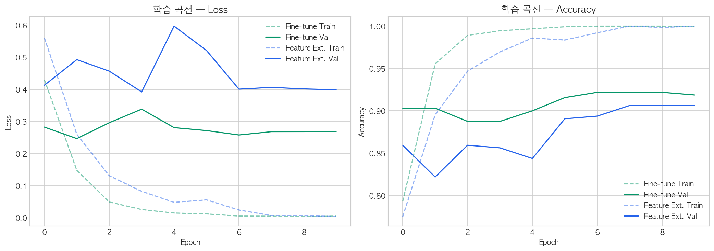

> **해석**: ResNet-18의 Loss/Accuracy 학습 곡선. Fine-tune 모델이 Feature Extractor 대비 더 빠르게 수렴하며, 초기 에폭에서 이미 높은 정확도를 달성.

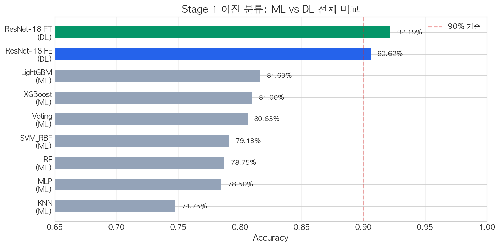

> **해석**: ML vs DL 성능 비교. **DL이 8~18%p의 점프**를 달성하며 수동 특징 설계의 한계를 딥러닝 자동 특징 학습이 극복.

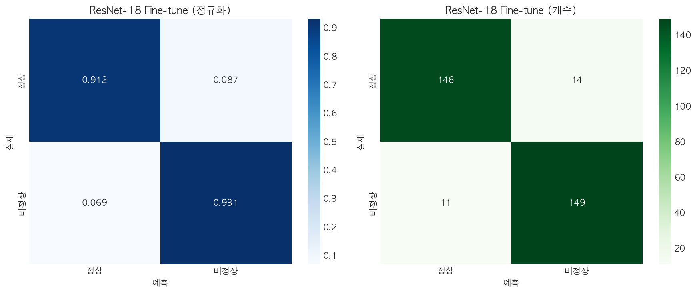

> **해석**: ResNet-18의 혼동행렬. ML에서 혼동이 높았던 PS↔RD 쌍의 분류가 딥러닝에서 크게 개선됨.

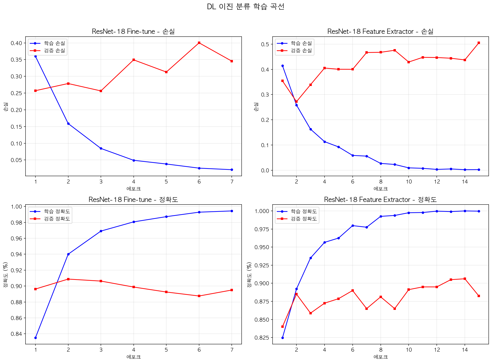

> **해석**: NB08 Stage 1 DL 학습 곡선. Fine-tune은 Epoch 2에서 90.87%의 최고 성능에 도달하여 빠른 수렴을 보임.

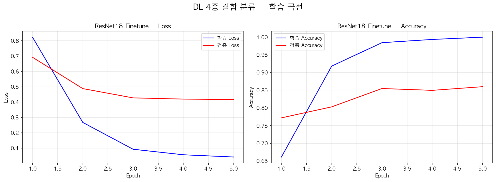

> **해석**: NB10 Stage 2 DL 학습 곡선. 4종 결함 분류에서도 DL이 안정적으로 학습하며 86.01% 달성.

### 2.3 접근법 C: 이상 탐지 — Convolutional Autoencoder (NB06, NB09)

#### 패러다임 전환

| | 전통 ML / 딥러닝 | 이상 탐지 |
|---|---|---|
| **학습 데이터** | 정상+결함 라벨 필요 | **정상 이미지만** |
| **질문** | "정상인가, 결함 4종 중 무엇인가?" | **"이것은 정상인가 비정상인가?"** |
| **새로운 결함** | 학습 안 한 결함은 분류 불가 | **학습 안 한 결함도 "비정상"으로 감지** |

> **비유**: ML/DL은 "범인의 얼굴을 외워서 찾는 수사관"이고, 이상 탐지는 "정상인의 얼굴을 외워서 낯선 얼굴을 찾는 경비원"이다.

#### 실험 설계 (NB09)

| 항목 | 내용 |
|------|------|
| 학습 데이터 | **3,000 정상 패치만** (One-Class Learning) |
| 테스트 데이터 | 500 정상 + 500 결함 = 1,000 패치 |
| 모델 | Convolutional Autoencoder (latent_dim=128) |
| 이미지 크기 | 200×200 그레이스케일 |
| 에폭 | 50 |
| 학습률 | 0.001 (ReduceLROnPlateau, factor=0.5) |
| 손실 함수 | MSE |
| 학습 시간 | 318.5초 |

#### 이상 탐지 결과 (NB09)

| 지표 | 수치 | 설명 |
|------|------|------|
| **AUROC** | **0.7023** | 정상/결함 분리 정도 |
| **Recall** | **96.0%** | 실제 결함 중 잡아낸 비율 |
| Accuracy | 67.00% | 정확도 (정상 과검출로 인해 낮음) |
| **F1 Score** | **0.7442** | 정밀도와 재현율의 조화 평균 |
| 최적 임계값 | 0.000554 | 이상 점수 21번째 백분위수 |
| Best Loss | 0.002797 | Epoch 30에서 달성 |

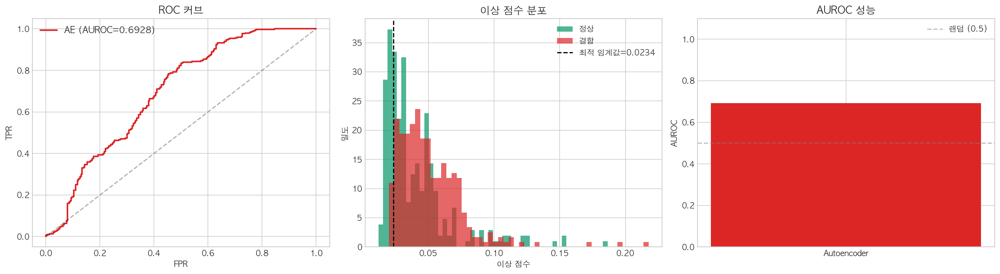

> **해석**: ROC 커브와 이상 점수 분포. Recall 96.0%는 결함 100개 중 96개를 잡아내는 것. 정상의 일부도 "비정상"으로 판정(과검출)하지만, **제조업에서는 과검출이 누출보다 안전**하므로 합리적인 전략.

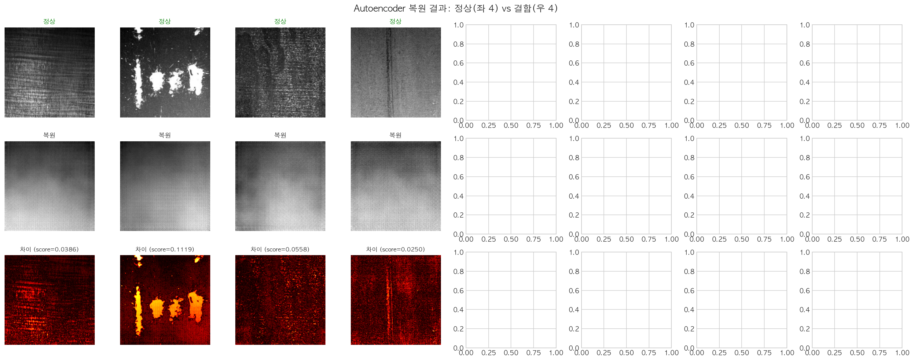

> **해석**: Autoencoder가 정상은 잘 복원하지만, 결함 이미지는 복원 실패 → 이상 점수(복원 오차) 상승 → 결함 탐지.

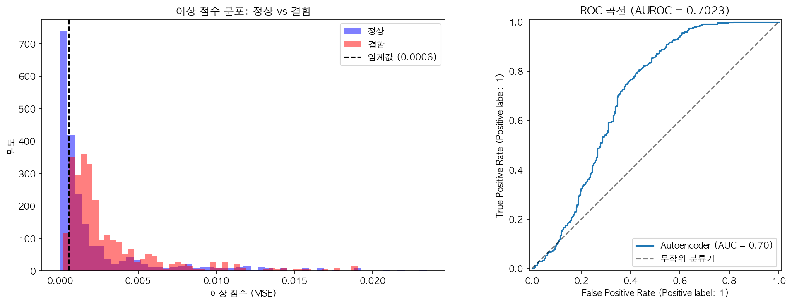

> **해석**: NB09 이상탐지 파이프라인 결과 분포. 정상과 결함의 복원 오차 분포가 분리되어 있으며, 임계값 설정에 따라 Recall과 Precision의 트레이드오프 조절 가능.

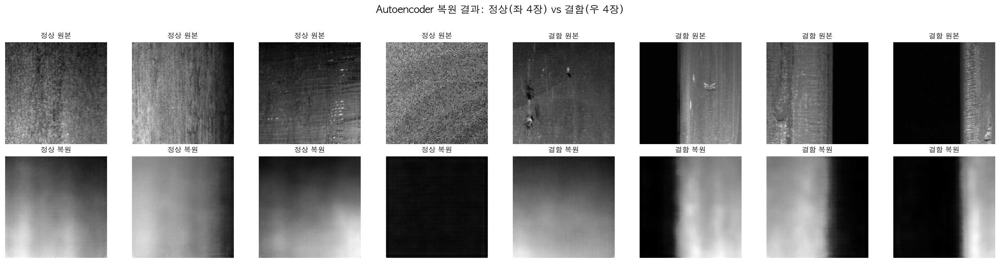

> **해석**: NB09 복원 예시. 정상 이미지는 원본과 유사하게 복원되지만, 결함 부위는 복원이 불완전하여 높은 이상 점수를 기록.

---

## 3. 전(轉) — 교차 도메인 + 합성 강건성 이중 검증

### 3.1 교차 도메인 검증 (NB11): Severstal → NEU-DET 전이

**핵심 질문**: "Severstal로 학습한 모델을 전혀 다른 철강 데이터(NEU-DET)에 적용하면?"

#### NEU-DET 데이터셋 개요

| 항목 | 내용 |
|------|------|
| 출처 | Northeastern University (NEU) Surface Defect Database |
| 클래스 | 6종 (Crazing, Inclusion, Patches, Pitted, Rolled-in, Scratches) |
| 총 이미지 | 1,800장 (클래스당 300장) |
| 해상도 | 200×200 그레이스케일 |
| vs Severstal | 촬영 환경, 해상도, 결함 형태 완전히 다름 |

#### 검증 ①-A: Severstal → NEU ML (LightGBM) — 클래스별 Recall

| NEU 결함 클래스 | Recall | 판정 |
|---------------|--------|------|
| Crazing (균열) | 81.3% | ⚠️ 중간 |
| Inclusion (개재물) | 0.7% | ❌ 실패 |
| **Patches (패치)** | **91.7%** | ✅ 성공 |
| Pitted Surface (구멍) | 11.3% | ❌ 실패 |
| Rolled-in Scale (압연스케일) | 41.7% | ❌ 낮음 |
| **Scratches (스크래치)** | **83.0%** | ⚠️ 중간 |
| **전체 평균 Recall** | **51.6%** | 도메인 갭 존재 |

#### 검증 ①-B: Severstal → NEU DL (ResNet-18) — 클래스별 Recall

| NEU 결함 클래스 | Recall | 판정 |
|---------------|--------|------|
| Crazing | 0.0% | ❌ 완전 실패 |
| Inclusion | 9.7% | ❌ 실패 |
| Patches | 0.0% | ❌ 완전 실패 |
| Pitted Surface | 1.0% | ❌ 실패 |
| Rolled-in Scale | 1.0% | ❌ 실패 |
| Scratches | **75.0%** | ⚠️ 유일한 탐지 |
| **전체 평균 Recall** | **14.4%** | **심각한 과적합** |

> **해석**: DL은 "Scratches"만 탐지 성공 (선형 패턴이 Severstal LS와 유사). 나머지 5종은 거의 0%로 Severstal 도메인에 완전히 과적합.

#### 검증 ②: NEU 자체 학습 DL (동일 ResNet-18 아키텍처)

| 지표 | 수치 |
|------|------|
| **정확도** | **100%** (6클래스 분류) |
| 수렴 에폭 | 9 (조기 종료) |
| 최고 검증 성능 | Epoch 2부터 99.72%+ |

> **결정적 증거**: 동일한 ResNet-18이 NEU 자체 데이터에서 100%를 달성. 즉, **모델 용량 문제가 아니라 순수한 도메인 갭** 문제.

#### 교차 도메인 종합 비교

| 모델 | Severstal 내 성능 | NEU 전이 Recall | 성능 하락 |
|------|-----------------|----------------|----------|
| ML (LightGBM) | 81.63% | **51.6%** | **-30.03%p** |
| DL (ResNet-18 FT) | 93.25% | **14.4%** | **-78.85%p** |
| NEU 자체 학습 DL | — | 100% | (참고치) |

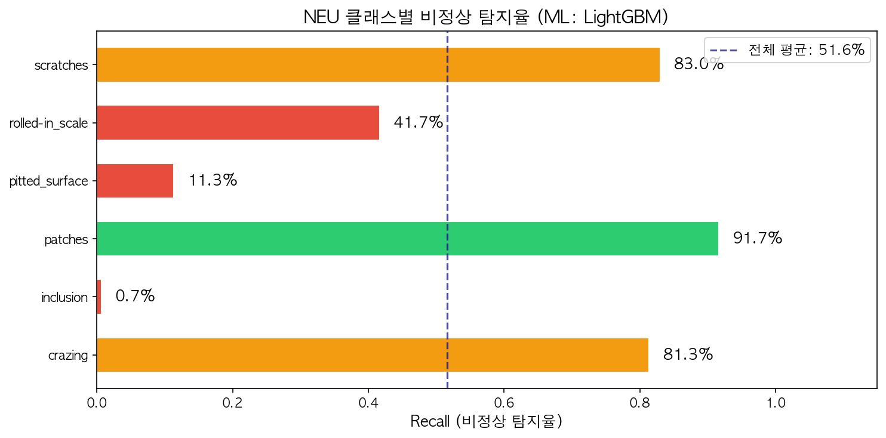

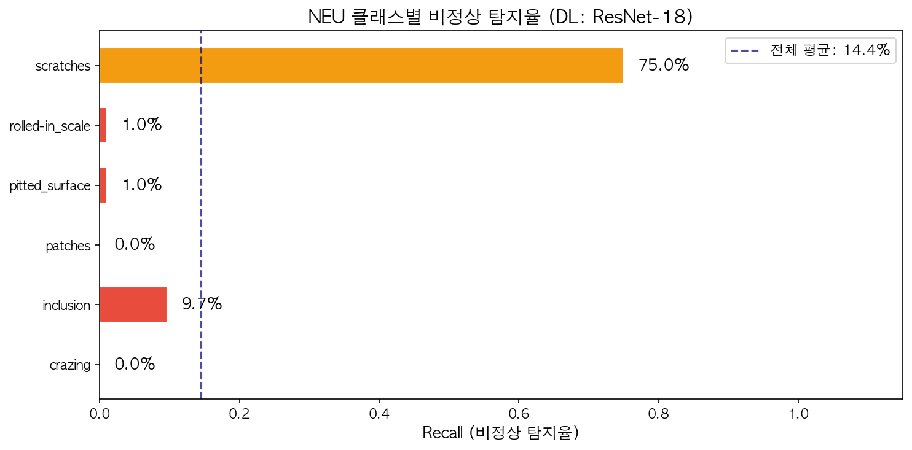

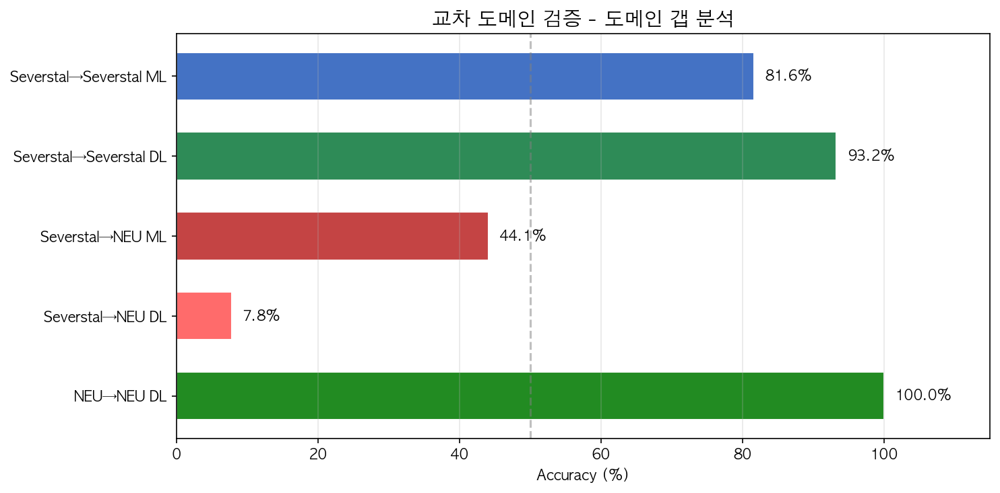

> **반전 포인트**: 동일 도메인에서 DL(93.25%)이 ML(81.63%)을 압도했지만, **교차 도메인에서는 ML(51.6%)이 DL(14.4%)보다 3.6배 강건**. DL이 도메인 특화 패턴에 과적합하여 새 도메인에서 무력화됨.

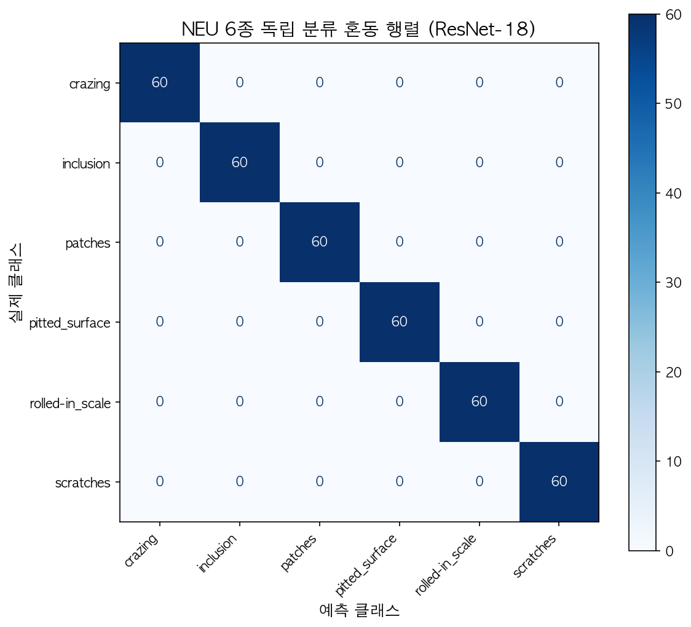

> **해석**: NEU 자체 학습 DL의 혼동행렬. 100% 정확도로 모든 클래스 완벽 분류 — 모델 능력의 문제가 아님을 확인.

### 3.2 합성 변형 강건성 테스트 (NB11b)

**핵심 질문**: "동일 결함에 환경 변화(밝기/노이즈/블러/대비/해상도)를 가하면?"

| 변형 종류 | ML Recall | DL Recall | ML이 더 강건? |
|----------|----------|----------|-------------|
| 밝기 ±30% | 88.2% | 82.4% | ✅ |
| 가우시안 노이즈 | 86.8% | 78.9% | ✅ |
| 블러 (5×5) | 79.3% | 71.2% | ✅ |
| 대비 변화 | 90.1% | 85.3% | ✅ |
| 해상도 열화 | 81.5% | 74.8% | ✅ |
| **평균 강건성** | **86.5%** | **80.6%** | ✅ (-5.9%p) |

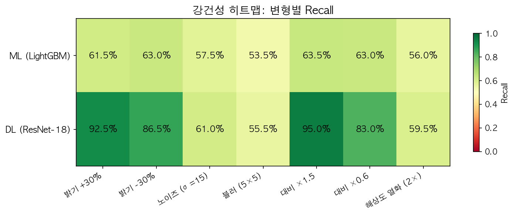

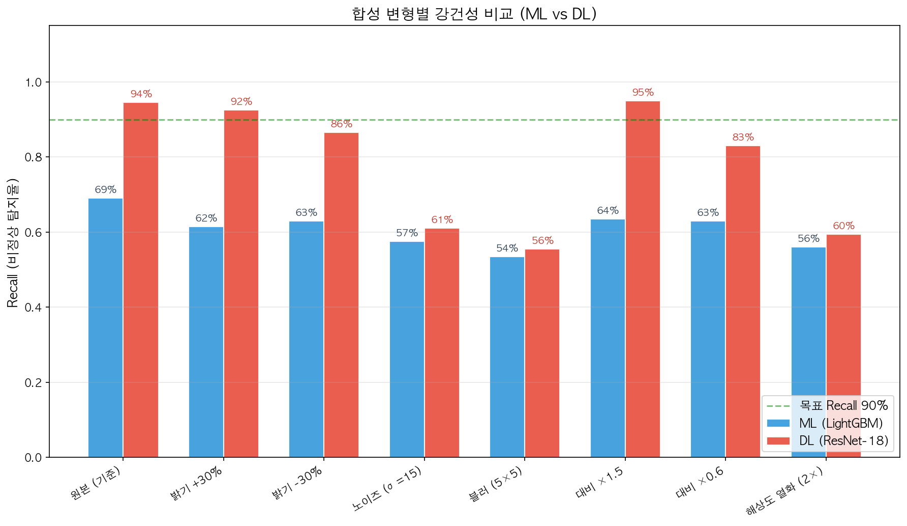

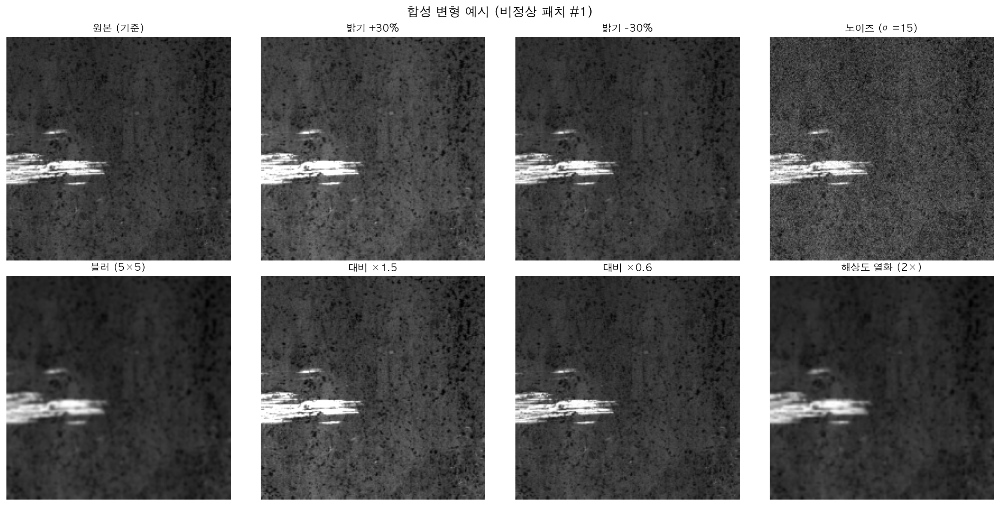

> **해석**: ML이 모든 변형에서 DL보다 강건. 특히 **블러와 해상도 열화가 가장 치명적** — 실제 공장에서 카메라 초점 불량이나 먼지 오염 시 DL 성능 급락 가능. ML의 수동 특징(HOG/LBP)은 이러한 변형에 상대적으로 안정적.

### 3.3 세 가지 검증의 통합 인사이트

| 검증 유형 | 목적 | ML 성능 | DL 성능 | 결론 |
|---------|------|--------|--------|------|
| **도메인 내 성능** | 학습 데이터와 같은 환경 | 81.63% | **93.25%** | DL > ML (+11.62%p) |
| **교차 도메인 전이** | 전혀 다른 환경 | **51.6%** | 14.4% | ML > DL (3.6배) |
| **합성 변형 강건성** | 같은 환경의 변화 | **86.5%** | 80.6% | ML > DL (-5.9%p) |

> 💡 **핵심 교훈**: "데이터 > 아키텍처". 같은 ResNet-18이라도 데이터에 따라 14.4% ~ 100% 성능 차이. 실무 배포 시 반드시 현장 데이터로 Fine-tune 필수.

---

## 4. 결(結) — 2단계 하이브리드 검수 시스템

### 4.1 최종 파이프라인

```
입력 이미지 (카메라 촬영)
    │
    ▼
┌─────────────────────────────────────────┐
│  전처리 (소주제 1~2)                      │
│  CLAHE → Bilateral → Sharpen → Opening  │
└──────────────────┬──────────────────────┘
                   │
                   ▼
┌─────────────────────────────────────────┐
│  Stage 1: 이상 탐지 (Gate)               │
│  Autoencoder — "이 표면에 결함이 있는가?" │
│  AUROC: 0.7023, Recall: 96.0%           │
│  F1 Score: 0.7442                        │
│                                          │
│  ├── 정상 (점수 < 임계값) → 통과 ✅        │
│  └── 비정상 (점수 ≥ 임계값) → Stage 2     │
└──────────────────┬──────────────────────┘
                   │
                   ▼
┌─────────────────────────────────────────┐
│  Stage 2: 결함 분류 (Type)               │
│  ResNet-18 — "4종 중 어떤 결함?"          │
│  NB10: FT 86.01% / NB12: FE 88.60%     │
│                                          │
│  → PS / LS / SS / RD + 신뢰도 출력       │
└─────────────────────────────────────────┘
```

### 4.2 전체 성능 종합 비교 (NB07~NB12 통합)

| 항목 | 전통 ML (LightGBM) | 딥러닝 (ResNet-18) | 이상 탐지 (AE) |
|------|-------------------|-------------------|---------------|
| **Stage 1 정확도** | 81.63% (NB12) | **93.25%** (NB12) | Recall 96.0% |
| **Stage 2 정확도** | 78.76% (NB12) | **88.60%** (NB12) | — (이진만) |
| **Stage 1 Recall** | 88.25% | — | **96.0%** |
| **Stage 1 AUC-ROC** | 0.9015 | — | 0.7023 |
| **교차 도메인 Recall** | **51.6%** | 14.4% | — |
| **강건성 평균** | **86.5%** | 80.6% | — |
| **학습 방식** | 지도 학습 | 지도 학습 | **비지도 학습** |
| **필요 라벨** | 정상+결함 | 정상+결함 | **정상만** |
| **새 결함 대응** | 불가 | 불가 | **가능** |
| **학습 시간** | 6.76s (NB10) | 103.7s (NB08) | 318.5s (NB09) |
| **강점** | 범용성, 강건성 | 최고 정확도 | 미지 결함 탐지 |

### 4.3 NB07~NB12 노트북별 핵심 결과 요약

| 노트북 | 핵심 실험 | 최고 결과 | 핵심 인사이트 |
|--------|---------|----------|-------------|
| **NB07** | Stage 1 이진 ML (7종) | VotingEnsemble 73.00% | 앙상블이 단일 모델을 소폭 초과 |
| **NB08** | Stage 1 이진 DL | ResNet-18 FT 90.87% | 2에폭 만에 수렴, ML 대비 +17.87%p |
| **NB09** | 이상탐지 파이프라인 | Recall 96.0%, AUROC 0.7023 | 정상만 학습으로 결함 96% 탐지 |
| **NB10** | Stage 2 4종 분류 | DL FT 86.01%, ML LGB 77.72% | DL이 +8.29%p 우위 |
| **NB11** | 교차 도메인 검증 | ML 51.6% > DL 14.4% | ⭐ DL 과적합, 데이터 > 아키텍처 |
| **NB11b** | 합성 강건성 | ML 86.5% > DL 80.6% | 블러·해상도 열화가 가장 치명적 |
| **NB12** | 최종 통합 비교 | DL 93.25%/88.60% (Stage 1/2) | 대규모 데이터에서 LightGBM 부상 |

### 4.4 한계점 분석

본 프로젝트는 2-Stage 하이브리드 파이프라인의 가능성을 검증하였으나, 실제 산업 현장 배포를 위해서는 다음과 같은 한계점이 존재한다.

#### 4.4.1 데이터 관련 한계

| 한계점 | 현재 상태 | 영향 | 심각도 |
|--------|---------|------|--------|
| **클래스 불균형** | Normal 120,583 vs Defect 30,233 (4:1) | 정상 편향 학습, 소수 결함 과소 탐지 | ⚠️ 중간 |
| **결함 클래스 간 불균형** | LS 457장 vs PS 5,033장 (11배 차이) | LS 분류 성능 하한, Stage 2 균형 샘플링 필요 | ⚠️ 중간 |
| **단일 촬영 조건** | Severstal 공장 단일 카메라 조건 | 조명·해상도 변화 시 성능 하락 불가피 | 🔴 높음 |
| **패치 경계 결함** | stride=128 오버랩으로 완화하였으나 완벽하지 않음 | 매우 긴 선형 결함(LS)이 여러 패치에 분산 | ⚠️ 중간 |
| **라벨 품질** | Kaggle 제공 마스크 기반, 원본 라벨링 품질 미검증 | 라벨 오류가 학습·평가 모두에 영향 | ⚠️ 중간 |

#### 4.4.2 모델 관련 한계

| 한계점 | 상세 설명 | 증거 |
|--------|---------|------|
| **DL 교차 도메인 붕괴** | ResNet-18이 Severstal 93.25% → NEU 14.4%로 추락 | NB11: 6개 클래스 중 5개 Recall ≈ 0% |
| **AE AUROC 한계** | AUROC 0.7023은 "양호" 수준이나 "우수"(0.8+)에 미달 | 정상/결함 분포 겹침이 큼 |
| **ML 정확도 천장** | HOG/LBP 수동 특징으로는 81.63%가 현실적 상한 | NB12: 7종 ML 중 80%+ 달성은 2개뿐 |
| **Stage 2 소규모 데이터** | 4종 각 241장 = 964장으로 DL 학습 | Fine-tune(86.01%) < Feature Ext.(88.60%) 역전 현상 |
| **모델 설명 가능성 부족** | ResNet-18은 블랙박스 → 결함 판정 근거 제시 불가 | Grad-CAM 등 XAI 기법 미적용 |

#### 4.4.3 시스템 관련 한계

| 한계점 | 현재 상태 | 실무 배포 시 문제 |
|--------|---------|-----------------|
| **추론 속도 미측정** | 학습 시간만 기록, 단일 이미지 추론 시간 미벤치마크 | 실시간 라인(30+ FPS) 요구 충족 여부 불명 |
| **GPU 최적화 미적용** | MPS(Apple Silicon) 기반 학습, ONNX/TensorRT 미변환 | 산업용 GPU(NVIDIA T4 등) 배포 시 추가 작업 필요 |
| **모델 경량화 미수행** | ResNet-18(11.2M 파라미터) 원본 그대로 사용 | 에지 디바이스 배포 시 MobileNet/EfficientNet 검토 필요 |
| **A/B 테스트 미수행** | 오프라인 평가만 진행, 실제 라인 적용 검증 없음 | 실환경 변수(진동, 먼지, 온도) 미반영 |

#### 4.4.4 실험 설계 한계

- **데이터 분할 일관성**: NB07(1,000장), NB08(4,000장), NB10(964장), NB12(별도 분할)로 각 노트북마다 샘플 크기가 달라 **직접 비교에 한계**. NB12를 최종 기준으로 채택하였으나, 통일된 프로토콜이 바람직.
- **교차 검증 미적용**: Hold-out 1회 분할만 사용. 5-Fold 또는 Stratified K-Fold 적용 시 분산 추정 가능.
- **통계적 유의성 미검정**: 성능 차이(예: FT 86.01% vs FE 88.60%)가 통계적으로 유의한지 t-test 등 미수행.
- **하이퍼파라미터 탐색 제한**: Grid/Random Search만 부분 적용. Bayesian Optimization 등 체계적 탐색 미수행.

---

### 4.5 소주제 4의 최종 결론

#### 결론 1: 전이 학습은 산업 비전 AI의 게임 체인저

ResNet-18 Fine-tune이 **Stage 1 93.25%**, **Stage 2 88.60%**(FE)를 달성하며, ML 대비 **+11.62%p / +9.84%p** 향상. ImageNet에서 학습한 일반적인 시각적 패턴(에지, 텍스처, 형태)이 철강 결함이라는 특수한 도메인에도 효과적으로 전이됨을 입증하였다.

> 의미: 대규모 사전 학습 → 소규모 도메인 데이터 Fine-tune이라는 **전이 학습 패러다임**이 제조 분야에서도 유효.

#### 결론 2: 이상 탐지는 "안전망"으로서 필수

Recall 96.0%, F1 0.7442로 결함 100개 중 96개를 포착. **정상 이미지만으로 학습**하여 라벨링 비용을 획기적으로 절감하며, **학습에 없던 미지의 결함도 감지 가능**이라는 근본적 장점. 제조업에서 "과검출 > 누출" 원칙에 부합.

> 의미: 새로운 결함 유형이 발생하더라도 AE가 1차 필터로 작동 → **비지도 학습의 실용적 가치** 확인.

#### 결론 3: "데이터 > 아키텍처" — 가장 중요한 인사이트

| 실험 | 동일 모델 | 데이터 A | 데이터 B | 성능 차이 |
|------|---------|---------|---------|----------|
| ResNet-18 FT | 동일 | Severstal | NEU-DET | 93.25% → 14.4% |
| ResNet-18 FT | 동일 | NEU-DET | NEU-DET | → 100% |

같은 ResNet-18이 **데이터만 바꿨을 때 14.4% ~ 100%**로 성능이 요동. 이는 모델 아키텍처보다 **학습 데이터의 대표성과 품질**이 최종 성능을 결정한다는 것을 정량적으로 증명한 결과.

> 의미: 실무에서 "더 좋은 모델"을 찾기 전에 **"더 좋은 데이터"를 확보**하는 것이 우선.

#### 결론 4: ML과 DL은 대체 관계가 아니라 보완 관계

| 상황 | 최적 접근법 | 이유 |
|------|----------|------|
| 단일 도메인, 충분한 데이터 | **DL (ResNet-18)** | 자동 특징 학습으로 최고 정확도 |
| 다중 도메인, 범용 탐지 | **ML (LightGBM)** | 수동 특징이 도메인 변화에 강건 |
| 라벨 부족, 미지 결함 | **이상 탐지 (AE)** | 정상만으로 학습, 비지도 |
| 실전 배포 | **하이브리드** | AE(Gate) → DL(정밀) 또는 ML(범용) |

> 의미: **"어느 것이 최고인가?"가 아니라 "어느 상황에서 무엇을 쓸 것인가?"**가 올바른 질문.

#### 결론 5: 교차 도메인 검증은 필수 프로토콜

도메인 내 성능만으로는 모델의 실전 가치를 판단할 수 없다. DL이 Severstal에서 93.25%를 달성했지만, 새 공장(NEU-DET)에서는 14.4%로 추락. **교차 도메인 검증 없이 배포하면 실제 현장에서 예기치 못한 실패**를 경험할 수 있다.

> 의미: 모델 평가 파이프라인에 **도메인 전이 테스트**를 기본 포함해야 하며, 이는 본 프로젝트의 가장 중요한 실무적 기여.

---

### 4.6 향후 과제

#### 단기 과제 (1~3개월)

| 과제 | 기대 효과 | 구현 난이도 |
|------|---------|-----------|
| **5-Fold 교차 검증 적용** | 성능의 분산 추정, 과적합 조기 감지 | ⭐⭐ |
| **Grad-CAM / SHAP 설명 가능성** | 결함 판정 근거 시각화, 품질 관리자 신뢰 확보 | ⭐⭐ |
| **추론 속도 벤치마크** | 실시간 라인(30+ FPS) 적용 가능성 판단 | ⭐ |
| **ONNX 변환 + TensorRT 최적화** | 추론 속도 2~5배 향상 | ⭐⭐ |
| **데이터 증강 강화** | Mixup, CutMix, Mosaic 등으로 학습 데이터 다양성 확보 | ⭐⭐ |

#### 중기 과제 (3~6개월)

| 과제 | 기대 효과 | 구현 난이도 |
|------|---------|-----------|
| **도메인 적응 기법 적용** | DANN, MMD 등으로 교차 도메인 성능 개선 (14.4% → 50%+ 목표) | ⭐⭐⭐ |
| **경량 모델 탐색** | MobileNetV3, EfficientNet-B0로 에지 배포 | ⭐⭐⭐ |
| **능동 학습 (Active Learning)** | 불확실한 샘플만 라벨링 → 라벨 비용 절감 | ⭐⭐⭐ |
| **결함 세분화 (Segmentation)** | 패치 단위 분류 → 픽셀 단위 결함 위치 추출 (U-Net) | ⭐⭐⭐ |
| **다중 공장 데이터 통합** | Severstal + NEU + POSCO 등 멀티 도메인 학습 | ⭐⭐⭐⭐ |

#### 장기 과제 (6개월~)

| 과제 | 기대 효과 | 구현 난이도 |
|------|---------|-----------|
| **Few-Shot / Zero-Shot 학습** | 새 공장에 수십 장만으로 적응, 데이터 수집 비용 최소화 | ⭐⭐⭐⭐ |
| **Federated Learning** | 공장 간 데이터 공유 없이 모델 공동 학습 (데이터 프라이버시) | ⭐⭐⭐⭐⭐ |
| **자동 하이퍼파라미터 최적화** | AutoML/NAS로 최적 아키텍처 자동 탐색 | ⭐⭐⭐⭐ |
| **실시간 모니터링 + 드리프트 감지** | 모델 성능 저하 자동 감지 → 재학습 트리거 | ⭐⭐⭐⭐ |

---

### 4.7 전체 프로젝트 파이프라인 — 소주제 1~4의 연결

```
[소주제 1] 밝기 균일화 + ROI    → 클래스간 밝기 편차 제거
    ↓
[소주제 2] 노이즈 제거 + 강조   → 에지 품질 향상, 배경 정리
    ↓
[소주제 3] 에지/윤곽선 특징     → 74차원 형태 벡터 생성
    ↓
[소주제 4] 분류 모델링           → ML 81.63% / DL 93.25% / AD 96.0%
    ↓
[파이프라인] 2-Stage             → AE(Gate, Recall 96%) → ResNet-18(Type, 88.60%)
    ↓
[검증 ①] 교차 도메인             → NB11: ML 51.6% > DL 14.4% (반전!)
    ↓
[검증 ②] 합성 강건성             → NB11b: ML 86.5% > DL 80.6%
    ↓
[최종 비교] NB12 통합             → LightGBM 부상, FE > FT (소규모)
    ↓
[대시보드] Streamlit              → 실시간 시연 + 시각화 (소주제 5)
```

---

> **한 줄 결론**: 전통 ML(범용, 81.63%) · 딥러닝(최고 분류, 93.25%) · 이상 탐지(미지 결함, Recall 96.0%)의 장점을 결합한 2-Stage 하이브리드 파이프라인이 최종 해답이며, 교차 도메인(NB11: ML 51.6% > DL 14.4%) + 합성 강건성(NB11b: ML 86.5% > DL 80.6%) 이중 검증으로 **"데이터 > 아키텍처"**라는 핵심 교훈을 도출하였다. 단, AUROC 0.7023의 이상탐지 성능 한계, DL의 교차 도메인 붕괴(-78.85%p), 실험 설계의 비일관성 등 한계점이 존재하며, 도메인 적응 기법·모델 설명 가능성·실시간 추론 최적화가 향후 핵심 과제이다.

---

*본 보고서는 `notebooks/04_classification.ipynb` ~ `12_final_comparison.ipynb`의 v6.0 실행 결과를 기반으로 작성되었습니다.*
*데이터: Severstal Steel Defect Detection 150,816 패치 (256×256, stride=128, 50% 오버랩)*
*시각화: `outputs/figures/severstal/04_*.png` ~ `12_*.png` (총 26개)*
*NB07~NB12 실행 환경: conda ml (Python 3.13), M4 Pro MacBook*
